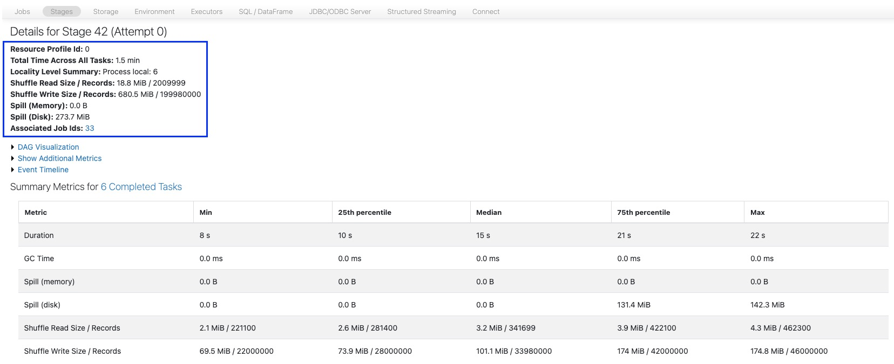

# 5_Verbessern: Die Anzahl der Shuffle-Partitionen erhöhen

Versuchen wir, die Performance dieser Query zu verbessern, indem wir die Anzahl der shuffle partitions erhöhen. Dazu ändern Sie die Konfigurationseinstellung **spark.sql.shuffle.partitions** und setzen sie auf **8** partitions.

Dies konfiguriert die Anzahl der partitions, die beim Shuffeln von Daten für joins oder aggregations verwendet werden.

Weitere Informationen finden Sie in der Dokumentation zu [spark.sql.shuffle.partitions](https://spark.apache.org/docs/latest/sql-performance-tuning.html#adaptive-query-execution).

```python
## Zelle erneut ausführen, um die broadcast-join-Funktionen zu deaktivieren, falls noch nicht geschehen
spark.conf.set("spark.sql.autoBroadcastJoinThreshold", -1)
spark.conf.set("spark.databricks.adaptive.autoBroadcastJoinThreshold", -1)

## Den Spill beheben, indem die Anzahl der shuffle partitions auf 8 erhöht wird
## In diesem kleinen Beispiel kein großer Unterschied, aber mit zunehmender Menge gespillter Daten
## kann dies einen großen Unterschied machen
spark.conf.set("spark.sql.shuffle.partitions", 8)
```

Führen Sie dieselbe Query wie im vorherigen Beispiel aus, diesmal jedoch mit der Anzahl der shuffle partitions auf 8 gesetzt. Notieren Sie sich die Ausführungszeit der Query.

**HINWEIS:** Dies sollte etwa ~50 Sekunden dauern.

```python
joined_df_8_partitions = spark.sql("""
    SELECT 
        transactions.id,
        amount,
        countries.name as country_name,
        employees,
        stores.name as store_name
    FROM
        transactions
    JOIN
        stores
        ON
            transactions.store_id = stores.id
    JOIN
        countries
        ON
            transactions.country_id = countries.id
""")

(joined_df_8_partitions
 .write
 .mode('overwrite')
 .saveAsTable('transact_countries')
)

## shuffle.partitions auf die Standardeinstellung zurücksetzen
spark.conf.unset("spark.sql.shuffle.partitions")
```

------

## 1_TODO: Den Spill ansehen

Betrachten Sie in der Spark UI den memory spill.

1. Erweitern Sie **Spark Jobs**, klicken Sie beim ersten job mit der rechten Maustaste und wählen Sie **Open in a New Tab**.

2. Wählen Sie in der Spark UI in der oberen Navigationsleiste **Stages**.

3. Suchen Sie die stage mit der größten Menge an shuffle writes (sollte etwa 679,9 MiB betragen, kann aber variieren) für die Query in der Spalte **Description**, die mit `joined_df_8_partitions = spark("""SELECT...)` beginnt.

4. Nachdem Sie diese stage gefunden haben, wählen Sie den Link im Feld **Description** aus.

5. Betrachten Sie das Feld **Spill (Disk)**. Beachten Sie, dass diese stage auf die Festplatte gespillt hat.

**HINWEIS:** In Apache Spark werden, wenn mehr Daten vorhanden sind, als im Speicher verarbeitet werden können, einige der zusätzlichen Daten auf die Festplatte ausgelagert. Dies wird als *spilling to disk* bezeichnet, und die 273,4 MiB bedeuten, dass etwa 273,4 MiB an Daten auf die Festplatte verschoben werden mussten, um die Verarbeitung fortzusetzen.

   Durch die Änderung der Anzahl der partitions hat sich der Spill verringert.



6. Betrachten Sie auf derselben Seite die **Locality Level Summary**. Dies bedeutet, dass die Anzahl der partitions in dieser stage 6 beträgt, obwohl wir die Anzahl der partitions auf 8 gesetzt haben. Das liegt daran, dass Spark automatisch entscheidet, kleinere partitions während eines jobs zu größeren zusammenzufassen, was Spark helfen kann, den job schneller abzuschließen und weniger Speicher zu verwenden.

   Sie können dies deaktivieren, indem Sie die folgende Option setzen: `spark.conf.set("spark.sql.adaptive.coalescePartitions.enabled", False)`.

7. Beachten Sie, dass die Menge der gespillten Daten reduziert wurde und die Ausführungszeit der Query etwas schneller ist.

**HINWEIS:** Die Spill-Metriken von 273 MB gespillten Daten können im query plan im Feld **PhotonShuffleExchangeSink**, das den join-Operationen folgt, sowie in den stage-Details der stage mit der größten Menge an shuffle writes beobachtet werden.

