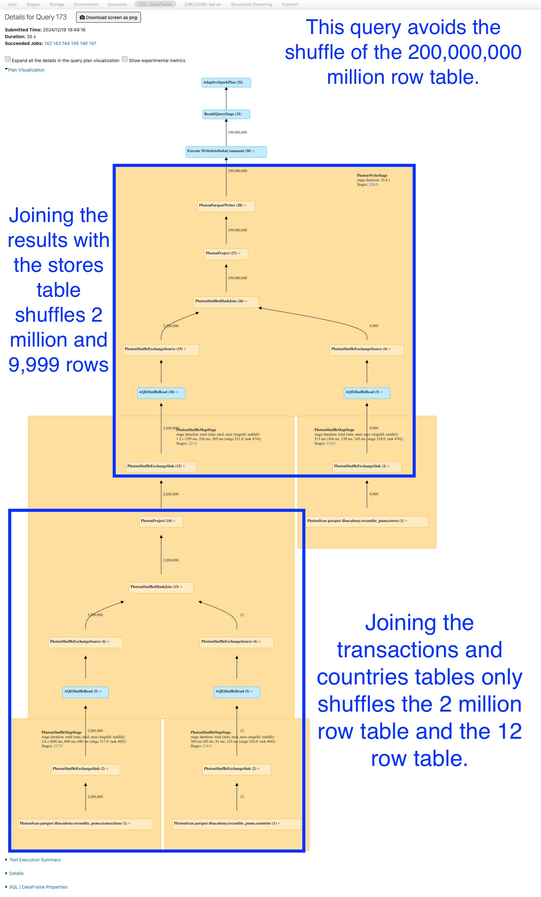
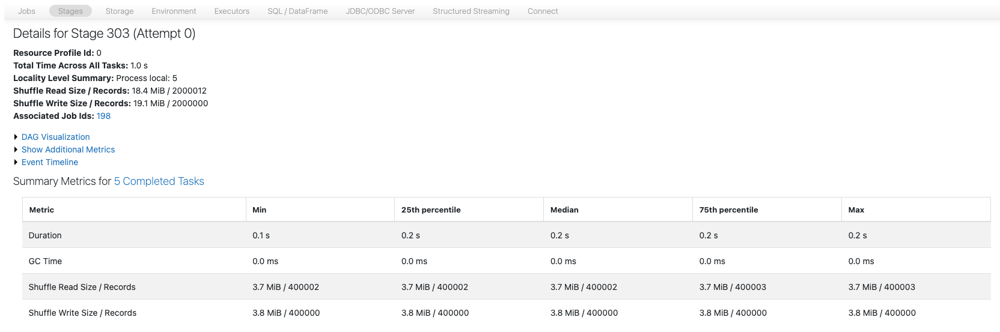

# 6_Verbessern: Die Join-Reihenfolge ändern

Führen Sie die untenstehende Zelle aus, um **autoBroadcastJoinThreshold** zu deaktivieren, falls noch nicht geschehen.

```python
## Broadcast-join-Funktionen deaktivieren, falls noch nicht geschehen
spark.conf.set("spark.sql.autoBroadcastJoinThreshold", -1)
spark.conf.set("spark.databricks.adaptive.autoBroadcastJoinThreshold", -1)
```

Betrachten wir die unten geänderte Query, die nun zunächst die **transactions**-Tabelle mit **countries** joint und anschließend mit der **stores**-Tabelle joint.

Indem zuerst der kleinere join ausgeführt wird (und der große exploding join vermieden wird), müssen wir nicht so viele Daten shuffeln wie zuvor, als zuerst mit der **stores**-Tabelle gejoint wurde.

Führen Sie die Zelle aus und notieren Sie sich die Zeit, die zur Fertigstellung der Query benötigt wird.

**HINWEIS:** Die Query wurde bereits für Sie geändert. Führen Sie einfach die Zelle aus.

```python
small_joined_first_df = spark.sql("""
    SELECT 
        transactions.id,
        amount,
        countries.name as country_name,
        employees,
        stores.name as store_name
    FROM
        transactions
    -- Beachten Sie, dass wir zuerst mit countries statt mit stores joinen, um dies zu vermeiden --
    JOIN
        countries
        ON
            transactions.country_id = countries.id
    -- Anschließend joinen wir die Ergebnisse mit der stores-Tabelle und vermeiden so den shuffle des großen exploding joins  --
    JOIN
        stores
        ON
            transactions.store_id = stores.id
""")

(small_joined_first_df
 .write
 .mode('overwrite')
 .saveAsTable('transact_countries')
)
```

## 1_TODO: Die Shuffles ansehen

Öffnen Sie die Spark UI und navigieren Sie zum Query-DAG. Identifizieren Sie die Explosion der Zeilen im DAG der Spark UI. Um zu sehen, wie der DAG funktioniert, gehen Sie wie folgt vor:

1. Erweitern Sie in der obigen Zelle **Spark Jobs**.

2. Klicken Sie beim ersten Job mit der rechten Maustaste auf **View** und wählen Sie *Open in a New Tab*.

**HINWEIS:** In der Vocareum-Lab-Umgebung wird ein Fehler im Pop-up-Fenster angezeigt, wenn Sie auf **View** klicken, ohne es in einem neuen Tab zu öffnen.

3. Suchen Sie im neuen Fenster oben die Überschrift **Jobs** und klicken Sie auf die Zahl unter **Associated SQL Query**.

4. Hier sollten Sie den gesamten query plan sehen. Lesen Sie den DAG-Graphen von unten nach oben, um die Details des Ausführungsplans besser zu verstehen.

5. Beachten Sie in der query-plan-Ansicht, dass der erste join zwischen den Tabellen **transactions** und **countries** stattfindet und 2 Millionen Ergebnisse liefert. Anschließend werden die Ergebnisse mit der **stores**-Tabelle gejoint, wodurch der exploding join entsteht. Dadurch muss der große join zwischen **transactions** und **stores** (~200.000.000 Zeilen) nicht mehr geshuffelt werden, wie es bei der ersten Query der Fall war.



------

## 2_TODO: Den Spill ansehen

Betrachten Sie in der Spark UI den memory spill.

1. Wählen Sie in der Spark UI in der oberen Navigationsleiste **Stages**. Hier sehen Sie alle auf dem cluster ausgeführten stages.
2. Suchen Sie die stage mit der größten Menge an **Shuffle Writes** (sollte etwa 19,1 MiB betragen, kann aber variieren) für die Query in der Spalte **Description**, die mit `small_joined_first_df = spark("""SELECT...)` beginnt.
3. Nachdem Sie diese stage gefunden haben, wählen Sie den Link im Feld **Description** aus.
4. Betrachten Sie das Feld **Spill (Disk)**. Beachten Sie, dass diese Query nicht auf die Festplatte gespillt hat.



5. Schließen Sie den Spark-UI-Browser.

