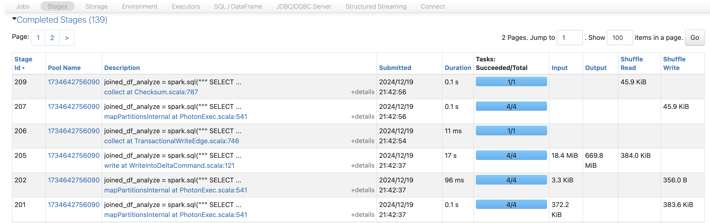
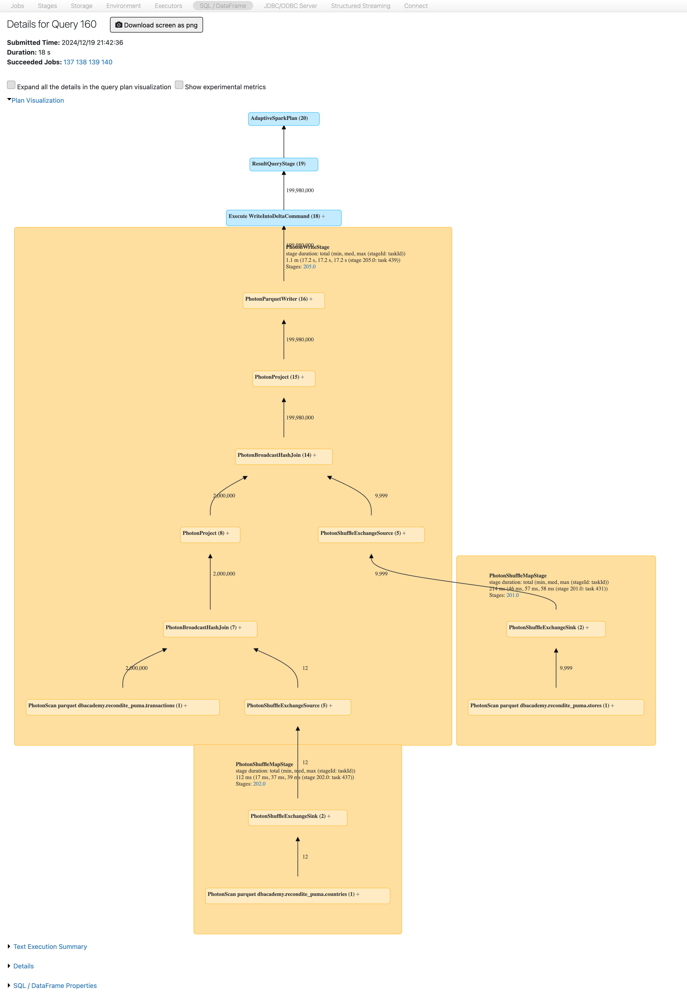

# 7_Verbessern: Standard-Broadcast-Konfigurationen analysieren und verwenden:

Setzen Sie die Konfigurationen **spark.sql.autoBroadcastJoinThreshold** und **spark.databricks.adaptive.autoBroadcastJoinThreshold** mithilfe der Methode `spark.conf.unset()` zurück.

[spark.sql.autoBroadcastJoinThreshold](https://spark.apache.org/docs/latest/sql-performance-tuning.html#automatically-broadcasting-joins) Dokumentation

[spark.databricks.adaptive.autoBroadcastJoinThreshold](https://spark.apache.org/docs/latest/sql-performance-tuning.html#converting-sort-merge-join-to-broadcast-join) Dokumentation

Führen Sie die Zelle aus und betrachten Sie die Ergebnisse. Bestätigen Sie die folgenden Standardwerte für die Konfigurationen:

- *Standardwert von autoBroadcastJoinThreshold: 10.485.760 bytes*
- *Standardwert von adaptive.autoBroadcastJoinThreshold: 31.457.280 bytes*

```python
# Standardwerte hier zurücksetzen
spark.conf.unset("spark.sql.autoBroadcastJoinThreshold")
spark.conf.unset("spark.databricks.adaptive.autoBroadcastJoinThreshold")

# Die Werte anzeigen
print(f'Default value of autoBroadcastJoinThreshold: {spark.conf.get("spark.sql.autoBroadcastJoinThreshold")}')
print(f'Default value of adaptive.autoBroadcastJoinThreshold: {spark.conf.get("spark.databricks.adaptive.autoBroadcastJoinThreshold")}')

# Ausgabe:
# Default value of autoBroadcastJoinThreshold: 10485760b
# Default value of adaptive.autoBroadcastJoinThreshold: 31457280b
```

Kostenbasierte Optimierer stützen sich auf Statistikinformationen, um den effizientesten physischen query plan mit den geringsten Kosten zu erzeugen. Dies umfasst Entscheidungen zur join-Strategie und zur Reihenfolge der joins.

Wenn `ANALYZE` auf die join-Spalten der drei Tabellen angewendet wird, kann der Optimierer bessere Entscheidungen treffen, und alles funktioniert wie von selbst.

Vervollständigen Sie die untenstehende Zelle, indem Sie die erforderlichen `ANALYZE`-Anweisungen schreiben.

**HINWEIS:** Weitere Informationen finden Sie in der Dokumentation zu ANALYZE TABLE: [AWS](https://docs.databricks.com/aws/en/sql/language-manual/sql-ref-syntax-aux-analyze-table) | [Azure](https://learn.microsoft.com/en-us/azure/databricks/sql/language-manual/sql-ref-syntax-aux-analyze-table) | [GCP](https://docs.databricks.com/gcp/en/sql/language-manual/sql-ref-syntax-aux-analyze-table).

```python
# Die transactions-Tabelle analysieren und Statistiken für die Spalten country_id und store_id berechnen
sql("ANALYZE TABLE transactions COMPUTE STATISTICS FOR COLUMNS country_id, store_id")

# Die stores-Tabelle analysieren und Statistiken für die Spalte id berechnen
sql("ANALYZE TABLE stores COMPUTE STATISTICS FOR COLUMNS id")

# Die countries-Tabelle analysieren und Statistiken für die Spalte id berechnen
sql("ANALYZE TABLE countries COMPUTE STATISTICS FOR COLUMNS id")
```

Im folgenden Beispiel schreibt ein Entwickler joins, ohne die optimale Reihenfolge der joins zu berücksichtigen.

Führen Sie die Query erneut mit der ursprünglichen Query aus, die wir in dieser Demonstration verwendet haben und die zuerst **transactions** mit **stores** joint und die Daten für den großen shuffle explodieren lässt.

Wird es funktionieren, wenn wir Spark selbst herausfinden lassen, wie die Daten effizient gejoint werden?

Notieren Sie sich die für den join benötigte Zeit.

```python
joined_df_analyze = spark.sql("""
    SELECT 
        transactions.id,
        amount,
        countries.name as country_name,
        employees,
        stores.name as store_name
    FROM
        transactions
    JOIN
        stores
        ON
            transactions.store_id = stores.id
    JOIN
        countries
        ON
            transactions.country_id = countries.id
""")

(joined_df_analyze
 .write
 .mode('overwrite')
 .saveAsTable('transact_countries')
)
```

**HINWEISE:**

- Wir haben die shuffle-Einstellungen auf die Standardwerte zurückgesetzt. Es ist in der Regel am besten, bei den Standardwerten zu bleiben, da diese sich im Laufe der Zeit tendenziell verbessern. Wenn Sie Konfigurationen fest codieren, verzichten Sie möglicherweise unbeabsichtigt auf zukünftige Performance-Verbesserungen. Es lohnt sich immer, alte Konfigurationen zu überprüfen, um sicherzustellen, dass sie noch benötigt werden. Durch das Bereinigen alter Konfigurationen können Sie große Performance-Verbesserungen erzielen.

Betrachten Sie die Spark UI. Denken Sie über Folgendes nach:

- Was können Sie im DAG des query plan erkennen?
- Gibt es einen Spill?
- Sind Zeilen explodiert?
- Reihenfolge des Joins?
- Ähnelt der DAG den vorherigen joins?
- Wurde die Query schneller ausgeführt? Wie groß waren die shuffle writes?
- Größer oder kleiner als bei den vorherigen Queries?



**DAG**

- Betrachten Sie die Unterschiede im DAG.



