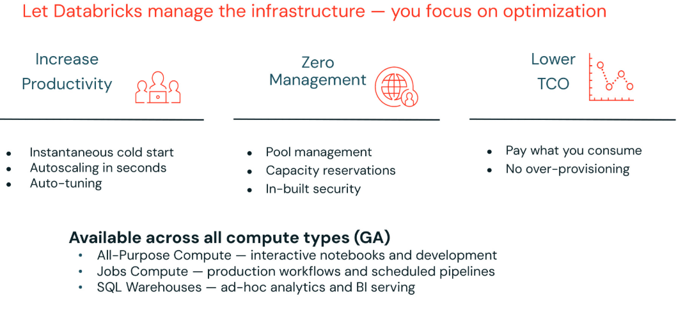
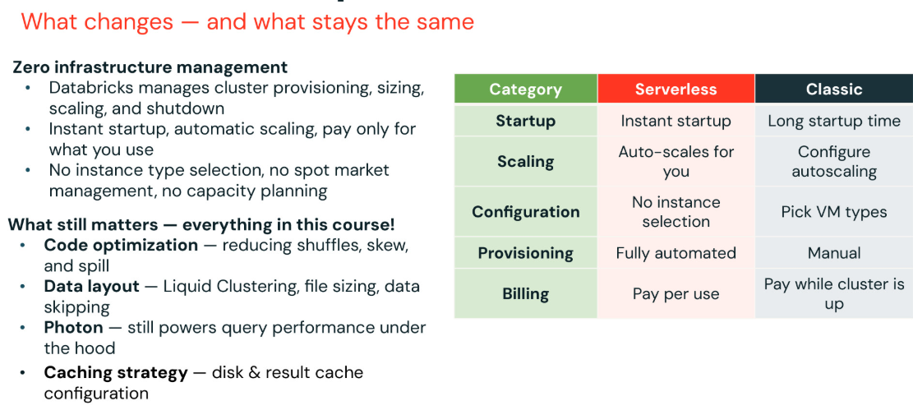
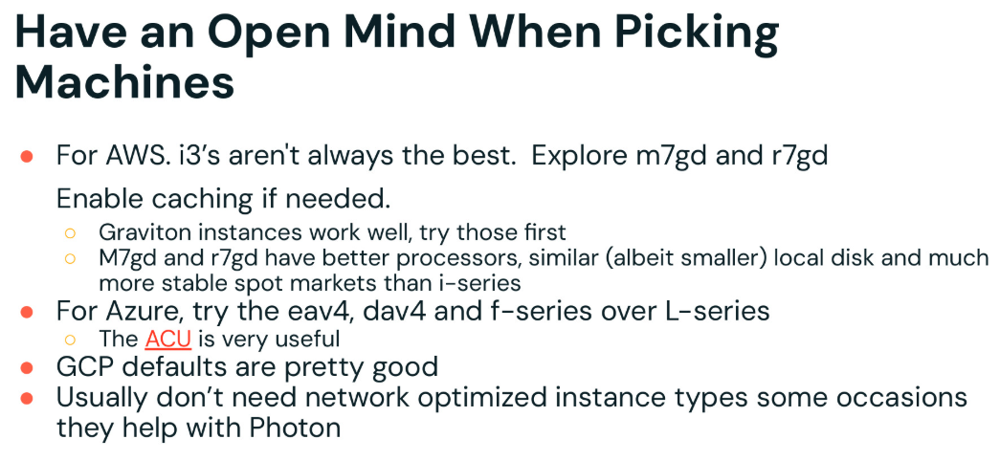
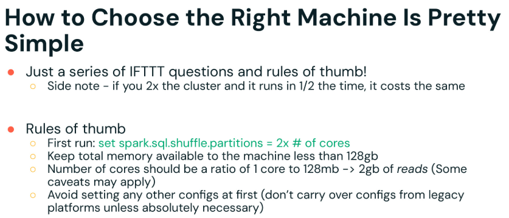
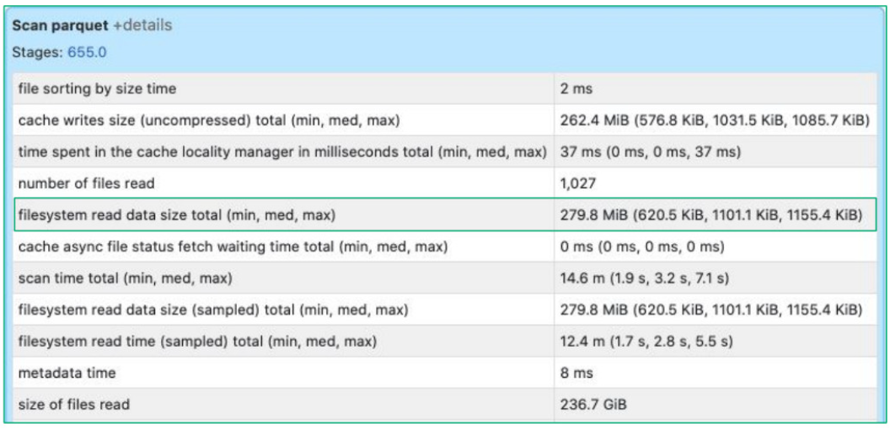
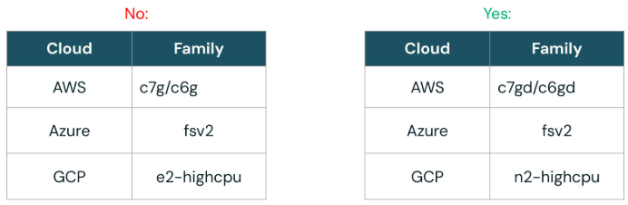
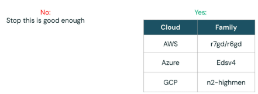

# 4_Fine_Tuning: Die Wahl des richtigen Clusters

## 4_1_Fine Tuning: Die Wahl des richtigen Clusters

Diese Lektion behandelt die Wahl des richtigen Cluster-Typs, Autoscaling, Spot-Instances, Photon und Best Practices zur Cluster-Optimierung.

Code zu entwickeln, bevor er in die Produktion überführt wird. Diese interaktiven Cluster, auch als All Purpose Compute bekannt, sind für Entwicklungsarbeiten und iteratives Testen gedacht. Jobs Compute ist speziell für die Ausführung von Workflow-Jobs konzipiert. Beim Erstellen eines Workflow-Jobs sollte Jobs Compute anstelle von All Purpose Compute verwendet werden, da es die passenden Ressourcen für diese Aufgaben bereitstellt. Jobs-Compute-Cluster sind Single-User, eignen sich gut für Isolation und Debugging und sind in der Regel kostengünstiger. Der dritte Typ sind SQL Warehouses, die Photon für bessere Performance integriert haben und für hohe Nebenläufigkeit, Ad-hoc-SQL-Abfragen und BI-Serving gedacht sind. SQL Warehouses werden speziell für SQL-Workloads verwendet. Jeder dieser Cluster-Typen erfüllt einen anderen Zweck: All Purpose Compute für die Entwicklung, Jobs Compute für die Ausführung von Jobs und SQL Warehouses für BI und SQL-Analysen.

**Cluster-Typen**

- **ALL PURPOSE COMPUTE**
  - Für interaktive Workloads konzipiert, einschließlich Streaming-Workloads.
  - Auto-Scale aktivieren, um bei Bedarf Kapazität hinzuzufügen und die Antwortzeit zu verkürzen
  - Sicherheitsaspekte müssen berücksichtigt werden, da Autoscaling zusätzliche Risiken mit sich bringen kann.
- **JOBS COMPUTE**
  - Läuft auf ephemeren Clustern, die für den Job erstellt werden und nach Abschluss beendet werden
  - Vorab geplant oder über die API übermittelt 
  - Single-User
  - Gut geeignet für Isolation und Debugging
  - Produktions- und wiederkehrende Workloads
  - Geringere Kosten
- **SQL WAREHOUSE**
  - Für hochgradig nebenläufige Ad-hoc-SQL-Analysen und BI-Serving konzipiert
  - Photon inklusive
  - Empfohlen: Shared Warehouse für Ad-hoc-SQL-Analysen, isoliertes Warehouse für spezifische Workloads
  - Serverless verfügbar für sofortigen Start und geringere TCO

------

**Spot-Instances**

Sie können Kosten senken, indem Sie Spot-Instances verwenden, die von Cloud-Anbietern zu einem niedrigeren Preis bereitgestellt werden, weil sie aktuell ungenutzt sind. Diese Instances ermöglichen es Ihnen, verfügbare Compute-Ressourcen zu Preisen unter dem Marktniveau zu nutzen – mit dem Verständnis, dass der Anbieter sie bei steigender Nachfrage zurückfordern kann. Dieser Ansatz eignet sich besonders für nicht geschäftskritische Jobs. Für zusätzliche Stabilität können Sie Ihren Cluster mit einer On-Demand-VM-Instance für den Driver konfigurieren, sodass die Steuerungsebene des Jobs stabil bleibt, während Sie für die Worker Spot-Instances verwenden, um Kosten zu sparen. Wenn der Anbieter die Spot-Instances zurückfordern muss, schlägt Ihr Hauptjob nicht vollständig fehl,
da der Driver weiterhin läuft.
Für wichtige Jobs oder Workflows mit strengen SLAs können Sie Spot-Instances verwenden, aber einen Fallback auf On-Demand-VMs aktivieren. So profitieren Sie von Kosteneinsparungen, wo immer möglich, vermeiden aber auch Unterbrechungen, falls die Spot-Kapazität entzogen wird. Mit diesem Setup bewahren Sie die Zuverlässigkeit für kritische Aufgaben und minimieren gleichzeitig die Kosten, wann immer die Cloud-Umgebung es zulässt.

- Spot-Instances nutzen, um freie VM-Instances zu einem Preis unter dem Marktniveau zu verwenden
  - Gut geeignet für Ad-hoc-/Shared-Cluster
  - Nicht empfohlen für Jobs mit geschäftskritischen SLAs
  - Niemals für den Driver verwenden! Kombinieren Sie On-Demand- und Spot-Instances (mit benutzerdefiniertem Spot-Preis), um Cluster auf unterschiedliche Anwendungsfälle zuzuschneiden

| **SLA**                       | **Spot oder On-Demand**                            |
| ------------------------------ | --------------------------------------------------- |
| Nicht geschäftskritische Jobs   | Driver On-Demand und Worker Spot                     |
| Workflows mit engen SLAs        | Spot-Instance mit Fallback auf On-Demand verwenden   |

------

**Autoscaling**

Autoscaling ermöglicht es einem Databricks-Cluster, seine Größe automatisch an den Bedarf der Workload anzupassen. Wenn für Jobs, Abfragen oder Aufgaben mehr Ressourcen benötigt werden, kann Autoscaling die Anzahl der Worker-Nodes erhöhen und so die Performance bei wachsender Workload verbessern. Sinkt der Bedarf, skaliert Autoscaling den Cluster herunter und reduziert so die Betriebskosten im Vergleich zu einem dauerhaft laufenden, statisch dimensionierten Cluster.
Um Autoscaling zu nutzen, aktivieren Sie die Funktion und legen eine minimale und maximale Anzahl an Workern fest. Dieser Bereich erfordert oft etwas Experimentieren, typischerweise während Entwicklungs- oder Analyse-Workloads, um ein optimales Gleichgewicht zu finden. Für Entwicklung und Ad-hoc-Analysen kann es hilfreich sein, eine höhere Obergrenze zuzulassen, um Flexibilität bei schwankender Nutzung zu gewährleisten. Sobald ein Workflow ausgereift ist und seine Datenmengen vorhersehbar werden, kann Autoscaling weniger notwendig werden. Für einige Produktions-Batch-Jobs reicht ein fest dimensionierter Cluster aus, aber das Setzen einer
Obergrenze kann helfen, gelegentliche Spitzen im Datenvolumen abzufedern. Autoscaling wird auch in Streaming-Umgebungen und mit Spark
Declarative Pipeline unterstützt. Am Horizont zeichnen sich Serverless-Cluster ab. Diese handhaben Autoscaling automatisch und vereinfachen das Workload-Management weiter, indem sie Ressourcen ohne manuelles Eingreifen optimieren.
Diese Flexibilität bedeutet, dass Cluster wechselnde Workloads effizient bewältigen können, ohne Ressourcen zu verschwenden.

- Passt die Cluster-Größe dynamisch an die Workload an
- Kann schneller laufen als ein statisch dimensionierter, unterprovisionierter Cluster
- Kann die Gesamtkosten im Vergleich zu einem statisch dimensionierten Cluster senken
- Das Festlegen des Bereichs für die Anzahl der Worker erfordert etwas Experimentieren

| Anwendungsfall                          | Autoscaling-Bereich                       |
| ---------------------------------------- | ------------------------------------------ |
| Ad-hoc-Nutzung oder Business Analytics   | Große Varianz                              |
| Produktions-Batch-Jobs                   | Nicht nötig oder Puffer an der Obergrenze  |
| Streaming                                | Verfügbar in Spark Declarative Pipeline    |

------

**Photon**

Was also ist Photon?

Photon, unsere Engine mit Weltrekord, erfährt eine starke Akzeptanz bei Kunden:

- Photon hat den bisherigen TPC-DS-Data-Warehouse-Weltrekord um mehr als das 2-Fache pulverisiert!
- Im ETL-Bereich verzeichnen Kunden eine Reduzierung ihrer Compute-Kosten um 40 %
- 6-fach besseres Preis-Leistungs-Verhältnis gegenüber anderen Cloud-Data-Warehouses und insgesamt eine 2- bis 3-fache Reduzierung der Abfragezeiten gegenüber OSS Spark
- Im letzten Quartal ist die Nutzung durch unsere Kunden um das 5-Fache gestiegen!
- Kunden können Photon einfach einführen: keine Codeänderungen oder Tuning nötig, und sie können ihre bevorzugte Sprache verwenden – SQL, Python, Scala, R und Java

Schließlich können Kunden Exploration, ETL, Big Data, Small Data, niedrige Latenz, hohe Nebenläufigkeit, Batch und Streaming durchführen – alles auf einer einzigen Engine und mit einem einzigen API-Set.

------

**Empfehlungen zur Cluster-Optimierung**

Der empfohlene Ansatz zur Cluster-Optimierung hängt von Ihrer Workload ab. Für die Entwicklung im Bereich Data Science und Data Engineering verwenden Sie All-Purpose-Compute-Cluster mit aktiviertem Autoscale und denken Sie daran, Auto Stop einzurichten, damit Sie nicht für ungenutzte Compute-Ressourcen bezahlen. Es ist außerdem am besten, während der Entwicklung mit einer Teilmenge der Daten zu entwickeln und zu testen, um den Ressourcenverbrauch des Clusters gering zu halten. Für Ingestion- oder ETL-Jobs konfigurieren Sie Jobs-Compute-Cluster und dimensionieren diese entsprechend den SLA-Anforderungen des Jobs. Für Ad-hoc-Analysen und
SQL-Analysen verwenden Sie SQL Warehouses, aktivieren Autoscaling und legen die benötigte Anzahl an Workern fest. Auto Stop sollte ebenfalls aktiviert werden – oder noch besser: verwenden Sie Serverless Compute, das für eine Reihe von Jobs, einschließlich BI-Reporting, erhebliche Kosten- und Effizienzvorteile bietet. Für BI-Workloads sollten isolierte SQL Warehouses verwendet und entsprechend den geschäftlichen Anforderungen dimensioniert werden.
Zu den Best Practices gehört außerdem, Spot-Instances für Worker-Nodes zu aktivieren und die neueste LTS-Databricks-Runtime für Performance und Stabilität zu verwenden. Nutzen Sie Photon nach Möglichkeit für verbesserte Performance und Kostenoptimierung, und wählen Sie die neueste VM-Generation – testen Sie zunächst General-Purpose-Typen, bevor Sie Memory- oder Compute-optimierte Typen ausprobieren. Passen Sie Cluster-Größe und -Konfiguration stets an die Anforderungen der Workload an und verfeinern Sie die Dimensionierung beim Übergang von der Entwicklung zur Produktion.

1. **DS- & DE-Entwicklung**: All-Purpose Compute, Auto-Scale und Auto-Stop aktiviert, Entwicklung & Test mit einer Teilmenge der Daten
2. **Ingestion- & ETL-Jobs**: Jobs Compute, Dimensionierung entsprechend dem Job-SLA
3. **Ad-hoc-SQL-Analysen**: (Serverless) SQL Warehouse, Auto-Scale und Auto-Stop aktiviert
4. **BI-Reporting**: Isoliertes SQL Warehouse, dimensioniert entsprechend den BI-SLAs 
5. **Best Practices**:
  6. Spot-Instances auf Worker-Nodes aktivieren
  7. Nach Möglichkeit die neueste LTS-Databricks-Runtime verwenden
  8. Photon verwenden, wenn anwendbar, für die beste TCO
  9. Neueste VM-Generation verwenden, mit General Purpose beginnen, dann Memory-/Compute-optimierte Typen testen

------

**Serverless Compute**

Wir haben Zeit damit verbracht, Classic Compute zu konfigurieren und zu optimieren – Instance-Typen, Autoscaling, Spot-Instances und Photon. Serverless Compute stellt eine andere Frage: Was wäre, wenn Sie all das gar nicht verwalten müssten?

Serverless basiert auf drei Wertversprechen, die Sie auf dieser Folie sehen.

Höhere Produktivität – Sofortiger Kaltstart, Autoscaling in Sekunden und Auto-Tuning bedeuten, dass Ihre Engineers ihre Zeit mit dem Schreiben von Code verbringen, statt auf Cluster zu warten oder Konfigurationen anzupassen.
Kein Management-Aufwand – Pool-Management, Kapazitätsreservierungen und integrierte Sicherheit werden alle automatisch von Databricks übernommen. Einmal einrichten und vergessen. Geringere TCO – Sie zahlen nur für das, was Sie tatsächlich nutzen. Keine Überprovisionierung, keine Kosten für ungenutzte Cluster.

Dies ist inzwischen für All-Purpose Compute, Jobs Compute und SQL Warehouses generell verfügbar (Generally Available) – keine Preview mehr.

Ein wichtiger Hinweis: Serverless übernimmt die Infrastrukturebene, aber die Optimierungsebene liegt weiterhin in Ihrer Verantwortung. Shuffles, Spill, Liquid Clustering, Photon – all das gilt weiterhin. Databricks liefert Ihnen automatisch die beste Infrastruktur; Ihre Aufgabe ist es, dafür den besten Code und das beste Daten-Layout bereitzustellen.

------

**Serverless Compute**

In diesem Abschnitt haben wir viel behandelt – Autoscaling, Spot-Instances, Photon sowie die Wahl des richtigen Cluster-Typs und der richtigen Instance für Ihre Workload. Bevor wir zum Entscheidungsleitfaden für die Instance-Auswahl übergehen, möchte ich einen Moment innehalten, um herauszuzoomen und über Serverless Compute zu sprechen, da es die Diskussion rund um Infrastruktur erheblich verändert.

Serverless ist inzwischen für alle drei Compute-Typen in Databricks generell verfügbar – All-Purpose für Ihre Notebooks und Entwicklungsarbeit, Jobs Compute für Ihre Produktions-Pipelines und SQL Warehouses für Ihre Ad-hoc-Analysen und BI-Workloads. In der Praxis bedeutet das, dass Databricks alles übernimmt, worüber Sie bisher manuell nachdenken mussten – die Bereitstellung des richtigen Instance-Typs, das Management des Spot-Markts, die Konfiguration von Autoscaling-Schwellenwerten und das Herunterfahren von Clustern bei Inaktivität. Sie erhalten Startzeiten von etwa 15 bis 30 Sekunden, verglichen mit den 5 bis 12 Minuten, die für Classic Compute typisch sind, und zahlen nur für die Compute-Zeit, die Ihre Workload tatsächlich verbraucht.

Und hier kommt der entscheidende Punkt für diesen Kurs: Serverless ändert nichts an dem, was wir Ihnen beigebracht haben. Wenn Ihr Code übermäßige Shuffles verursacht, wird er auch auf Serverless langsam sein. Wenn Ihr Daten-Layout schlecht ist – kleine Dateien, kein Liquid Clustering, kein Data Skipping – wird Serverless das nicht auf magische Weise beheben. Photon treibt weiterhin die Query-Engine im Hintergrund an. Databricks übernimmt die Infrastrukturebene; Sie sind weiterhin für die Code- und Datenebene verantwortlich.

## 4_2_Die besten Instance-Typen wählen

Diese Lektion zeigt Ihnen, wie Sie die besten Instance-Typen auswählen, indem Sie Maschinenmerkmale, Dimensionierung, den Spot-Markt und Shuffle-Partition-Strategien berücksichtigen.

Verlassen Sie sich bei der Wahl von Maschinentypen für Cloud-Workloads nicht nur auf vertraute Optionen. Probieren Sie in AWS neben i3 auch m7gd und r7gd für bessere Prozessoren und stabilere Spot-Preise aus. Aktivieren Sie bei Bedarf Caching, und ziehen Sie Graviton-Instances für ein kosteneffizientes Performance-Verhältnis in Betracht. Verwenden Sie in Azure eav4, dav4 oder die F-Serie vor der L-Serie, und prüfen Sie die ACU-Metrik, um die VM-Performance zu vergleichen. Für GCP eignen sich die empfohlenen Standardwerte meist gut.
Netzwerkoptimierte Instances werden nicht oft benötigt, können aber bei Photon oder bandbreitenintensiven Workloads hilfreich sein. Testen Sie stets unterschiedliche Instance-Typen und nutzen Sie den Spot-Markt mit Bedacht, um Einsparungen und Stabilität in Einklang zu bringen. Flexibilität und Offenheit gegenüber Alternativen sind der beste Weg, um die am besten geeigneten Ressourcen für Ihre Workloads zu finden.

------

Die Wahl der richtigen Maschine für Ihre Workload ist unkompliziert, wenn Sie ein paar grundlegende Faustregeln und einfache „Wenn-dies-dann-das"-Entscheidungen befolgen. Es lohnt sich, daran zu denken: Wenn Sie einen doppelt so großen Cluster verwenden und dieser den Job in der halben Zeit fertigstellt, bleiben die Gesamtkosten in etwa gleich – Sie sparen aber wertvolle Zeit. Das bedeutet, dass ein größerer Cluster manchmal nicht teurer ist, wenn er schnellere Ergebnisse liefert, da eingesparte Zeit genauso wertvoll sein kann wie eingesparte Kosten.
Für Ihren ersten Durchlauf ist es eine gute Regel, `spark.sql.shuffle.partitions` auf das Doppelte der Anzahl der Cores in Ihrem Cluster zu setzen. Achten Sie darauf, den insgesamt verfügbaren Speicher jeder Maschine unter 128 GB zu halten. Verwenden Sie bei der Konfiguration der Cores ein Verhältnis von einem Core pro 128 MB bis 200 GB gelesener Daten – beachten Sie jedoch, dass dies eine Richtlinie ist und je nach den Besonderheiten Ihrer Workload Ausnahmen auftreten können.
Am besten vermeiden Sie es, beim Start Konfigurationseinstellungen aus anderen Umgebungen oder früheren Projekten zu übernehmen, es sei denn, es gibt einen triftigen Grund dafür. Beginnen Sie mit diesen grundlegenden Richtlinien, testen Sie Ihr Setup und passen Sie Konfigurationen nur bei Bedarf basierend auf der beobachteten Performance an. Dieser sorgfältige, schrittweise Ansatz hilft Ihnen dabei, die besten Ressourcen auszuwählen und optimale Performance sowie Kosteneffizienz für Ihre Workload zu erzielen.

------

Die im Spark UI angezeigte Dateisystem-Lesedatenmenge zeigt Ihnen, wie viele Daten während eines Jobs von der Festplatte gelesen werden. Die Überprüfung dieses Werts hilft Ihnen zu beurteilen, ob Größe und Konfiguration Ihres Clusters geeignet sind, und kann eventuell nötige Anpassungen für Effizienz oder Performance aufzeigen.

Die Wahl der richtigen Maschine ist ziemlich einfach

- Faustregeln

------

Bei der Auswahl von Instance-Typen sollten Sie sich vor allem auf das Verhältnis von Cores zu RAM, den Prozessortyp, lokalen versus entfernten Storage sowie das Storage-Medium konzentrieren. Diese Faktoren – etwa wie viel Speicher pro Core zur Verfügung steht, Geschwindigkeit und Generation des Prozessors sowie ob Ihr Storage schneller lokaler NVMe- oder langsamerer entfernter Speicher ist – haben den größten Einfluss auf Ihre Query-Performance. In AWS bieten beispielsweise Instances der C5-Familie ein Verhältnis von einem Core zu zwei Gigabyte RAM mit Intel-Prozessoren und lokalem NVMe-Storage. Ähnliches gilt für die Instance-Auswahl bei Azure und GCP. Die Priorisierung dieser grundlegenden Hardware-Spezifikationen stellt sicher, dass Sie für eine effiziente und schnelle Query-Ausführung gerüstet sind.

------

Bei der Dimensionierung des Drivers im Vergleich zu den Workern in einem Spark-Cluster ist es meist am einfachsten, die Größe des Drivers einfach an die der Worker anzupassen. Das vermeidet unnötige Komplexität und funktioniert für nahezu alle Workloads gut, da der Driver in typischen Spark-Anwendungen deutlich weniger Arbeit leistet als die Worker. Ein Driver mit 4-8 Cores und 16-32 GB RAM reicht für die meisten Szenarien aus. 

Wenn Sie die Kosten so weit wie möglich minimieren möchten, können Sie einen etwas kleineren Driver in Betracht ziehen, aber in der Regel besteht kein Grund, die Sache zu verkomplizieren. Beachten Sie jedoch, dass der Driver mehr Speicher benötigt, wenn Sie große Datenmengen in Delta-Tabellen committen. Diese Richtlinien gelten nicht mehr, wenn Sie viele Streams oder gleichzeitige Jobs auf derselben Maschine ausführen oder besonders große Commits verarbeiten – etwa das Schreiben von 100.000 oder mehr Dateien in eine Delta-Tabelle oder das Sammeln großer Datenmengen auf dem Driver zur Verwendung mit pandas oder R. In diesen Ausnahmefällen benötigen Sie einen größeren, sorgfältiger dimensionierten Driver, um Speicherprobleme zu vermeiden

------

Bei der Verwendung von Spot-VMs ist es wichtig zu wissen, dass jeder Instance-Typ unterschiedliche Verfügbarkeits- und Preisersparnisse bietet. Der Spot-Markt kann Ihnen erhebliche Einsparungen bei der Infrastruktur ermöglichen, aber Ersparnis und Zuverlässigkeit variieren je nach Instance. Während i3-Instances beispielsweise etwa 70 % Ersparnis gegenüber On-Demand-Preisen bieten können, müssen Sie möglicherweise mit höheren Unterbrechungsraten rechnen, was sie für manche Workloads weniger attraktiv macht. r5d-Instances hingegen bieten oft noch bessere Ersparnisse – bis zu 85 % – und eine geringere Unterbrechungshäufigkeit, teils unter 5 %. Die Wahl von Instance-Typen wie R5d Large oder Extra Large kann Ihre Kosten erheblich senken und gleichzeitig das Risiko von Unterbrechungen durch den Cloud-Anbieter minimieren. Vergleichen Sie daher sowohl die potenzielle Ersparnis als auch die Unterbrechungshäufigkeit, wenn Sie Spot-VMs für Ihren Cluster auswählen.

**Überlegungen zum Spot-Markt**

- Der Spot-Markt ist eine hervorragende Möglichkeit, bei der Infrastruktur Geld zu sparen.
- Jeder Instance-Typ hat in jeder Region ein unterschiedliches Maß an Verfügbarkeit und Preisersparnis.
- Beispiel: i3s sind nicht ideal, r5d's sehen deutlich besser aus.

------

**IFTTT – Schritt 1**

Möchten Sie Photon verwenden?

Stellen Sie sich bei der Entscheidung über Ihre Cluster-Konfiguration zunächst die Frage, ob Sie Photon verwenden möchten. Wenn Sie Photon nicht nutzen wollen, gehen Sie zum nächsten Satz an Überlegungen für Ihre VM-Auswahl über. Wenn Sie Photon nutzen möchten, können Sie mit der Liste der empfohlenen, für Photon optimierten VM-Typen als Ausgangspunkt beginnen. Dieser einfache Entscheidungsprozess hilft Ihnen, Ihre Maschinenwahl für eine effiziente und effektive Cluster-Einrichtung zu steuern.

------

**IFTTT – Schritt 2**

Wenn Sie Photon nicht verwenden, lautet die nächste Frage, ob es sich bei Ihrem Job um eine ETL-Workload mit Joins, Windows, Group-by oder Aggregationen handelt. Lautet die Antwort Nein, gibt es spezifische Instance-Empfehlungen, die sich am besten für leichtere oder andere Workloads eignen. Lautet die Antwort Ja, gibt es andere Empfehlungen, die auf die Unterstützung dieser komplexeren Datenoperationen ausgerichtet sind. Dieser Ansatz hilft Ihnen, Ihren Maschinentyp an die Anforderungen Ihres konkreten Jobs anzupassen.

------

**IFTTT – Schritt 3**

Sobald Sie einen Instance-Typ gewählt und Ihren Cluster anhand der Faustregeln eingerichtet haben, führen Sie Ihren Job aus und prüfen anschließend im Spark UI die am längsten laufende Query. Achten Sie insbesondere darauf, ob Spill auftritt. Tritt kein Spill auf, ist Ihr Setup ausreichend. Sehen Sie Spill, ist das Ihr Signal für weitere Anpassungen. Setzen Sie zunächst `spark.sql.shuffle.partitions` passend zur Größe der größten Shuffle-Read-Stage – passt alles in 200 MB, nutzen Sie das als Referenzwert. Setzen Sie Ihre Shuffle-Partitionen anschließend auf „auto", damit Spark das Partitionieren übernimmt, um die Performance zu optimieren und Spill zu reduzieren. Dieser Ansatz erlaubt es Ihnen, Ihre Umgebung Schritt für Schritt zu optimieren und Probleme erst dann anzugehen, wenn sie auftreten.

Führen Sie den Job mit dem Instance-Typ aus, befolgen Sie unsere Faustregeln, und öffnen Sie das SQL UI der am längsten laufenden Query – sehen Sie Spill?

------

**IFTTT – Schritt 4**

Prüfen Sie nach der Aktualisierung Ihrer Shuffle-Partitionen erneut im Spark UI, ob noch Spill auftritt. Tritt kein Spill mehr auf, sind Ihr Cluster und Ihre Einstellungen gut abgestimmt, und Sie können loslegen. Tritt weiterhin Spill auf, wenden Sie den nächsten Satz an Empfehlungen an und führen Sie den Job erneut aus.

Führen Sie den Job mit den aktualisierten Shuffle-Partitionen aus – sehen Sie weiterhin Spill?

------

**IFTTT – Schritt 5**

Wiederholen Sie diesen Prozess – Einstellungen anpassen und die Ergebnisse beobachten – so lange, bis Sie Spill eliminiert haben und Ihr Job effizient läuft. Diese schrittweise Optimierung stellt sicher, dass Ihre Konfiguration präzise auf die Anforderungen Ihrer Workload abgestimmt ist.

Führen Sie den Job mit dem aktualisierten Instance-Typ aus – sehen Sie weiterhin Spill?

------

**Hinweis zu Shuffle-Partitionen**

Halten Sie es bei Shuffle-Partitionen einfach. Sie können Shuffle-Partitionen auf „auto" setzen und Spark die Anpassungen für Sie vornehmen lassen. Wenn Sie es manuell einstellen möchten, öffnen Sie das Stage-UI in Spark und suchen Sie die größte Shuffle-Read-Größe. Teilen Sie diese Größe durch 200, um die Anzahl der zu setzenden Shuffle-Partitionen zu bestimmen. Dieser Ansatz hilft Ihnen, die Partitionsgröße an Ihre Workload anzupassen und die Effizienz zu wahren.

------

**Vergessen Sie nicht, das Event Log zu überprüfen!**

Vergessen Sie das Event Log nicht. Das Event Log ist äußerst nützlich, um das Verhalten Ihres Clusters zu überwachen und Probleme zu diagnostizieren, insbesondere bei Spot-Ausfällen. Es zeigt Ihnen wichtige Details, etwa wie sich der Cluster während des Autoscaling in der Größe verändert – von höheren zu niedrigeren Worker-Zahlen und umgekehrt. Durch die Überprüfung des Event Logs können Sie feststellen, wie viele Worker Sie tatsächlich benötigen, welche VM-Typen am besten funktionieren und ob Fehler oder Unterbrechungen auftreten. Das Event Log sollte immer die erste Anlaufstelle sein, wenn Sie Ihren Cluster optimieren oder Probleme beheben.

Spot-Ausfälle passieren. Sie verlangsamen die Dinge. Wir wissen es. Vergessen Sie nicht, das Event Log zu überprüfen. Es ist wahrscheinlich das Erste, was Sie tun sollten.

