# Automated Deployment with Declarative Automation Bundles

[website](https://customer-academy.databricks.com/learn/learning-plans/10/data-engineer-learning-plan/courses/3489/automated-deployment-with-declarative-automation-bundles/lessons)

Kursmaterial und Code unter: [Further Learning](https://customer-academy.databricks.com/learn/courses/3724/Automated%20Deployment%20with%20Declarative%20Automation%20Bundles)

[Vocareum](https://labs.vocareum.com/main/vnav.php?m=vnb&mode=s&asnid=5140852&stepid=5140853&hideNavBar=1#)

# 1_DevOps- und CI/CD-Überblick

## 1_1_DevOps-Überblick

Schauen wir uns kurz an, was DevOps ist.

DevOps ist eine Kultur und eine Reihe von Praktiken, die Best Practices aus der Softwareentwicklung mit IT-Betrieb kombinieren, um Software schneller, effizienter und mit höherer Qualität auszuliefern.

Es geht darum, die Zusammenarbeit zwischen Entwicklungs- und Betriebsteams zu fördern, um Arbeitsabläufe zu automatisieren, Prozesse zu vereinfachen und die kontinuierliche Auslieferung von Anwendungen sicherzustellen.

Die wichtigsten Vorteile von DevOps sind:

- Schnellere Deployment-Zyklen
- Verbesserte Zusammenarbeit zwischen Teams
- Höhere Systemzuverlässigkeit
- Bessere Skalierbarkeit und Effizienz

Kurz gesagt: DevOps ist eine Möglichkeit, Software schnell und zuverlässig zu bauen und auszuliefern, indem die Lücke zwischen Entwicklung und Betrieb geschlossen wird.

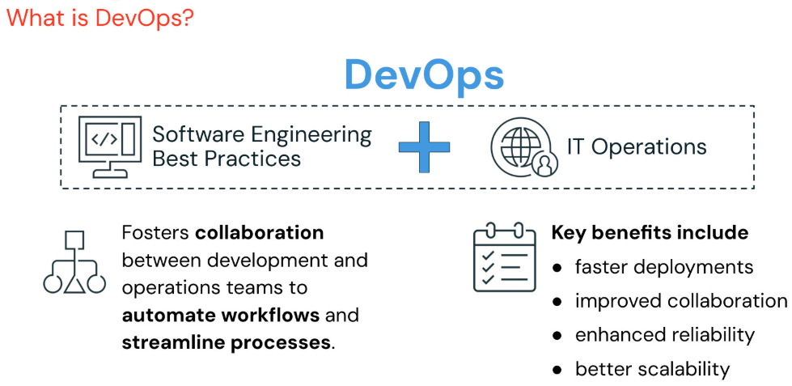

------

Im DevOps-Lebenszyklus geht es um eine nahtlose Zusammenarbeit zwischen Entwicklungs- und Betriebsteams, um hochwertige Software auszuliefern.

Er beginnt mit Planung, Coding, Build und Test. Anschließend geht es weiter mit Release, Deployment, Betrieb und Monitoring.

Der DevOps-Lebenszyklus wird kontinuierlich durchlaufen, sobald das Projekt Fixes, Updates oder neue Features benötigt.

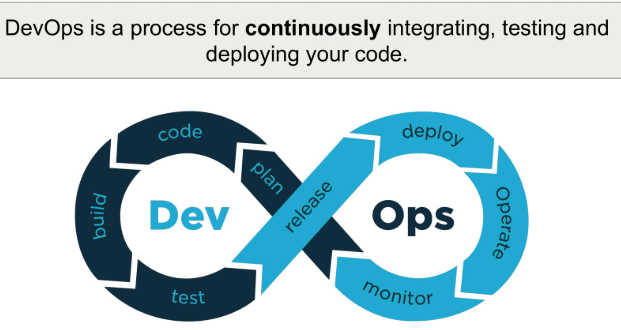

------

**DevOps für Data Engineering und Machine Learning**

Wir können DevOps-Prinzipien auf Data Engineering und Machine Learning anwenden. Denken Sie daran: Bei DevOps geht es um die Automatisierung von Prozessen, verbesserte Zusammenarbeit, Testing und schnellere Auslieferung.

DataOps ist eine Teilmenge von DevOps und wendet DevOps auf Data Engineering an. Es automatisiert das Management von Datenpipelines und sorgt für einen reibungslosen, zuverlässigen Datenfluss von der Erfassung bis zur Verarbeitung. Das bedeutet weniger Engpässe und schnellere Erkenntnisse.

MLOps bedeutet, DevOps auf Machine Learning anzuwenden. Es vereinfacht den Prozess der Bereitstellung und Verwaltung von ML-Modellen und stellt sicher, dass Modelle schnell von der Entwicklung in die Produktion überführt und hinsichtlich ihrer Performance überwacht werden.

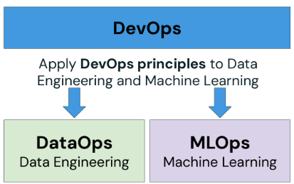

------

**DataOps = DevOps für Data Engineering**

DataOps ist im Grunde DevOps für Data Engineering – es wendet dieselben Prinzipien von Automatisierung, Zusammenarbeit und kontinuierlicher Verbesserung auf Datenworkflows an. So wie DevOps die Softwareauslieferung optimiert, konzentriert sich DataOps auf die Optimierung von Fluss, Qualität und Verwaltung von Datenpipelines.

Letztlich geht es darum, sich zu überlegen, wie DevOps-Prinzipien und -Kultur auf Ihre Data-Engineering-Pipelines angewendet werden können.

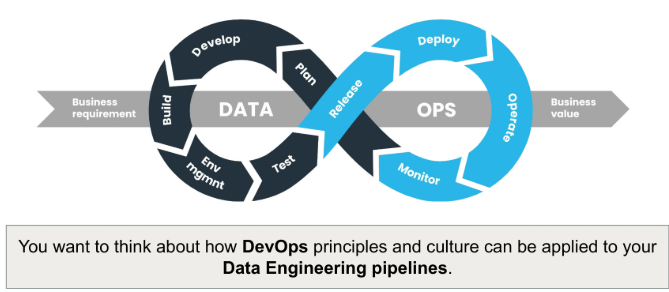

## 1_2_Überblick über Continuous Integration und Continuous Deployment/Delivery (CI/CD)

**Rückblick auf die Rolle von CI/CD in DevOps**

Schauen wir uns kurz auf hoher Ebene an, welche Rolle CI/CD in DevOps spielt.

CI/CD ist eine zentrale Teilmenge der DevOps-Praktiken, die sich auf die Automatisierung von Code-Integration, Testing und Auslieferung konzentriert. Innerhalb des DevOps-Lebenszyklus legt Continuous Integration (CI) den Schwerpunkt auf Planung, Entwicklung, Umgebungsverwaltung und das Testen der Pipelines.

Continuous Deployment/Delivery (CD) hingegen konzentriert sich auf die Automatisierung von Release-Prozessen, Deployment, Betrieb und Monitoring dieser Pipelines.

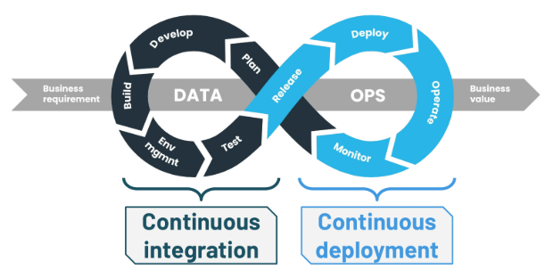

------

**Rückblick auf die Rolle von CI/CD in DevOps**

Continuous Integration (CI) im Überblick

Bei CI werden regelmäßig Codeänderungen von mehreren Mitwirkenden in ein zentrales Repository zusammengeführt (gemerged), und es werden automatisierte Tests ausgeführt, um die Codequalität sicherzustellen. Tests, die fehlschlagen, gelangen nicht in Ihren Quellcode.

Stellen Sie sich zum Beispiel drei Entwickler vor, die an einem Projekt arbeiten und Updates oder Fixes umsetzen.

Die Entwickler pushen ihren Code in ein Versionskontrollsystem, das automatisch Tests ausführt, bevor der Commit durchgeführt wird. So wird sichergestellt, dass Probleme im Code erkannt werden. Schlagen die Tests fehl, wird der Commit gestoppt. Bestehen die Tests, werden die Änderungen übernommen.

Wie Testing und Commits in die Versionskontrolle gehandhabt werden, hängt von der Branching-Strategie ab, die in Ihrer Organisation festgelegt ist. Die Entscheidung für die richtige Branching- und Teststrategie ist entscheidend, um Qualität und reibungslose Arbeitsabläufe sicherzustellen.

Hier sind vier zentrale Vorteile von Continuous Integration:

- Erstens, frühzeitige Erkennung von Problemen – durch häufiges Integrieren von Code werden Bugs und Konflikte frühzeitig erkannt und lassen sich so leichter beheben.
- Zweitens, schnellerer Entwicklungszyklus – häufige Integration beschleunigt die Auslieferung neuer Features und Fixes.
- Drittens, verbesserte Zusammenarbeit und Codequalität – regelmäßige Integration führt zu saubererem, modularerem Code und besserer Teamarbeit.
- Schließlich, automatisiertes Testing und Validierung – bei jeder Integration laufen automatisierte Tests, um sicherzustellen, dass der Code stabil ist und mit bestehenden Funktionen zusammenarbeitet.

Diese Vorteile – frühzeitige Fehlererkennung, schnellere Auslieferung, bessere Zusammenarbeit und automatisiertes Testing – machen Continuous Integration unverzichtbar für eine reibungslose Entwicklung.

Bei CI werden regelmäßig **Codeänderungen zusammengeführt (merged)**, die von **mehreren Mitwirkenden** stammen, in ein **zentrales Repository**, und es laufen **automatisierte Tests**, um die Codequalität sicherzustellen.

**Slide 6: Continuous Integration (CI)**

- **Titel**: Was ist Continuous Integration (CI)?
- **Inhalt**:
  - **Definition**: CI bedeutet, dass Codeänderungen von mehreren Mitwirkenden regelmäßig in ein zentrales Repository zusammengeführt werden und automatisierte Tests laufen, um die Codequalität sicherzustellen.
  - **Wichtige Praktiken**:
- Häufige Commits (mehrmals täglich)
- Automatisierter Build und Test bei jedem Commit
- Schnelles Feedback bei Fehlern
  - **Visualisierung**: Ein Flowchart des CI-Prozesses (Developer-Commit -> Build-Server -> Test -> Feedback-Schleife).

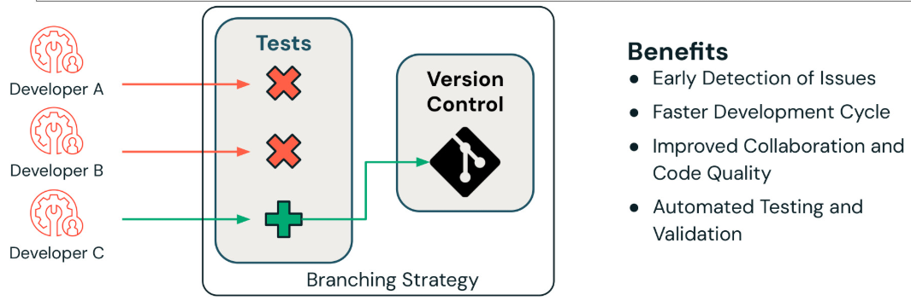

------

**Rückblick auf die Rolle von CI/CD in DevOps**

Schauen wir uns kurz die grundlegenden Testing-Schritte innerhalb von CI/CD an.

Die Testing-Schritte, denen Sie folgen sollten, sind Teil der sogenannten Testpyramide. Die Testpyramide kategorisiert verschiedene Testarten: Unit-Tests, Integrationstests und Systemtests. Das Testen Ihres Codes ist extrem wichtig.

Die Basis der Pyramide bilden Unit-Tests, die einzelne Funktionen oder Methoden isoliert testen. Da es sich um kleine, einzelne Funktionen handelt, können sie in der Regel schnell, häufig und automatisiert ausgeführt werden, um sicherzustellen, dass die Funktionen wie erwartet arbeiten. Unit-Tests bilden das Fundament, weil sie kostengünstig sind und die breiteste Abdeckung bieten. Ein Beispiel wäre das Testen, ob eine PySpark-Methode wie erwartet funktioniert.

Als Nächstes folgen Integrationstests, die das Zusammenspiel zwischen verschiedenen Komponenten oder Systemen testen. Diese sind in der Regel langsamer und teurer als Unit-Tests, bieten aber eine größere Sicherheit, dass Komponenten korrekt zusammenarbeiten. Innerhalb von Databricks drehen sich diese typischerweise um die Verwendung von Notebooks, Lakeflow Declarative Pipelines und/oder Lakeflow Jobs. Ein Beispiel wäre das Testen, ob eine PySpark-Methode und eine Declarative Pipeline korrekt zusammenarbeiten.

Schließlich testen Systemtests die gesamte Anwendung und stellen sicher, dass alle Teile in einem realitätsnahen Szenario zusammenarbeiten. Diese sind in der Regel langsam, teuer und laufen häufig in einer produktionsähnlichen Umgebung. Ein Beispiel wäre bei unserer End-to-End-Datenpipeline das Testen, ob die Datenpipeline innerhalb eines Workflows wie erwartet funktioniert und unsere gewünschten Ergebnisse erzeugt.

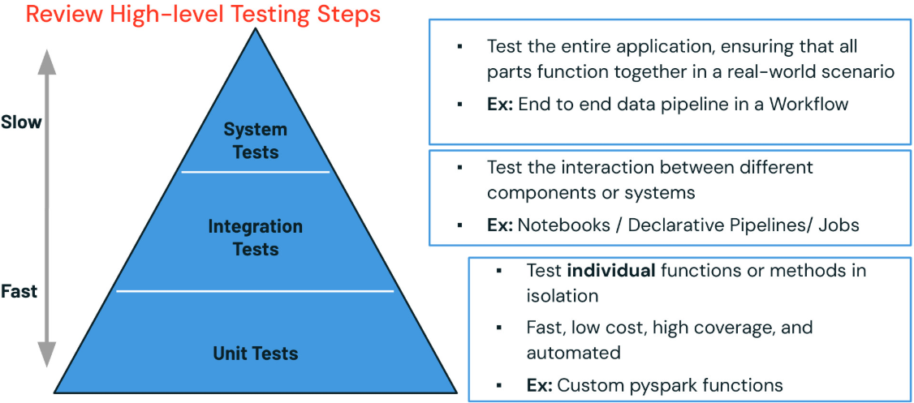

Der Continuous-Delivery/Deployment-(CD)-Teil ist bei CI/CD extrem wichtig.

Bei Continuous Delivery geht es darum, den Prozess der Übertragung von Änderungen in Staging- oder Pre-Production-Umgebungen zu automatisieren. Dieser Aufbau ermöglicht nahtlose Updates und bietet die Flexibilität, bei Bedarf manuell in die Produktion zu deployen – so werden reibungslose, kontrollierte Releases sichergestellt. Zum Beispiel können wir uns, nachdem die Continuous-Integration-Schritte abgeschlossen sind und Tests durchgeführt wurden, dazu entscheiden, unsere Datenpipeline in die Produktion zu deployen.

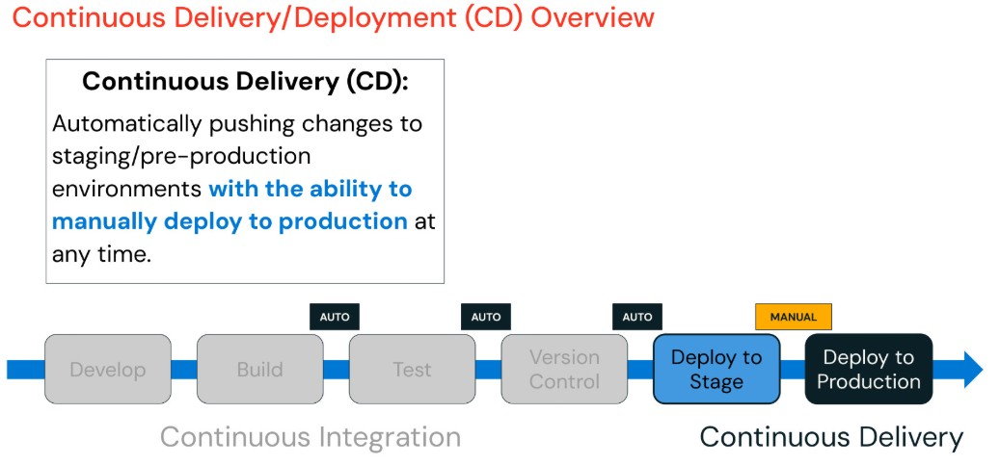

------

Continuous Deployment treibt die Automatisierung noch einen Schritt weiter. Sobald eine Änderung alle Tests besteht, wird sie automatisch in die Produktion deployt, sodass neue Features oder Fixes schnell und nahtlos ausgeliefert werden – ohne manuelles Eingreifen.

Wenn Ihre Continuous-Integration-Prozesse zum Beispiel aufeinander abgestimmt und gut implementiert sind, können wir unsere Datenpipeline automatisch von der Entwicklung über Staging bis zur Produktion deployen und manuelle Deployment-Schritte vermeiden. Die Umsetzung dieser Technik erfordert gut durchdachte Tests, um sicherzustellen, dass die Pipeline auch wirklich deployt werden sollte.

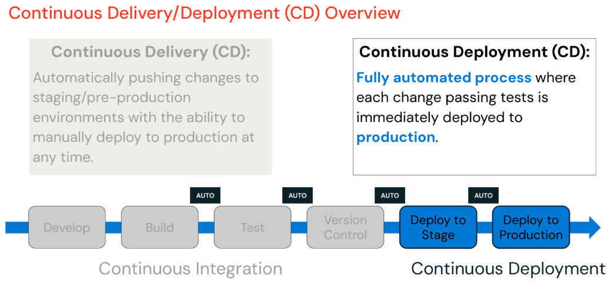

------

Betrachtet man den Überblick über CI/CD auf hoher Ebene, wollen wir Continuous Integration (Entwickeln, Bauen, Testen und Versionskontrolle) mit Continuous Delivery/Deployment (Deployment des Projekts in Stage und Produktion) kombinieren. Dieser gesamte Prozess wird automatisiert, um schnell und fehlerfrei zu entwickeln.

Letztlich vereinfacht der CI/CD-Prozess die Entwicklung Ihrer Datenpipelines, indem Testing und Deployment automatisiert werden, was zu schnelleren, zuverlässigeren Releases führt.

Dieser Ansatz minimiert manuelle Fehler, verbessert die Zusammenarbeit und stellt sicher, dass hochwertige Software schnell und konsistent ausgeliefert wird.

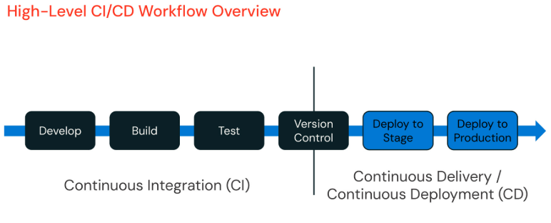

------

**Isolieren von Umgebungen für CI/CD**

Das Isolieren Ihrer Umgebungen für die verschiedenen Entwicklungsphasen ist entscheidend für die Entwicklung einer CI/CD-Pipeline. So wird sichergestellt, dass Code in der Entwicklungs- und Staging-Umgebung entwickelt und getestet wird, bevor er die Produktionsumgebung berührt.

Das minimale Setup besteht aus zwei Umgebungen: „Development & Stage“ und „Production“ – dies kann jedoch je nach den Anforderungen Ihrer Organisation variieren.

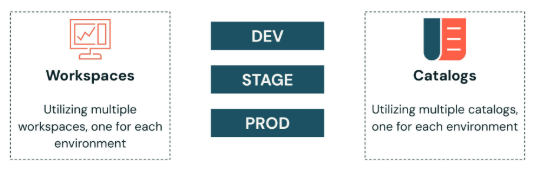

------

**Einrichten Ihrer Daten für CI/CD**

Innerhalb einer CI/CD-Pipeline

In der Entwicklung werden Daten häufig anonymisiert oder mithilfe synthetischer Datensätze generiert, um schnelle Entwicklung und Tests zu ermöglichen, ohne die Privatsphäre oder die Integrität der Produktionsdaten zu gefährden.

Wenn Sie über eine Staging-Umgebung verfügen, sollten die Staging-Daten in Struktur und Umfang eng an die Produktion angelehnt sein, wobei sensible Informationen anonymisiert oder bereinigt werden, um realistisches Testen und Validieren zu gewährleisten.

Produktionsdaten sind live, vollständig operativ und werden kontinuierlich aktualisiert, enthalten echte Nutzerdaten und müssen mit hohen Sicherheits-, Datenschutz- und Compliance-Standards behandelt werden.

Jede Umgebung sollte über Daten verfügen, die für ihren jeweiligen Zweck geeignet sind, wobei Realismus, Sicherheit und Compliance in jeder Phase ausbalanciert werden müssen. Wie dies umgesetzt wird, hängt von Ihrer Organisation und der Sensibilität Ihrer Daten ab.

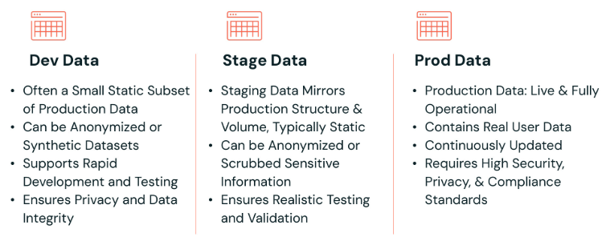

------

**Überblick über Deployment-Tools in Databricks**

Es stehen mehrere Tools zur Verfügung, um Ihre Databricks-Projekte zu deployen.

Zunächst können Sie die Databricks REST API verwenden. Die REST API bietet direkten Zugriff auf die Databricks-Funktionalität über HTTP-Requests. Dabei müssen Sie HTTP-Requests manuell erstellen und die zurückgegebenen Antworten selbst verarbeiten.

Als Nächstes hilft das Databricks SDK dabei, Entwicklung und Deployment innerhalb der Databricks Data Intelligence Platform zu beschleunigen. Es deckt alle öffentlichen Databricks-REST-API-Operationen ab und unterstützt mehrere Programmiersprachen, darunter Python, Java, Go und R.

Ein weiteres Tool, das Sie verwenden können, ist die Databricks CLI. Die Databricks CLI bietet eine einfach zu bedienende Oberfläche zur Automatisierung von Aufgaben über das Terminal, die Eingabeaufforderung oder Bash-Skripte. Zusätzlich ermöglicht Ihnen die Databricks CLI die Nutzung von Declarative Automation Bundles (DABs), um Infrastructure as Code für Databricks zu schreiben. In diesem Kurs konzentrieren wir uns auf diese Technik.

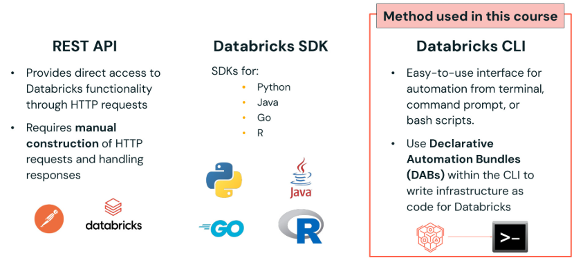

------

**Verwenden der Databricks CLI**
Verbindung und Authentifizierung

Es gibt verschiedene Möglichkeiten, die Databricks CLI zu verwenden, je nach Ihren Anforderungen.

Zunächst können Sie das Databricks Web-Terminal nutzen, um Databricks-CLI-Befehle direkt über die Web-Oberfläche auszuführen.

Dieses Terminal ermöglicht es Ihnen, Shell-Befehle innerhalb von Databricks auszuführen, wodurch die Verwaltung und Interaktion mit Ihrer Umgebung erleichtert wird.

Standardmäßig wird die neueste Version der Databricks CLI verwendet, sodass Sie stets Zugriff auf die aktuellsten Funktionen haben.

Die Authentifizierung basiert auf dem aktuellen Benutzer, sodass Sie automatisch authentifiziert werden, um Befehle entsprechend Ihren Berechtigungen auszuführen.

Beachten Sie jedoch, dass diese Funktion in Ihrer Umgebung aktiviert sein muss, bevor Sie das Web-Terminal nutzen können.

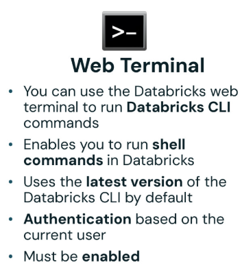

------

Sie können die Databricks CLI auch innerhalb einer Integrated Development Environment (IDE) wie VSCode installieren und ausführen.

Bei der Verwendung von VSCode ist es wichtig, sich an Ihrem Databricks-Workspace zu authentifizieren, um die CLI-Befehle ausführen zu können.

Zusätzlich bietet VSCode die Databricks VSCode Extension, die zusätzliche Funktionen bereitstellt, um Ihren Entwicklungsprozess zu verbessern.

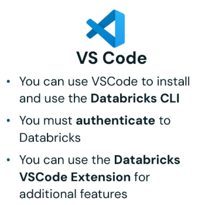

------

Eine weitere Technik, die Sie nutzen können, sind Databricks Notebooks.

Innerhalb von Notebooks können Sie Shell-Befehle direkt über den %sh-Magic-Befehl ausführen.

Dies ermöglicht es Ihnen, die Databricks CLI zu installieren und zu verwenden, sodass Sie mit Ihrer Databricks-Umgebung über die Kommandozeile interagieren können.

Um die Databricks CLI innerhalb eines Notebooks zu verwenden, müssen Sie sich mithilfe eines Tokens authentifizieren, um einen sicheren Zugriff auf Ihren Databricks-Workspace zu gewährleisten.

In diesem Kurs verwenden wir Notebooks, um Databricks-CLI-Befehle auszuführen, da diese Methode Einfachheit und einen leichten Einstieg bietet. Bitte beachten Sie jedoch, dass dieser Ansatz möglicherweise nicht der beste für die Anforderungen Ihrer Organisation ist. Während er in einer Lernumgebung gut funktioniert, benötigen Sie in der Produktion möglicherweise einen anderen Ansatz.

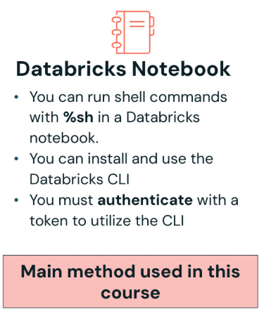

# 2_Deployment mit Databricks Asset Bundles (DABs)

## 2_1_Deployment von Databricks-Projekten

Lassen Sie uns kurz die typischen Komponenten eines Databricks-Projekts zusammenfassen.

Zunächst besteht ein Databricks-Projekt aus mehreren Komponenten, darunter Code, Notebooks, Python-Dateien, Python-Wheel-Dateien, JARs, DBT und mehr.

Es umfasst außerdem eine Ausführungsumgebung innerhalb eines oder mehrerer Databricks-Workspaces, zusammen mit spezifischen Compute-Konfigurationen für die Verarbeitung.

Schließlich kann das Projekt weitere Databricks-Ressourcen umfassen, wie zum Beispiel Lakeflow Jobs, MLflow, Lakeflow Declarative Pipelines und mehr.

Darüber hinaus erzeugt ein Databricks-Projekt typischerweise eine Vielzahl von Datenprodukten, darunter Tabellen, Pipelines, Modelle, Jobs, Dashboards und mehr.

Schließlich bestimmen die Ergebnisse (Deliverables) Ihres Projekts, welche Komponenten Sie benötigen.

Zum Beispiel könnte ein einfacher Report ein oder mehrere Notebooks umfassen, die auf einem einfachen Single-Node-Compute laufen.

Eine vollständige MLOps-Pipeline hingegen würde mehrere Komponenten erfordern, wie zum Beispiel MLflow, den Feature Store, Model-Serving-Komponenten, Notebooks und mehr.

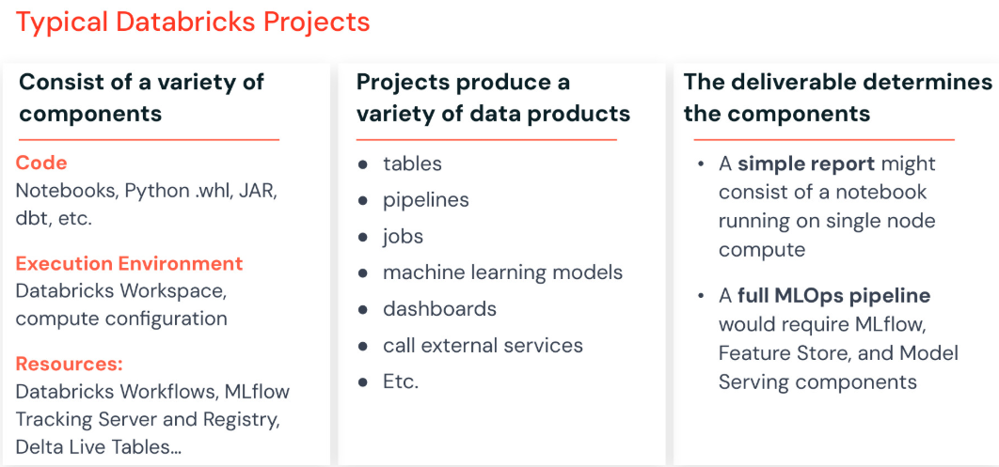

------

Ein einfaches Data-Engineering-Databricks-Projekt könnte zum Beispiel Notebooks, Delta Live Tables, einen Workflow, Kataloge innerhalb von Unity Catalog sowie spezifische Compute-Konfigurationen für das Projekt umfassen.

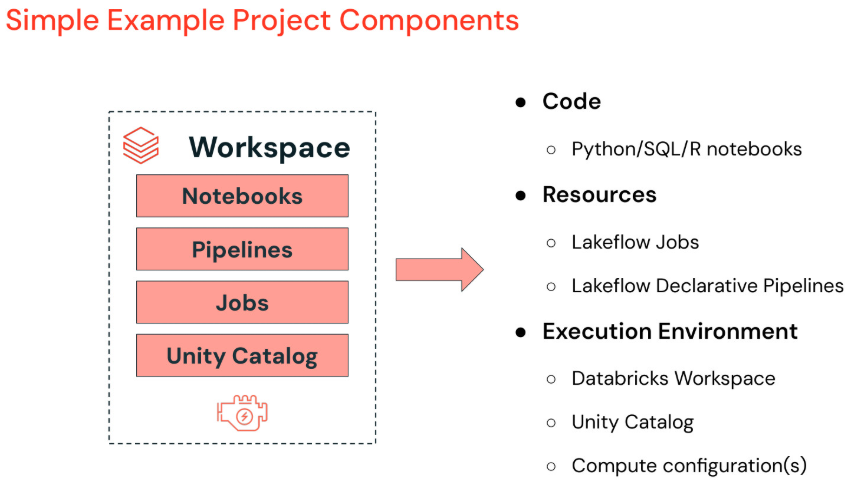

------

Werfen wir einen Blick auf eine CI/CD-Reise zur Produktion auf hoher Ebene.

Zunächst sollten Sie eine Versionskontrollstrategie einrichten. Ihre Strategie könnte beispielsweise dev-, stage- und main-Branches umfassen.

Von hier aus beginnen Sie damit, Ihr Databricks-Projekt in die Entwicklungsumgebung zu deployen. So können Sie alle Änderungen oder Updates, die an Ihrem Projekt vorgenommen wurden, mit Entwicklungsdaten und spezifischen Entwicklungskonfigurationen testen.

Nach Abschluss der Entwicklung und dem Erstellen eines Pull Requests in Ihren Stage-Branch deployen Sie anschließend in die Staging-Umgebung. Dies stellt sicher, dass das Testen Ihres Projekts mit neuen Staging-Daten und den entsprechenden Staging-Konfigurationen fortgesetzt wird.

Sobald sowohl Ihre Entwicklungs- als auch Ihre Staging-Umgebung das Testen abgeschlossen und alle Tests bestanden haben, können Sie in Ihren Main- oder Produktions-Branch deployen. Dadurch wird Ihr Projekt vollständig in die Produktion überführt, wobei Produktionsdaten und die notwendigen Produktionskonfigurationen verwendet werden.

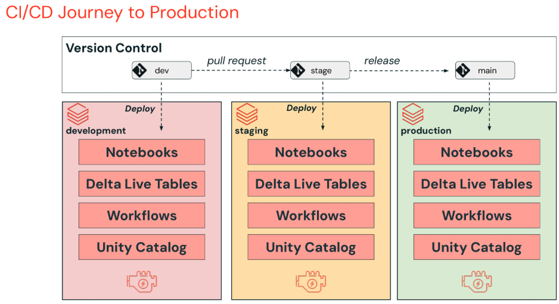

------

Schauen wir uns einige Beispielkonfigurationen für jede Umgebung an.

Für die Entwicklung konfigurieren wir die Umgebung so, dass Single-Node-Compute verwendet wird, da unsere Daten klein sind und keinen großen Cluster erfordern. Wir führen das Projekt mit unserem Benutzerkonto auf den Entwicklungsdaten aus.

Im Staging streben wir eine möglichst enge Annäherung an die Produktionsumgebung an. Hier verwenden wir Serverless-Compute, um unsere Ressourcen bei Bedarf zu skalieren. Wir führen das Projekt mit einer Service-Principal-Identität aus, die automatisierten Tools ausschließlich Zugriff auf die notwendigen Databricks-Ressourcen gewährt und dadurch mehr Sicherheit bietet als die Verwendung von Benutzer- oder Gruppenzugriff. Dies erfolgt mit unseren Staging-Daten.

Schließlich verwenden wir für die Produktion weiterhin Serverless-Compute und die Service-Principal-Identität. Das Projekt läuft mit Produktionsdaten, und wir stellen das Projekt so ein, dass es wöchentlich läuft, um die Daten für unsere Konsumenten zu aktualisieren.

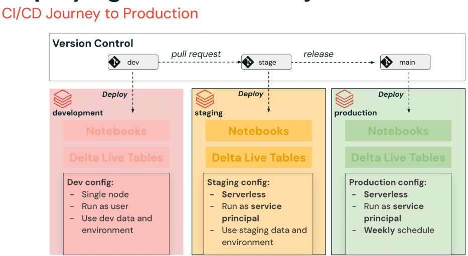

------

Wie können wir diese CI/CD-Reise zur Produktion also orchestrieren?

Schauen wir uns drei verschiedene Methoden an.

Zunächst können wir das manuell tun.

Ein Vorteil dieser Methode ist, dass die Benutzeroberfläche leicht zu erlernen und zu bedienen ist.

Die Nachteile sind jedoch, dass es extrem zeitaufwendig ist, das Projekt jedes Mal manuell zu deployen. Es ist außerdem sehr fehleranfällig, da menschliches Eingreifen erforderlich ist, und – was wichtig ist – es ist keine praktikable Option für den CI/CD-Prozess, bei dem wir den Deployment-Prozess automatisieren und einfach von einer Umgebung zur nächsten wechseln möchten.

Als Nächstes können wir dies programmatisch mithilfe der Databricks REST API oder des Databricks SDK tun.

Ein Vorteil dieser Methode ist, dass sie Ihnen eine Low-Level-Kontrolle bietet und Sie alles, was Sie benötigen, selbst programmieren können.

Die Nachteile sind jedoch, dass dieser Ansatz mittlere bis fortgeschrittene Programmierkenntnisse erfordert. Sie müssen zahlreiche APIs erlernen, wenn Sie die REST API verwenden, oder viele Klassen im Fall des SDK-Ansatzes, und die vollständige Codierung zur Automatisierung des gesamten CI/CD-Prozesses kann extrem zeitaufwendig sein.

Schließlich können Sie, wenn Sie Erfahrung mit Terraform haben, dieses verwenden.

Es ist ein sehr leistungsfähiges und ausdrucksstarkes Tool, das üblicherweise von Administratoren zur Verwaltung von Infrastruktur eingesetzt wird.

Während diese Methode für manche gut funktionieren mag, kann sie für Data Scientists und Engineers, die keinen tiefen Hintergrund im Infrastrukturmanagement haben, herausfordernd sein. Zudem kommt ein weiteres Tool hinzu, das erlernt und verwaltet werden muss.

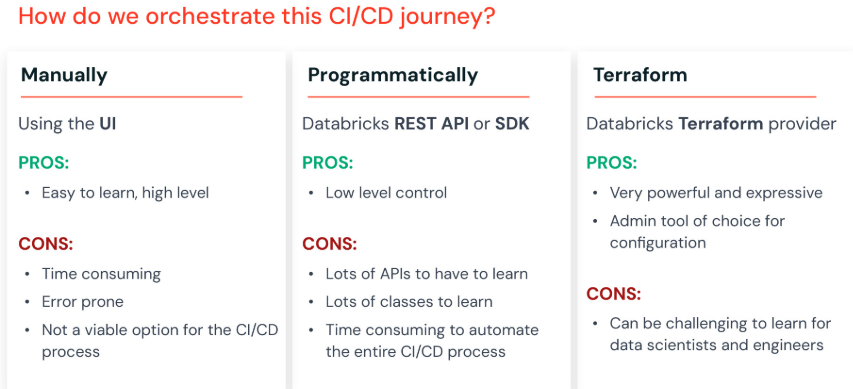

------

Wie können wir also den CI/CD-Prozess für Databricks-Projekte vereinfachen? Wie können wir Code für unser Projekt einmal schreiben und ihn dann einfach in mehreren Umgebungen deployen, während wir unsere Konfigurationen anpassen?

Was, wenn wir Folgendes tun könnten?

Code zusammen mit allen Konfigurationen in einem einfachen, leicht verständlichen Format wie YAML mitversionieren? YAML ist ein menschenlesbares Format, das Daten in einer einfachen, gut lesbaren Struktur mithilfe von Einrückung und minimaler Syntax organisiert. Dadurch ist es im Vergleich zu anderen Formaten wie XML oder JSON leichter zu verstehen und zu bearbeiten.

Databricks-Ressourcen mithilfe bestehender REST-API-Parameter definieren? So wird sichergestellt, dass Parameter konsistent zu den anderen Techniken bleiben.

Benutzerisolation während des Deployments sicherstellen? Dies hilft zu verhindern, dass sich Benutzer während des Deployments gegenseitig in die Quere kommen.

Umgebungsbasierte Overrides und Variablen festlegen? So können wir Werte je nach Zielumgebung, in die wir deployen möchten, einfach überschreiben und dadurch Flexibilität in unserer Konfiguration für jede Umgebung sicherstellen.

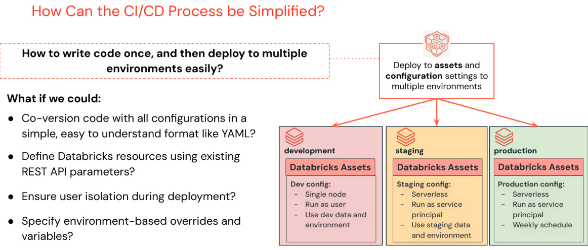

------

Wir stellen vor: Declarative Automation Bundles (oder DABs)!

Ein Tool, das die Einführung von Best Practices aus der Softwareentwicklung erleichtert, darunter Versionskontrolle, Code-Reviews, Testing sowie Continuous Integration and Delivery (CI/CD), für Ihre Daten- und KI-Projekte.

Databricks empfiehlt künftig DABs zum Erstellen, Entwickeln, Deployen und Testen von Jobs und anderen Databricks-Ressourcen als Quellcode.

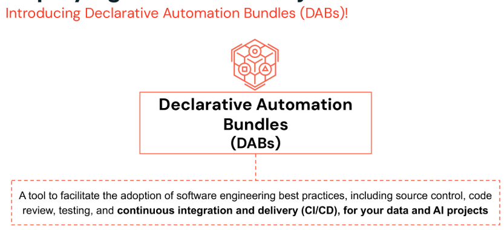

## 2_2_Einführung in Declarative Automation Bundles (DABs)

DABs ermöglichen es uns, Code einmal zu schreiben und überall zu deployen. Aber was genau sind sie?

DABs (Declarative Automation Bundles) verwenden YAML-Dateien, um die Artefakte, Ressourcen und Konfigurationen eines Databricks-Projekts festzulegen. Sie ermöglichen es uns, alle notwendigen Komponenten eines Databricks-Projekts auf konsistente und effiziente Weise für mehrere Umgebungen zu verwalten und zu deployen.

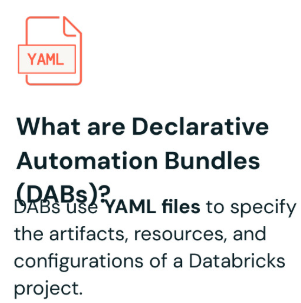

------

Wie genau funktionieren DABs?

Die neue Databricks CLI verfügt über spezifische Bundle-Befehle, um Declarative Automation Bundles anhand einer YAML-Datei zu validieren, zu deployen und auszuführen. Wir werden im Verlauf des Kurses lernen, wie das funktioniert.

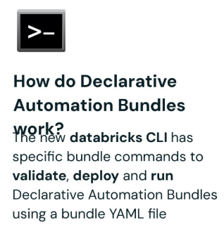

------

Wo werden Declarative Automation Bundles also eingesetzt?

DABs sind extrem nützlich während der Entwicklung und in CI/CD-Prozessen, um Databricks-Assets in Zielumgebungen zu deployen und dabei spezifische Konfigurationen für jede Umgebung anzupassen. Wir werden im Verlauf des Kurses sehen, wie das funktioniert.

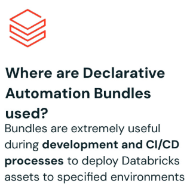

------

**Einführung in DABs**

Werfen wir einen Blick auf das folgende Diagramm, das einen Überblick über eine Entwicklungs- und CI/CD-Pipeline mit Bundles auf hoher Ebene bietet.

Wenn Sie lokal arbeiten, bauen Sie das Projekt-Bundle mit Ihrem Team über ein lokales Umgebungssetup (oder Sie können dies auch innerhalb Ihres Databricks-Workspace tun).

Von hier aus können Sie entweder Bundles verwenden oder manuell in Ihre Entwicklungsumgebung deployen, die einen Entwicklungs-Workspace oder Kataloge umfassen kann. Hier können Sie Ihre Änderungen fernab der Produktion testen.

Nach der Entwicklung können Benutzer Änderungen in die Versionskontrolle innerhalb eines Projekt-Repositorys committen und ihre Entwicklungsänderungen pushen.

Sobald die Änderungen committet wurden, können Sie eine Benachrichtigung einrichten, die die CI/CD-Pipeline auslöst. In einer typischen Pipeline werden die Tests zunächst in eine Staging-Umgebung deployt.

Sobald alle Tests im Staging bestanden sind, kann der Code anschließend in die Produktionsumgebung deployt werden, nachdem die Prozesse Ihrer Organisation, wie zum Beispiel Code-Review und Freigabe, durchlaufen wurden.

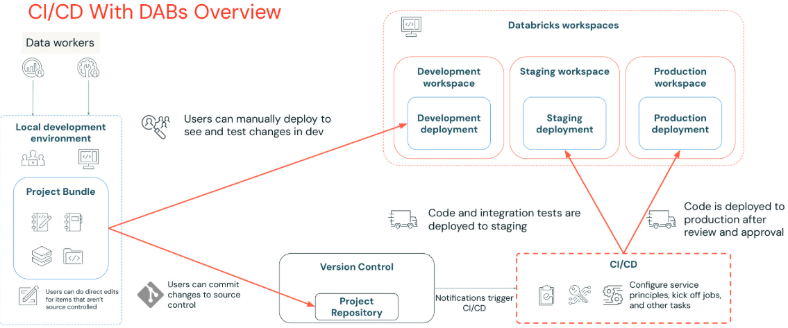

------

Nachdem wir nun einen guten Überblick über den CI/CD-Prozess haben, schauen wir uns eine typische, einfache Projektstruktur für Ihr Bundle an.

In Ihrem Projektordner sollten Sie mehrere Unterordner anlegen, um Ihre Assets zu organisieren. Eine einfache Projektstruktur sollte mit Ihrem Projektordner beginnen, gefolgt von verschiedenen Ordnern und Dateien, wie zum Beispiel resources, src, tests und einer zentralen databricks.yaml-Datei. Diese Ordner können zusätzliche Unterordner zur Speicherung spezifischer Dateien enthalten.

Der resources-Ordner sollte, falls erforderlich, zusätzliche YAML-Konfigurationsdateien für Ihre Declarative Automation Bundles enthalten.

Der src- (oder source-)Ordner enthält die Quelldateien, die für Ihre Datenpipeline benötigt werden, wie zum Beispiel Notebooks und Python-Dateien.

Der tests-Ordner enthält Ihre Unit- und Integrationstests für die Pipeline.

Das Organisieren und Modularisieren Ihrer Ordner und Dateien hilft Ihnen während der Entwicklung und Wartung, wenn Ihr Projekt wächst.

Dies ist ein einfaches Beispiel, und Ihr Projekt kann zusätzliche Dateien und Ordner oder eine andere Organisationsstruktur aufweisen.

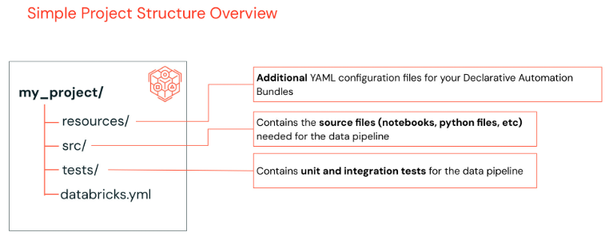

------

Die databricks.yml-Datei ist eine erforderliche Bundle-Konfigurationsdatei, die zum Deployen Ihrer Databricks-Assets verwendet wird. Diese Datei muss:

- im YAML-Format vorliegen.
- mindestens die Top-Level-bundle-Mapping enthalten.
- mindestens eine (und nur eine) Bundle-Konfigurationsdatei namens databricks.yml enthalten.

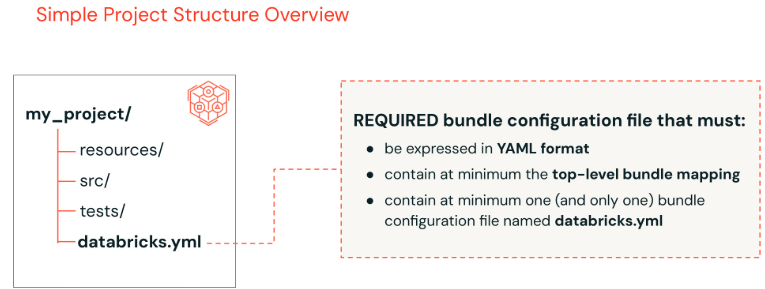

------

Die databricks.yml-Datei ist der Schlüssel zu Ihrem Bundle. Schauen wir uns ein einfaches Beispiel an.

Zunächst enthält die YAML-Datei mehrere Top-Level-Mapping-Keys, die linksbündig ausgerichtet sind. In diesem Beispiel für die databricks.yml-Datei sind das die Top-Level-Mappings: bundle, resources und targets.

Weitere Top-Level-Mappings sind variables, workspace, permissions, artifacts, include und sync. Wir werden viele dieser Top-Level-Mappings im Verlauf dieses Kurses behandeln.

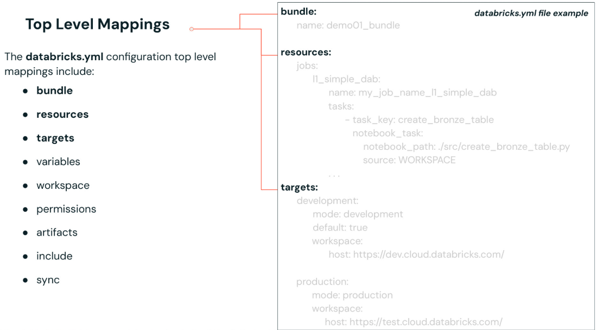

------

Eine Bundle-Konfigurationsdatei darf nur ein Top-Level-**bundle**-Mapping enthalten, das den gesamten Inhalt des Bundles mit einem Namen verknüpft. Zusätzlich können Sie, falls erforderlich, weitere Databricks-Workspace-Einstellungen wie **cluster_id**, **compute_id**, **git** und einige weitere angeben. Die zusätzlichen Mappings unterhalb des Top-Level-Mappings müssen eingerückt sein.

Das folgende Beispiel deklariert den Top-Level-Mapping-Key **bundle** mit einem **name**-Mapping, das den Bundle-Namen festlegt, emo01_bundle.

Das **resources**-Mapping enthält Informationen zu den vom Bundle verwendeten Databricks-Ressourcen, wie zum Beispiel:

Lakeflow Jobs
Lakeflow Declarative Pipelines
MLflow
und mehr

Die Ressourcen werden anhand der entsprechenden Databricks-REST-API-Parameter definiert.

Jedes **resource**-Typ-Mapping enthält nun eine oder mehrere einzelne Ressourcendeklarationen, die jeweils einen eindeutigen Namen haben müssen.

In diesem Beispiel hat der Job das Ressourcen-Mapping **name** /1_simple_dab. Dieser Job erstellt über das **name**-Mapping-Key einen Job namens my_job_name_11_simple_dab, und dieser Job enthält eine oder mehrere Tasks, die anhand der entsprechenden REST-API-Parameter angegeben werden.

Innerhalb des **tasks**-Mappings heißt die Task create_bronze_table und verwendet das **notebook_path**-Mapping-Key, um das zu verwendende Notebook anzugeben. Wichtig ist, hier einen relativen Pfad zum Notebook innerhalb Ihres Projekts mit der korrekten Dateiendung für das Notebook zu verwenden.

Beachten Sie, dass ab dem 20. Dezember 2024 das Standardformat für neue Notebooks das .ipynb-Format sein wird. Wenn Sie nicht die korrekte Notebook-Dateiendung angeben, wird ein Fehler zurückgegeben. In diesem Beispiel verwendet dieses Notebook die traditionelle .py-Dateiendung.

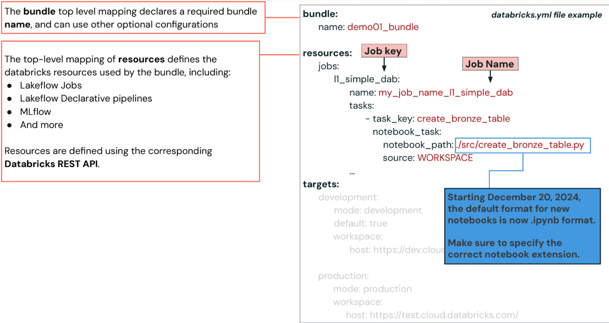

------

Der Top-Level-Mapping-Key targets legt spezifische Umgebungen und Umgebungskonfigurationen fest, darunter:

- Den Umgebungsmodus-Typ, wie zum Beispiel development oder production.
- Die Standard-Zielumgebung, die auf die Entwicklungsumgebung gesetzt werden sollte. So wird sichergestellt, dass dieses Bundle standardmäßig in die Entwicklungsumgebung deployt und ausgeführt wird, wenn Sie kein Ziel angeben.
- Im targets-Mapping können Sie diverse weitere Konfigurationen und Konfigurations-Overrides für dieses spezifische Target angeben.

In diesem Beispiel enthalten wir zwei Zielumgebungen: **development** und **production**, jeweils mit eigenen Konfigurationen und Overrides.

In diesem einfachen Beispiel geben wir die Mappings **mode** development und **default true** für die Entwicklungsumgebung an, zusammen mit einer spezifischen Entwicklungs-Workspace-URL.

Für die Produktionsumgebung verwenden wir **mode production** und geben die Produktions-Workspace-URL an.

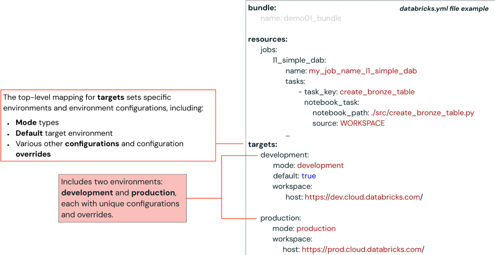

------

**Validieren, Deployen und Ausführen Ihres DAB**

Nachdem wir nun ein gutes Verständnis der databricks.yml-Datei haben, schauen wir uns an, wie wir unser Databricks Asset Bundle validieren, deployen und ausführen können.

Zunächst möchten Sie Ihr Bundle validieren. Dies können Sie mit dem Databricks-CLI-Befehl databricks bundle validate tun.

Als Nächstes deployen Sie das Bundle in Ihren Databricks-Workspace. Verwenden Sie dazu den Befehl databricks bundle deploy, das Flag -t für das Target, und geben Sie die Umgebung an, in die Sie deployen möchten. In diesem Beispiel deployen wir in die Entwicklungsumgebung. Standardmäßig ist development als Standard-Target festgelegt, sodass es dorthin geht, wenn Sie kein Ziel angeben. Es ist jedoch bewährte Praxis, dies explizit anzugeben.

Sobald das Bundle in Databricks deployt ist, möchten Sie es in der Regel ausführen. Um den Job im Bundle auszuführen, verwenden Sie den Befehl databricks bundle run, das Flag -t für development sowie den Key, der den auszuführenden Job angibt. Hier lautet der Key 11_simple_dab.

Und das war's! Wir haben behandelt, wie man ein einfaches Databricks Asset Bundle erstellt, validiert, deployt und ausführt!

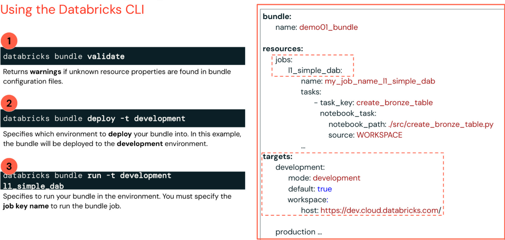

## 2_3_Variablenersetzung in DABs

**Variablen in Declarative Automation Bundles (DABs)**

Überblick

Declarative Automation Bundles unterstützen Substitutionen und benutzerdefinierte Variablen, wodurch Ihre Bundle-Konfigurationsdateien modularer und wiederverwendbarer werden. Sowohl Substitutionen als auch benutzerdefinierte Variablen ermöglichen den dynamischen Abruf von Werten, was bedeutet, dass Einstellungen zum Zeitpunkt des Deployments und der Ausführung des Bundles bestimmt werden können.

Um eine Variable in Ihrer YAML-Datei zu verwenden, referenzieren Sie diese mit einem Dollarzeichen, geschweiften Klammern und dem Mapping, gefolgt vom Variablennamen.

Standardmäßig steht eine Vielzahl von Substitutionen zur Verfügung. Einige gängige sind auf dem Bildschirm dargestellt. Ein paar, die man sich merken sollte, sind unter anderem bundle.target, um den Wert der Zielumgebung zu erhalten, workspace.file_path für den Workspace-Dateipfad sowie resources.jobs.job name oder id, um nur ein paar zu nennen.

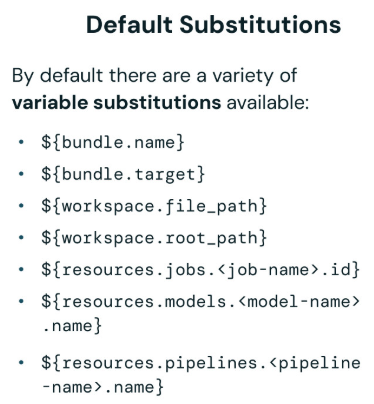

------

Sie können außerdem einfache benutzerdefinierte Variablen verwenden, die Sie in Ihren Declarative Automation Bundles selbst definieren.

Benutzerdefinierte Variablen ermöglichen den dynamischen Abruf von Werten, die für verschiedene Szenarien benötigt werden. Diese Variablen werden in Ihren Bundle-Konfigurationsdateien innerhalb des variables-Mappings deklariert.

Zum Beispiel können Sie unter dem Top-Level-Mapping variables eine beliebige Anzahl benutzerdefinierter Variablen angeben.

In diesem Beispiel erstellen wir eine Variable namens my_lab_user_name, gefolgt von einer Beschreibung und ihrem Standardwert labuser23904.

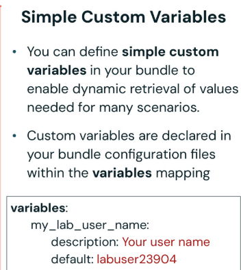

------

Sie können sowohl einfache als auch komplexe benutzerdefinierte Variablen in Ihren Declarative Automation Bundles definieren, um den dynamischen Abruf von Werten für verschiedene Szenarien zu ermöglichen.

Standardmäßig wird bei einer einfachen benutzerdefinierten Variable angenommen, dass sie vom Typ string ist. Wenn Sie jedoch komplexere Daten benötigen, können Sie eine benutzerdefinierte Variable mithilfe des **type complex**-Mappings als komplexen Typ definieren.

In diesem Fall erstellen wir zum Beispiel eine komplexe Variable namens **my_cluster** mit einem Standardwert, der die Spark-Version, den Node-Typ und die Anzahl der Worker angibt.

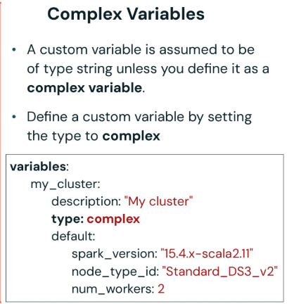

------

**Erstellen einfacher benutzerdefinierter Variablen**

Schauen wir uns ein Beispiel für das Erstellen und Referenzieren einfacher benutzerdefinierter Variablen in Ihrer databricks.yml-Datei an.

Zunächst definieren Sie das Top-Level-Mapping **variables**. Unter **variables** können Sie Ihre benutzerdefinierten Variablen hinzufügen. Die Bundle-Einstellungsdatei darf nur ein Top-Level-variables-Mapping enthalten, in dem alle Ihre benutzerdefinierten Variablen definiert werden.

Erstellen Sie eine Variable namens **my_lab_user_name** mit dem Standardwert labuser23904.

Sie können die benutzerdefinierte Variable **my_lab_user_name** anschließend innerhalb anderer Variablen oder Mappings referenzieren. In diesem Beispiel verwenden wir die Variable **my_lab_user_name**, um zwei neue Variablen zu erstellen: **catalog_dev** und **catalog_prod**, indem wir die Zeichenketten _1_dev und _3_prod an den Benutzernamen anhängen. Um eine benutzerdefinierte Variable zu referenzieren, verwenden Sie das Top-Level-Mapping var, gefolgt von einem Punkt und dem Variablennamen **my_lab_user_name** innerhalb geschweifter Klammern, und hängen Sie anschließend die literale Zeichenkette an.

Als Ergebnis ist die Variable **catalog_dev** gleich labuser23904_1_dev, und die Variable **catalog_prod** ist gleich labuser23904_3_prod.

Diese Technik ermöglicht es Ihnen, Variablen im gesamten databricks.yml-Datei zu referenzieren oder zu überschreiben. Wir schauen uns weitere Beispiele an, wie sich das anwenden lässt.

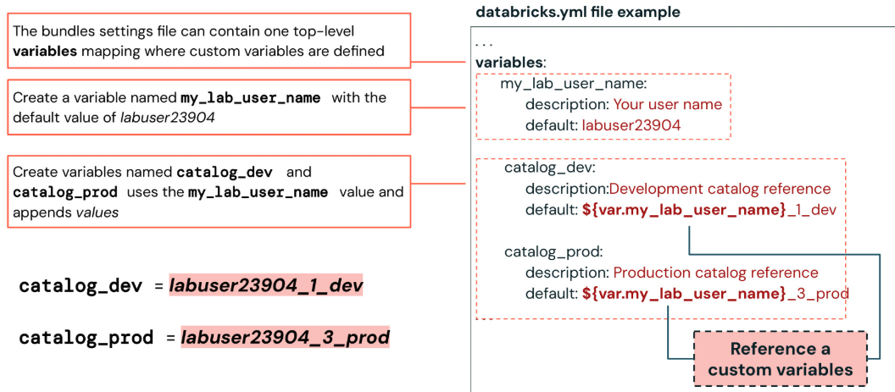

------

**Definieren einer komplexen Variable**

Standardmäßig wird angenommen, dass eine Variable vom Typ string ist, es sei denn, Sie definieren sie als komplexe Variable.

In diesem Beispiel definieren wir die Variable my_cluster als type complex und legen ihre Standardwerte fest. Dies ermöglicht es Ihnen, strukturiertere Daten für die Variable bereitzustellen, wie zum Beispiel die Angabe einer Spark-Version, eines Node-Typs und der Anzahl der Worker.

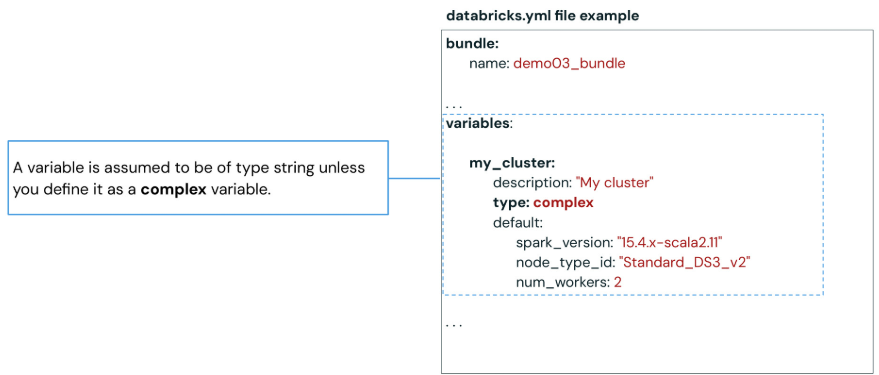

------

**Lookup-Variablen**

Für bestimmte Objekttypen können Sie ein Lookup für Ihre benutzerdefinierte Variable definieren, um die ID des Objekts anhand des folgenden Formats abzurufen:

Geben Sie zunächst den Variablennamen an. In diesem Beispiel heißt die Variable **my_cluster_id**. Verwenden Sie dann das lookup-Mapping, um festzulegen, wonach gesucht werden soll. In diesem Fall suchen wir nach dem Cluster-Namen **myclustername**, um die entsprechende Cluster-ID zu ermitteln.

Wenn für eine Variable ein Lookup definiert ist, wird die ID des Objekts mit dem angegebenen Namen als Wert der Variable verwendet. So wird sichergestellt, dass für die Variable stets die korrekt aufgelöste ID des Objekts verwendet wird.

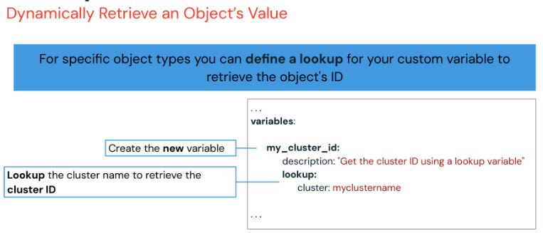

Sie können Lookup-Variablen zum Zeitpunkt dieser Aufzeichnung für die Objekttypen alert, cluster_policy, cluster, dashboard, instance_pool, job, metastore, notification_destination, pipeline, query, service_principal und warehouse verwenden.

------

**Overrides von Zielumgebungsvariablen**

Benutzerdefinierte Variablen können anschließend im gesamten databricks.yml-Datei verwendet werden. Einer der Orte, an denen Sie diese verwenden können, ist innerhalb Ihres targets-Mappings. Dies ermöglicht es Ihnen, Variablenwerte für jede Zielumgebung dynamisch anzupassen.

Nehmen wir zum Beispiel an, wir haben eine benutzerdefinierte Variable namens **target_catalog**, die verwendet wird, um einen Job-Parameter zu befüllen, mit dem Daten aus einem bestimmten Katalog gelesen und geschrieben werden. Sie können ihren Wert für jede Umgebung anpassen. In diesem Fall verwendet die Variable **target_catalog** beim Deployen in die Entwicklungsumgebung den Wert **catalog_dev**.

Beim Deployen in die Produktion verwendet die Variable **target_catalog** den Wert **catalog_prod**.

Wenn Sie für Ihre Variable kein Override angeben, wird standardmäßig ihr ursprünglicher Wert verwendet.

Bitte beachten Sie, dass für die Variable im Top-Level-Mapping variables ein Standardwert definiert sein muss, damit ein Override funktioniert. Wenn einer Variable kein Standardwert zugewiesen ist, funktioniert das Override nicht wie erwartet.

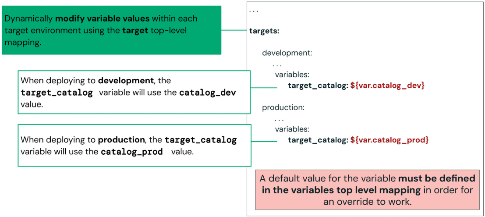

------

**Vorteile der Verwendung von Variablen**

Es gibt mehrere Vorteile, wenn Sie Variablen in Ihrer databricks.yml-Bundle-Konfigurationsdatei verwenden:

Erstens können Sie sie für unterschiedliche Umgebungen anpassen: Mit Variablen können Sie Konfigurationen wie Kataloge, Dateipfade und andere Einstellungen für Entwicklungs-, Staging- und Produktionsumgebungen einfach anpassen.

Sie bieten Wiederverwendbarkeit über Databricks-Projekte hinweg: Sie können dasselbe Asset Bundle über mehrere Teams oder Workspaces hinweg verwenden, indem Sie lediglich die Variablenwerte anpassen, was Konsistenz fördert und Redundanz reduziert.

Schließlich lassen sie sich einfach warten und aktualisieren: Mit Variablen können Sie Assets und Konfigurationen schnell aktualisieren, wodurch Konsistenz über Umgebungen hinweg sichergestellt und das Fehlerrisiko reduziert wird.

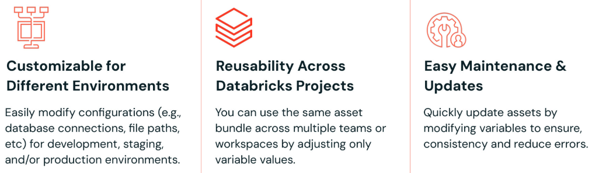

## 2_4_Überblick über DAB-Projektvorlagen

**Databricks Asset Bundle Projektvorlagen**

Werfen wir nun einen kurzen Blick auf Databricks Asset Bundle Templates.

Sie haben hier zwei Hauptoptionen: Sie können entweder die von Databricks bereitgestellten vorkonfigurierten Templates verwenden, oder Sie können eigene, individuelle Templates erstellen, die Ihren spezifischen Anforderungen entsprechen.

Databricks bietet mehrere Standard-Bundle-Templates an, darunter:

- default-python für Python-basierte Projekte
- default-sql für SQL-basierte Projekte
- dbt-sql für Projekte, die DBT (Data Build Tool) Workflows verwenden
- mlops-stacks für Machine-Learning-Operations-Stacks

Um mit einem dieser Templates zu starten, können Sie den Databricks-CLI-Befehl databricks bundle init <template_name> verwenden. Dieser Befehl initialisiert Ihr Asset Bundle automatisch anhand des ausgewählten Templates und spart Ihnen so Zeit beim Einrichten der Konfiguration von Grund auf.

Ein Hinweis: Wenn Sie ein Bundle-Template innerhalb eines Databricks-Notebooks verwenden, erhalten Sie das gesamte Template. Führen Sie den CLI-Befehl außerhalb eines Notebooks aus, ermöglichen Ihnen eine Reihe von Eingabeaufforderungen, bestimmte Teile des Templates auszuwählen.

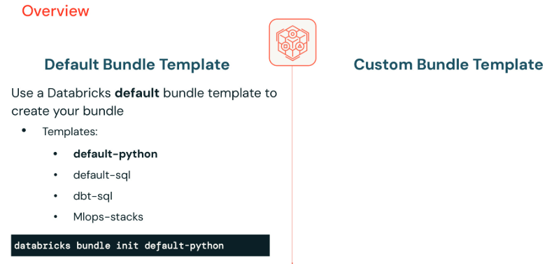

------

Zusätzlich zu den Standard-Templates von Databricks können Sie individuelle Bundle-Templates erstellen, die speziell auf Ihre Organisation zugeschnitten sind.

Auch wenn wir in diesem Kurs nicht im Detail auf die Erstellung individueller Templates eingehen, hier ein paar wichtige Punkte:

Individuelle Templates erfordern mindestens die Dateien databricks_template_schema.json und databricks.yml.tmpl.
Sie können Benutzerabfragen (Prompts) einbinden, Ordnerstrukturen definieren und Einstellungen anpassen.

Um ein individuelles Template zu verwenden, übergeben Sie einfach den lokalen Pfad oder die Remote-URL des Templates an den Databricks-CLI-Befehl bundle init.

Individuelle Templates helfen Organisationen dabei, Bundles konsistent und wiederholbar zu erstellen und zu verwalten, indem Ordnerstrukturen, Tasks und DevOps-Infrastructure-as-Code (IaC) für Entwicklung und Deployment etabliert werden.

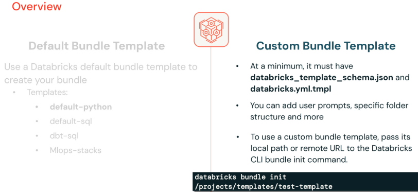

## 2_5_Überblick über CI/CD-Projekte mit DABs

In dieser Lektion gehen wir durch, wie ein CI/CD-Workflow mit **Declarative Automation Bundles (DABs)** umgesetzt wird. Wir behandeln, wie ein Projekt geplant wird, wie Teststrategien aufgesetzt werden und wie Workloads effizient über verschiedene Umgebungen hinweg deployt werden.

**Planung des Projekts**

Beginnen wir damit, zu besprechen, was **CI/CD** ist und wie **Declarative Automation Bundles (DABs)** den Prozess vereinfachen.

- Continuous Integration (CI): Automatisierung der Code-Integration und des Testings.
- Continuous Delivery/Deployment (CD): Sicherstellen, dass Code stets in einem deploybaren Zustand ist.

Declarative Automation Bundles vereinfachen diesen Prozess, indem sie es uns ermöglichen, **Assets strukturiert mithilfe der Databricks CLI zu definieren, zu versionieren und zu deployen**.

Bei der Planung eines Projekts ist es entscheidend, Folgendes zu definieren:

- **Deliverables** -> Was bauen wir?
- **Tasks** -> Was sind die wichtigsten Schritte, um dies zu erreichen?
- **Databricks-Assets** – Welche Komponenten werden benötigt?

In diesem Fall **visualisieren wir Gesundheitsdaten**. Die wichtigsten Tasks umfassen:

- **Das Einlesen einer täglichen, inkrementellen CSV-Datei** in eine **Bronze-Tabelle**.
- **Das Bereinigen der Daten** und deren Überführung in eine **Silber-Tabelle**.

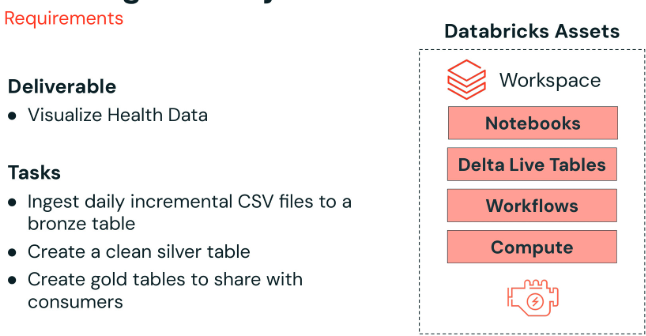

------

Nachdem wir nun ein Verständnis unseres Projekts, unserer Daten und der Isolierung von Umgebungen haben, tauchen wir in das Projekt-Setup ein.

In diesem Projekt erstellen wir für jede Umgebung einen Katalog: dev, stage und prod.

Der dev-Katalog enthält eine kleine, statische Teilmenge unserer Produktionsdaten, die für die Entwicklung und erste Tests verwendet wird.

Der stage-Katalog enthält eine größere Teilmenge der Produktionsdaten und ermöglicht so umfassenderes Testen, während wir unseren CI/CD-Prozess durchlaufen.

Schließlich enthält der prod-Katalog die live laufenden Produktionsdaten, auf die wir uns für den finalen Betrieb verlassen.

Unser Workflow beginnt mit der Entwicklung auf den dev-Daten, wobei wir Unit- und Integrationstests durchführen, während wir die Pipeline durchlaufen. Die Pipeline ist mit Databricks Workflows aufgesetzt, die die Unit-Tests, die Lakeflow Declarative Pipeline und die abschließenden Visualisierungen ausführen.

Während wir die Pipeline durch jede Phase testen, stellen wir sicher, dass alles korrekt funktioniert, bevor wir in die Produktion deployen.

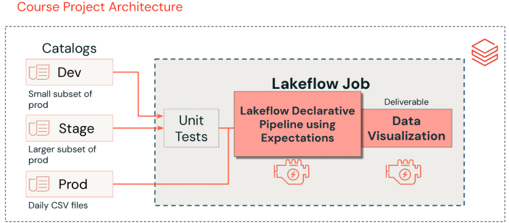

------

**Rückblick auf die Rolle von CI/CD-Testing**

Innerhalb von CI/CD gibt es Testing-Schritte, denen Sie folgen sollten, die Teil der sogenannten Testpyramide sind. Die Testpyramide kategorisiert verschiedene Testarten: Unit-Tests, Integrationstests und Systemtests. Das Testen Ihres Codes ist extrem wichtig.

Die Basis der Pyramide bilden Unit-Tests, die einzelne Funktionen oder Methoden isoliert testen. Da es sich um kleine, einzelne Funktionen handelt, können sie in der Regel schnell, häufig und automatisiert ausgeführt werden, um sicherzustellen, dass die Funktionen wie erwartet arbeiten. Unit-Tests bilden das Fundament, weil sie kostengünstig sind und die breiteste Abdeckung bieten. Ein Beispiel wäre das Testen, ob eine PySpark-Methode wie erwartet funktioniert.

Als Nächstes folgen Integrationstests, die das Zusammenspiel zwischen verschiedenen Komponenten oder Systemen testen. Diese sind in der Regel langsamer und teurer als Unit-Tests, bieten aber eine größere Sicherheit, dass Komponenten korrekt zusammenarbeiten. Innerhalb von Databricks drehen sich diese typischerweise um die Verwendung von Notebooks, Lakeflow Declarative Pipelines und/oder Lakeflow Jobs. Ein Beispiel wäre das Testen, ob eine PySpark-Methode und eine Pipeline korrekt zusammenarbeiten.

Schließlich testen Systemtests die gesamte Anwendung und stellen sicher, dass alle Teile in einem realitätsnahen Szenario zusammenarbeiten. Diese sind in der Regel langsam, teuer und laufen häufig in einer produktionsähnlichen Umgebung. Ein Beispiel wäre bei unserer End-to-End-Datenpipeline das Testen, ob die Datenpipeline innerhalb eines Workflows wie erwartet funktioniert und unsere gewünschten Ergebnisse erzeugt.

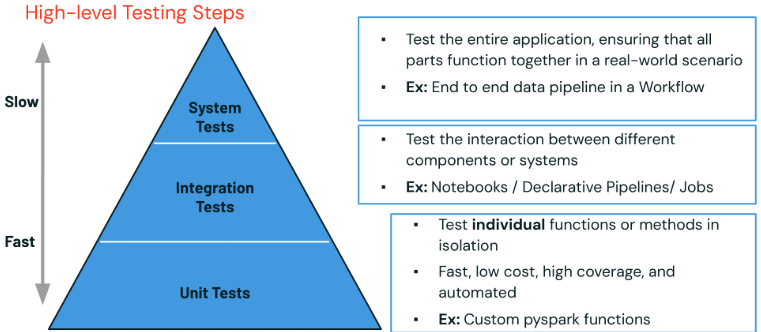

------

**Rückblick auf Unit-Testing mit pytest**

Als Nächstes sprechen wir über das Unit-Testing-Framework pytest.

Pytest ist ein beliebtes Testing-Framework für Python, das das Schreiben einfacher und skalierbarer Testfälle erleichtert. Es bietet eine Vielzahl von Vorteilen für die Ausführung Ihrer Unit-Tests.

Zunächst hat pytest eine sehr einfache Syntax. Sie müssen sich nicht um komplexe Einrichtungen kümmern. Schreiben Sie einfach Testfunktionen, die mit test_ beginnen, und pytest erkennt und führt sie automatisch aus.

Als Nächstes nutzt pytest die in Python eingebauten assert-Anweisungen (oder Sie können andere assert-Anweisungen verwenden, wie zum Beispiel in PySpark). Diese sind einfach zu verwenden, liefern aber detaillierte Fehlermeldungen, wenn ein Test fehlschlägt, wodurch das Debuggen Ihrer Funktionen deutlich einfacher und schneller wird, da Sie besser verstehen, was schiefgelaufen ist.

Pytest erkennt und führt außerdem automatisch alle Ihre Tests aus. Es ist nicht notwendig, manuell zu konfigurieren, welche Tests ausgeführt werden sollen. Benennen Sie einfach Ihre Testdateien und -funktionen mit dem Präfix test_, und pytest übernimmt den Rest.

Schließlich verfügt pytest über ein umfangreiches Plugin-Ökosystem, um seine Funktionalität zu erweitern. Egal ob Sie Testabdeckungsberichte, parallele Testausführung oder die Integration mit anderen Tools benötigen – es gibt für fast alles ein Plugin, sodass Sie pytest an Ihre Bedürfnisse anpassen können.

Dieser Kurs bietet eine einfache Einführung in pytest. Es gibt viele verfügbare Testing-Frameworks – wählen Sie dasjenige aus, das den Anforderungen Ihrer Organisation am besten entspricht.

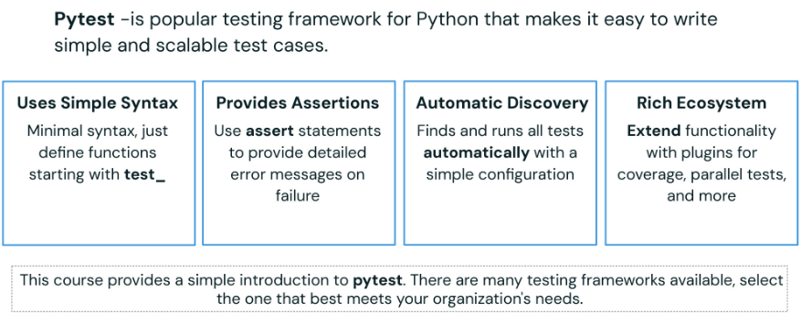

------

**Rückblick auf Pipeline-Erwartungen für Integrationstests**

Zusammenfassung der Pipeline-Erwartungen:

[FEHLT]

Links bereitstellen: Schauen Sie hier nach Links
https://dbc-d9be2316-40bd.cloud.databricks.com/editor/notebooks/634209448007576?o=3434287344177969#command/634209448007577

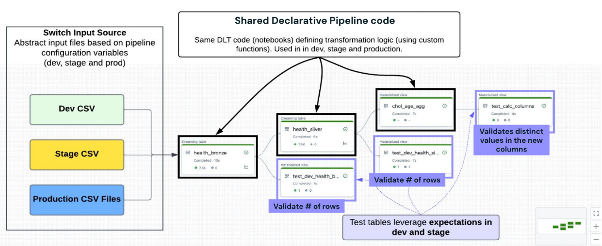

------

**Die Rolle von CI/CD in DevOps**

Betrachtet man den Überblick über CI/CD auf hoher Ebene, wollen wir Continuous Integration (Entwickeln, Bauen, Testen und Versionskontrolle) mit Continuous Delivery/Deployment (Deployment des Projekts in Stage und Produktion) kombinieren. Dieser gesamte Prozess wird automatisiert, um schnell und fehlerfrei zu entwickeln.

Letztlich vereinfacht der CI/CD-Prozess die Entwicklung Ihrer Datenpipelines, indem Testing und Deployment automatisiert werden, was zu schnelleren, zuverlässigeren Releases führt.

Dieser Ansatz minimiert manuelle Fehler, verbessert die Zusammenarbeit und stellt sicher, dass hochwertige Software schnell und konsistent ausgeliefert wird.

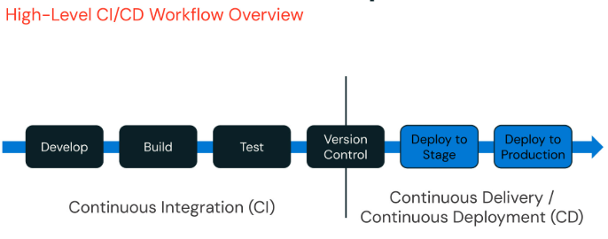

------

**CI/CD mit DABs**

Betrachtet man den Überblick über CI/CD auf hoher Ebene, wollen wir Continuous Integration (Entwickeln, Bauen, Testen und Versionskontrolle) mit Continuous Delivery/Deployment (Deployment des Projekts in Stage und Produktion) kombinieren. Dieser gesamte Prozess wird automatisiert, um schnell und fehlerfrei zu entwickeln.

Letztlich vereinfacht der CI/CD-Prozess die Entwicklung Ihrer Datenpipelines, indem Testing und Deployment automatisiert werden, was zu schnelleren, zuverlässigeren Releases führt.

Dieser Ansatz minimiert manuelle Fehler, verbessert die Zusammenarbeit und stellt sicher, dass hochwertige Software schnell und konsistent ausgeliefert wird.

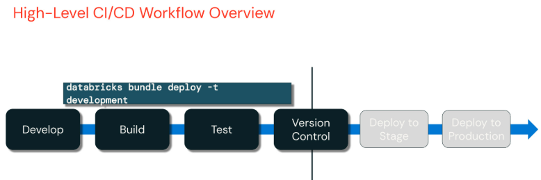

------

Betrachtet man den Überblick über CI/CD auf hoher Ebene, wollen wir Continuous Integration (Entwickeln, Bauen, Testen und Versionskontrolle) mit Continuous Delivery/Deployment (Deployment des Projekts in Stage und Produktion) kombinieren. Dieser gesamte Prozess wird automatisiert, um schnell und fehlerfrei zu entwickeln.

Letztlich vereinfacht der CI/CD-Prozess die Entwicklung Ihrer Datenpipelines, indem Testing und Deployment automatisiert werden, was zu schnelleren, zuverlässigeren Releases führt.

Dieser Ansatz minimiert manuelle Fehler, verbessert die Zusammenarbeit und stellt sicher, dass hochwertige Software schnell und konsistent ausgeliefert wird.

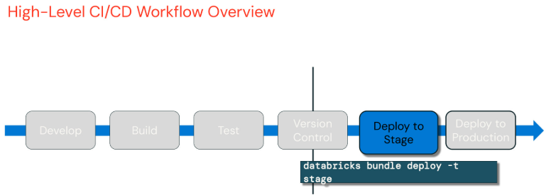

------

Betrachtet man den Überblick über CI/CD auf hoher Ebene, wollen wir Continuous Integration (Entwickeln, Bauen, Testen und Versionskontrolle) mit Continuous Delivery/Deployment (Deployment des Projekts in Stage und Produktion) kombinieren. Dieser gesamte Prozess wird automatisiert, um schnell und fehlerfrei zu entwickeln.

Letztlich vereinfacht der CI/CD-Prozess die Entwicklung Ihrer Datenpipelines, indem Testing und Deployment automatisiert werden, was zu schnelleren, zuverlässigeren Releases führt.

Dieser Ansatz minimiert manuelle Fehler, verbessert die Zusammenarbeit und stellt sicher, dass hochwertige Software schnell und konsistent ausgeliefert wird.

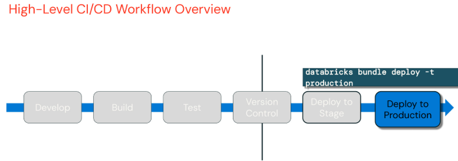

# 3_Mehr mit Databricks Asset Bundles erreichen

## 3_1_Lokale Entwicklung mit Visual Studio Code (VSCode)

Lokale Entwicklung mit VSCode

Für viele Entwickler ist die Verwendung einer IDE wie VSCode die bevorzugte Wahl. Mit VSCode können Sie auf mehrere Arten mit Ihrer Databricks-Umgebung interagieren, sodass Sie innerhalb der IDE bleiben können, ohne zur Databricks-Browser-Oberfläche wechseln zu müssen.

Schauen wir uns kurz einige der Tools an, die Sie innerhalb von VSCode verwenden können.

Zunächst können Sie die Databricks CLI lokal installieren.

Die Databricks CLI ermöglicht schnelle Interaktionen mit Databricks über die Kommandozeile. Sie eignet sich ideal für Aufgaben wie:

- Shell-Skripting und leichtgewichtige Kommandozeilenaufgaben
- Entwicklungs- und CI/CD-Prozesse
- Unterstützung einheitlicher Authentifizierung (OAuth, PATs usw.)
- Bietet interaktiveres Debugging im Vergleich zur Verwendung der CLI in Notebooks

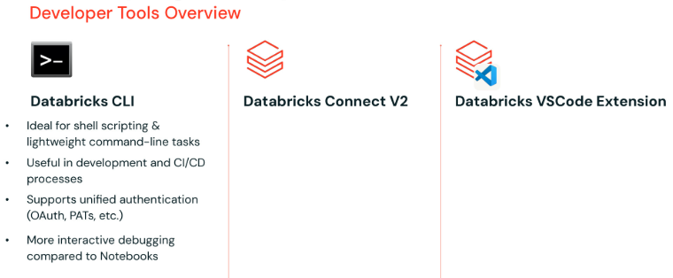

------

Als Nächstes können Sie Databricks Connect v2 installieren und verwenden.

Databricks Connect v2 ermöglicht es Ihnen, von überall aus mit Databricks zu interagieren, was Flexibilität und Produktivität erhöht.

Mit Databricks Connect v2 können Sie:

- Apache-Spark-Code remote auf einem Databricks-Cluster von einer lokalen Umgebung aus ausführen
- Ideal für interaktives Debugging und die entfernte Ausführung von Spark-Jobs
- Einfache Einrichtung mit pip install databricks-connect>=<Ihre Version>

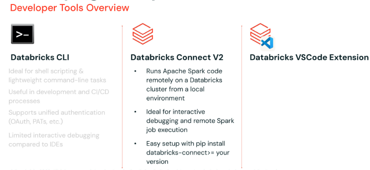

------

Schließlich können Sie die Databricks VSCode Extension verwenden.

Diese Extension verbessert Ihr IDE-Erlebnis, indem sie Databricks-Funktionalitäten direkt in Visual Studio Code integriert.

Mit der VSCode-Extension können Sie:

- Databricks sowohl für Batch- als auch interaktive Entwicklung in VS Code integrieren
- Die Einrichtung mit Resource Explorern und der Databricks CLI vereinfachen
- Python-Dateien direkt auf Databricks-Clustern ausführen und debuggen
- In VS Code bleiben, während Sie auf zusätzliche Bundle-Benutzeroberflächenfunktionen zugreifen

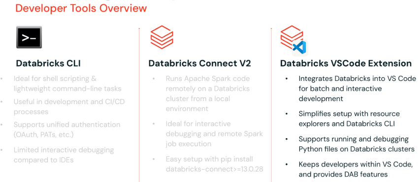

------

Die VSCode-Extension bietet eine einfache Einrichtung über den VSCode Marketplace, sodass Sie innerhalb weniger Minuten mit Compute verbunden sind.

Sie bietet Entwicklern, die VSCode bevorzugen, eine native Erfahrung und ermöglicht es Ihnen, Code direkt aus Ihrer IDE heraus auf Databricks auszuführen.

Einfache Einrichtung: Finden Sie uns auf dem VS Code Marketplace und verbinden Sie sich innerhalb weniger Minuten mit Compute

Native Erfahrung: Schreiben Sie Code mit den Produktivitätsfunktionen, die Sie an VS Code schätzen

Auf Databricks ausführen: Führen Sie Batch-Workloads aus oder starten Sie interaktives Debugging direkt aus Ihrer IDE

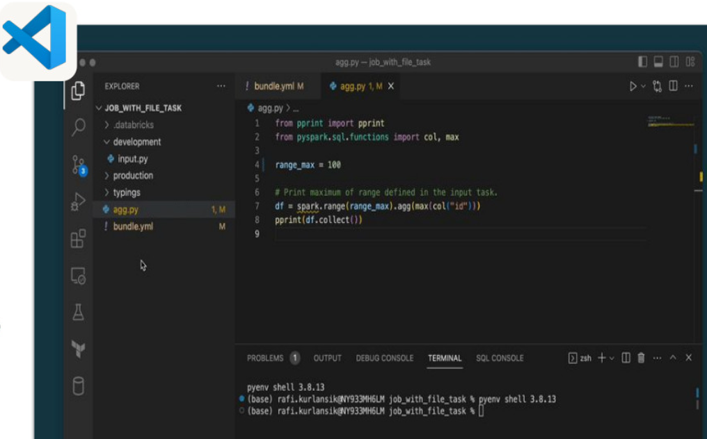

## 3_2_CI/CD-Best-Practices für Data Engineering

**CI/CD Best Practices für Data Engineering**

In diesem Abschnitt behandeln wir CI/CD Best Practices für Data Engineering

Bei der Umsetzung von CI/CD-Strategien in einer Organisation, insbesondere im Data Engineering, gibt es einige wichtige Best Practices, die man berücksichtigen sollte.

Zunächst sollten Sie eine klare Teststrategie definieren, die Unit-, Integrations- und End-to-End-Tests umfasst. Die Automatisierung dieser Tests stellt sicher, dass Ihr Code korrekt funktioniert und die Datenintegrität vor dem Deployment gewahrt bleibt. Dies reduziert das Fehlerrisiko und verbessert die Gesamtqualität Ihrer Codebasis.

Als Nächstes sollten Sie eine solide Versionskontrollstrategie mithilfe von Systemen wie GitHub implementieren, um Ihren Code, Ihre Notebooks und Konfigurationsdateien zu verwalten. Eine gute Versionskontrollstrategie ist für die teamübergreifende Zusammenarbeit unerlässlich. Ich empfehle, eine Branching-Strategie zu definieren, die dabei hilft, verschiedene Entwicklungsphasen zu verwalten, wodurch es einfacher wird, Änderungen nachzuverfolgen und Konflikte zu lösen.

Es ist außerdem entscheidend, einen robusten Code-Review-Prozess zu etablieren. Peer-Reviews stellen sicher, dass Änderungen gründlich geprüft werden, bevor sie gemerged werden. Zusätzlich können CI-Tools automatisch Builds bei Pull Requests auslösen, was eine schnelle Möglichkeit bietet, Änderungen zu validieren und Probleme frühzeitig zu erkennen.

Als Nächstes sollten Sie Declarative Automation Bundles (DABs) für konsistente und wiederholbare Deployments nutzen. Die Automatisierung des Deployment-Prozesses minimiert menschliche Fehler und beschleunigt den Deployment-Zyklus. DABs stellen sicher, dass stets der richtige Code in die korrekte Umgebung deployt wird, wodurch Konsistenz über Ihre Projekte hinweg gewahrt bleibt.

Schließlich sollten Sie die Performance Ihrer CI/CD-Pipelines kontinuierlich überwachen. Die Optimierung im Hinblick auf Geschwindigkeit, Zuverlässigkeit und Skalierbarkeit stellt sicher, dass Ihre Pipeline so effizient wie möglich läuft. Sammeln Sie Feedback von Entwicklern, identifizieren Sie Engpässe und arbeiten Sie daran, die Automatisierungseffizienz zu verbessern.

Durch die Umsetzung dieser Praktiken schaffen Sie einen optimierten, zuverlässigen und skalierbaren CI/CD-Prozess innerhalb Ihrer Databricks-Umgebung. Dies verbessert nicht nur Ihre Entwicklungszyklen, sondern erhöht auch die Gesamtqualität Ihrer datengetriebenen Produkte.

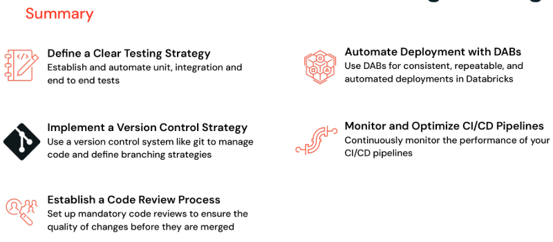

------

Zusammenfassend erfordert die Umsetzung von CI/CD-Praktiken eine Abstimmung zwischen den Teams sowie die Etablierung festgelegter Prozesse, die kontinuierliche Verbesserung und Qualität sicherstellen.

Für detailliertere Best Practices empfehle ich einen Blick in die Databricks-Dokumentation: Best Practices for Operational Excellence.

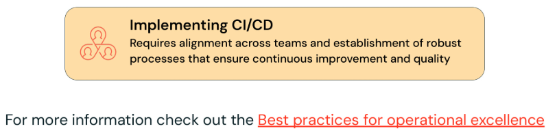

## 3_3_Nächste Schritte: Automatisiertes Deployment mit GitHub Actions

**Deployment-Muster mit DABs und GitHub Actions**

- **Einführung**: Schauen wir uns auf hoher Ebene an, wie wir GitFlow (ein alternatives Git-Branching-Modell, das Feature-Branches und mehrere primäre Branches nutzt) mit Declarative Automation Bundles, oder DABs, integrieren. Dieser Workflow vereinfacht den Prozess der Entwicklung, des Testens und des Deployments von Databricks-Projekten, indem er das strukturierte Branching-Modell von GitFlow und GitHub Actions zur Automatisierung nutzt.

- **Erstellen von Feature-Branches**: Der Prozess beginnt ganz links, wenn der Entwickler einen Feature-Branch vom dev-Branch erstellt. Hier werden einzelne Features oder Bugfixes isoliert entwickelt. Entwickler können Code mithilfe der databricks-cli direkt in den DEV-Databricks-Workspace deployen

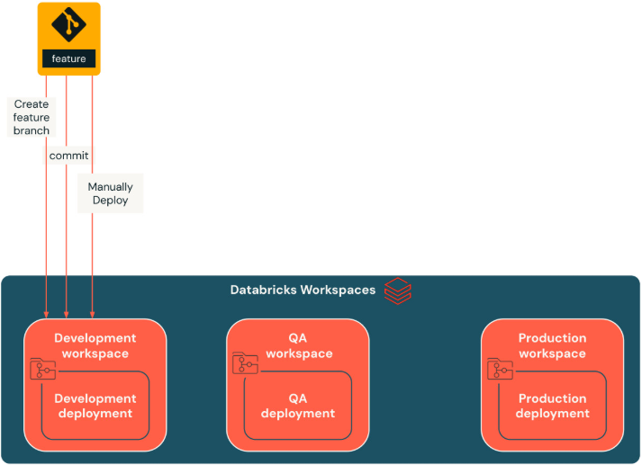

------

- **Pull-Request-Workflow**: Sobald die Entwicklung auf einem Feature-Branch abgeschlossen ist, wird ein Pull Request eröffnet. Nachdem der Code einem Peer-Review unterzogen wurde, wird er in den develop-Branch gemerged.

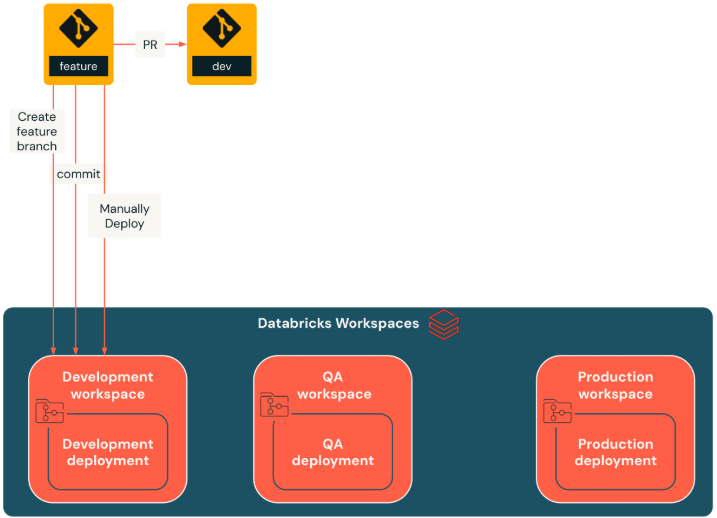

------

**Deployment in QA und Produktion**:

- Nach dem Merge in develop besteht der nächste Schritt darin, den GH-Actions-Workflow für das Erstellen eines Release-Entwurfs (Drafting a release) auszulösen. Dieser deployt die Änderungen mithilfe von DABs in die QA-Umgebung, führt Tests, Code-Coverage-Prüfungen und Sicherheitsscans durch und erstellt schließlich den versionierten Release-Branch. Außerdem wird ein PR erstellt, damit der Release-Branch in main gemerged werden kann.
- Nachdem der Release-PR geschlossen wurde, löst dies einen weiteren GitHub-Actions-Workflow aus, der das Bundle in PROD deployt, einen Release-Tag erstellt und schließlich einen PR erzeugt, damit der main-Branch in DEV gemerged wird.

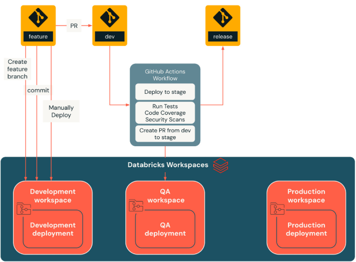

------

**Deployment in QA und Produktion**:

- Nach dem Merge in develop besteht der nächste Schritt darin, den GH-Actions-Workflow für das Erstellen eines Release-Entwurfs (Drafting a release) auszulösen. Dieser deployt die Änderungen mithilfe von DABs in die QA-Umgebung, führt Tests, Code-Coverage-Prüfungen und Sicherheitsscans durch und erstellt schließlich den versionierten Release-Branch. Außerdem wird ein PR erstellt, damit der Release-Branch in main gemerged werden kann.
- Nachdem der Release-PR geschlossen wurde, löst dies einen weiteren GitHub-Actions-Workflow aus, der das Bundle in PROD deployt, einen Release-Tag erstellt und schließlich einen PR erzeugt, damit der main-Branch in DEV gemerged wird.

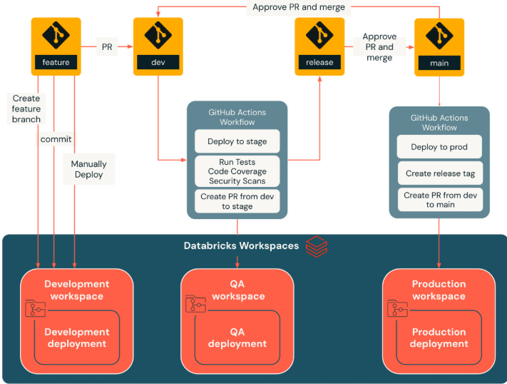

------

Release-Branching und Hotfixes: Sollte schließlich ein kritisches Problem in der Produktion auftreten, beheben wir dies mit einem Hotfix-Branch, der von main abgezweigt und nach der Behebung sowohl in main als auch in dev zurückgemerged wird. So wird sichergestellt, dass unsere Produktionsumgebung stabil bleibt, während die laufende Entwicklung fortgesetzt werden kann.

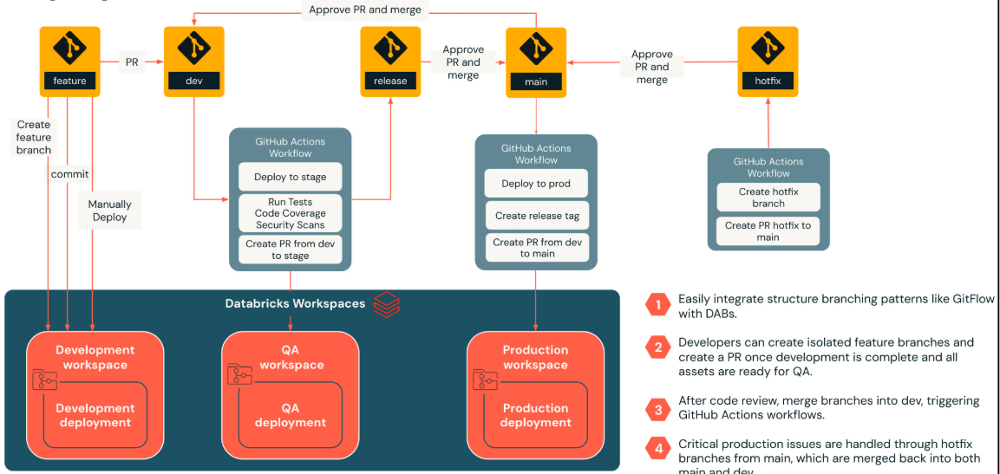

Referenz:
https://www.atlassian.com/git/tutorials/comparing-workflows/gitflow-workflow

------

**Überblick über Git mit Databricks**
Definitionen
Git ist ein kostenloses und quelloffenes Software-Framework, das entwickelt wurde, um Änderungen am Quellcode während der Softwareentwicklung nachzuverfolgen

Git-Vorteile: Versionskontrolle ermöglicht das Nachverfolgen von Codeänderungen und erleichtert Rollbacks und Zusammenarbeit. Branching und Merging ermöglichen es mehreren Entwicklern, parallel zu arbeiten und Änderungen effizient zu integrieren. Ein verteilter Workflow stellt sicher, dass jeder Entwickler über ein vollständiges lokales Repository verfügt, was Flexibilität und Zuverlässigkeit erhöht. Git ist auf leistungsstarke Handhabung großer Projekte optimiert, und seine Sicherheitsfunktionen nutzen kryptografische Integritätsprüfungen, um Datenkorruption zu verhindern.

**Git-Tools und -Dienste**

1. **GitHub, GitLab, Bitbucket, Azure DevOps** – Cloudbasierte Repositories mit CI/CD, Issue-Tracking und Teamzusammenarbeit.
2. **Git-CLI- und -GUI-Clients (z. B. SourceTree, GitKraken, VS Code Git Integration)** – Bieten verschiedene Oberflächen zur Verwaltung von Repositories.
3. **CI/CD-Integration** – Automatisierte Test- und Deployment-Pipelines.
4. **Code-Review und Zusammenarbeit** – Funktionen wie Pull Requests und Merge-Freigaben vereinfachen die Teamarbeit.
5. **Sicherheit und Zugriffskontrolle** – Rollenbasierte Berechtigungen und Audit-Logs verbessern die Sicherheit des Repositorys.

1. Git-Operationen, die wir auf der nächsten Folie besprechen.
2. **Nahtlose Integration** – Benutzer können Remote-Git-Repositories nutzen, während sie Code innerhalb von Databricks-Notebooks entwickeln
3. **CI/CD-Fähigkeiten** – Die Repos-REST-API ermöglicht die Integration von Daten- und KI-Projekten in CI/CD-Pipelines und erlaubt es Benutzern, Git-Workflows zu automatisieren
