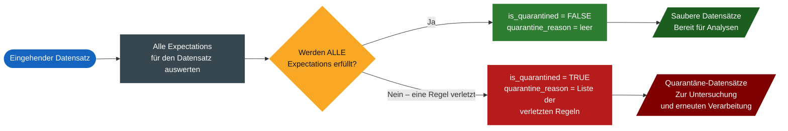

# Zusammenfassung – Alle Themen

Zusammengeführt aus allen Dateien im Ordner `Zusammenfassungen/`.

## Inhaltsverzeichnis

1. [Data Ingestion — Batch, Incremental, Auto Loader, JSON, MERGE INTO](#thema-1-data-ingestion)
2. [Spark Declarative Pipelines (SDP) — Bronze/Silver/Gold, Constraints, Streaming Joins, CDC](#thema-2-spark-declarative-pipelines-sdp)
3. [Unit Testing — pytest, PySpark Testing Utils](#thema-3-unit-testing)
4. [Lakeflow Pipelines Advanced Patterns — Multi-Flow, Sinks, Expectations, Resilient Design, Quarantine Pattern](#thema-4-lakeflow-pipelines-advanced-patterns)
5. [Unity Catalog Governance & Data Privacy — CDF, Berechtigungen, Dynamic Views, Row Filters, Column Masks, Pseudonymisierung](#thema-5-unity-catalog-governance--data-privacy)
6. [Performance Optimization — Liquid Clustering, Shuffle, Broadcast Join, UDFs](#thema-6-performance-optimization)
7. [Databricks Asset Bundles (DAB)](#thema-7-databricks-asset-bundles-dab)

---

<a name="thema-1-data-ingestion"></a>

# Thema 1: Data Ingestion (Batch, Incremental, Auto Loader, JSON, MERGE INTO)

#### Methode 1 – Batch – `CREATE TABLE AS (CTAS)`

**`CREATE TABLE AS (CTAS)`**: Batch-Ingestion mit `read_files()`, die UC-Tabellen aus Rohdateien erstellt. Am besten geeignet für kleinere Ad-hoc-Datensätze.

```sql
DROP TABLE IF EXISTS new_table;

CREATE TABLE new_table AS
SELECT *,
  _metadata.file_modification_time AS file_modification_time,
  _metadata.file_name AS source_file,file name
  current_timestamp() as ingestion_time
FROM read_files(
  <path_to_file(s)>,
  format => '<file_type>',
  <other_format_specific_options>
);
```

```python
df = (spark.read
      .format('<file_type>')
      .load('<path_to_file(s)>')
    )

(df.write
 .mode("overwrite")
 .saveAsTable('<path_to_file(s)>')
)
```

#### Methode 2 – Inkrementeller Batch – `COPY INTO`

**`COPY INTO`**: Inkrementelle Batch-Ingestion, die idempotent und wiederholbar ist. Überspringt bereits geladene Dateien und unterstützt Format- und Kopieroptionen für eine feingranulare Steuerung.

```sql
CREATE TABLE new_table;
COPY INTO new_table
FROM '<dir_path>'
FILEFORMAT = <file_type>
FORMAT_OPTIONS (<options>)
COPY_OPTIONS (<options>)
```

#### Methode 3 – Inkrementeller Batch oder Streaming – `AUTO LOADER`

Python

```python
(spark
  .readStream
    .format("cloudFiles")
    .option("cloudFiles.format", "json")
    .option("cloudFiles.schemaLocation", "<checkpoint_path>")
    .load("/Volumes/catalog/schema/files")
  .writeStream
    .option("checkpointLocation", "<checkpoint_path>")
    .trigger(processingTime="5 seconds")
    .toTable("catalog.database.table")
)
```

SQL

```sql
CREATE OR REFRESH STREAMING TABLE catalog.schema.table
SCHEDULE EVERY 1 HOUR
AS
SELECT *
FROM STREAM read_files('<dir_path>', format => '<file_type>')
```

------

## Rescued Data

Ingestion-Techniken wie **`read_files()`**, **`spark.read`** oder **Auto Loader** stellen während der Ingestion eine Rescued-Data-Spalte bereit.

```sql
-- Eine Spalte _rescued_data wird automatisch hinzugefügt, um 
-- alle Daten zu erfassen, die nicht zum abgeleiteten oder angegebenen Schema passen.

-- Um den Wert aus dem Feld **_c0** zu erhalten, 
-- können Sie die Syntax `_rescued_data:_c0` verwenden, wie in der nächsten Zelle gezeigt.
SELECT 
	*,
    cast(rescueddatacolumn:_c0 AS BIGINT) AS order_id,
FROM read_files(
        "/Volumes/dbacademy_ecommerce/v01/raw/sales-csv",
        format => "csv",
        sep => "|",
        header => true,
        schema => '''
            order_id INT, 
            email STRING, 
            transactions_timestamp BIGINT''', 
            rescueddatacolumn => '_rescued_data'    -- Die Spalte _rescued_data erstellen    	
      )
```

```python
df = (spark
      .read 
      .option("header", True) 
      .option("sep","|") 
      .option("rescuedDataColumn", "_rescued_data")
      .csv("/Volumes/dbacademy_ecommerce/v01/raw/sales-csv")
    )
```

------

## JSON

### JSON-Structur

#### 1.1 `schema_of_json()`

`schema_of_json()` gibt das Schema eines `JSON`-Strings im `DDL`-Format zurück.

Anstatt das Schema manuell zu definieren, können Sie die eingebaute Funktion `schema_of_json` verwenden, um das Schema automatisch aus einem Beispiel-JSON-String abzuleiten.

```sql
SELECT schema_of_json('sample-json-string')
```

#### 1.2 `from_json()`

`from_json()` gibt einen STRUCT-Wert mit `jsonStr` und `schema` zurück.

Sobald Sie die Struktur des JSON-formatierten Strings kennen, können Sie die Spark-Funktion **`from_json`** verwenden. Mit `from_json` wird eine neue Spalte vom Datentyp STRUCT erstellt, die die gemäß dem definierten Schema geparsten JSON-Daten enthält.

```sql
SELECT from_json(json_col, 'json-struct-schema') AS struct_column
FROM table
```

```sql
CREATE OR REPLACE TABLE bronze_struct AS
SELECT 
  * EXCEPT (decoded_value),
  from_json(
      decoded_value,    -- JSON-formatierte String-Spalte
      'STRUCT<device: STRING, .. user_id: STRING>') AS myValue
FROM bronze_decoded;

SELECT 
  myValue.device as device,
  myValue.geo.city as city,
  myValue.items as items,
  -- Array Size
  array_size(items) AS number_elements_in_array,
  -- Explode Size
  explode(value.items) AS item_in_array,
FROM kafka_events_bronze_struct;
```

### JSON-Value

JSON-Elemente in JSON-Strings auswählen:

```sql
CREATE OR REPLACE TABLE bronze_decoded AS
SELECT
  cast(unbase64(myValue) AS STRING) AS decoded_value
FROM bronze_raw;

CREATE OR REPLACE TABLE bronze_string_flattened AS
SELECT
  decoded_value:geo,       -- Enthält einen weiteren JSON-formatierten String
  decoded_value:items      -- Enthält ein verschachteltes Array JSON-formatierter Strings
FROM bronze_decoded;
```

#### `parse_json()`

Arbeiten mit einer VARIANT-Spalte über `parse_json`:

```sql
CREATE OR REPLACE TABLE bronze_variant AS
SELECT
  parse_json(decoded_value) AS json_variant_value   -- decoded_value in VARIANT konvertieren
FROM bronze_decoded;

SELECT
  json_variant_value,
  json_variant_value:device :: STRING,  -- Den Wert von device abrufen und in einen String casten
  json_variant_value:items
FROM kafka_events_bronze_variant
```

------

## MERGE INTO

MERGE INTO unterstützt **Schema Enforcement** oder **Schema Evolution** und ermöglicht unterschiedliche Aktionen, je nachdem, ob eine Zeile zwischen Quell- und Zieltabelle übereinstimmt.

```sql
MERGE INTO target_table target
USING source_table source
ON target.id = source.id
WHEN MATCHED AND source.status = 'update' THEN
  UPDATE SET
    target.email = source.email,
    target.status = source.status
WHEN MATCHED AND source.status = 'delete' THEN
  DELETE
WHEN NOT MATCHED THEN
  INSERT (id, first_name, email, sign_up_date, status)
  VALUES (source.id, source.first_name, source.email, source.sign_up_date, source.status);
```

Sie müssen Schema Evolution explizit aktivieren, um das Schema der Zieltabelle weiterzuentwickeln. 

```sql
-- Die Anweisung MERGE WITH SCHEMA EVOLUTION INTO verwenden
MERGE WITH SCHEMA EVOLUTION INTO main_users_target target  
USING new_users_source source
ON target.id = source.id
WHEN MATCHED AND source.status = 'update' THEN
  UPDATE SET 
    target.email = source.email,
    target.status = source.status
WHEN MATCHED AND source.status = 'delete' THEN
  DELETE
WHEN NOT MATCHED AND source.status = 'new' THEN
  INSERT (id, first_name, email, sign_up_date, status, country)
  VALUES (source.id, source.first_name, source.email, source.sign_up_date, source.status, source.country);
```

---

<a name="thema-2-spark-declarative-pipelines-sdp"></a>

# Thema 2: Spark Declarative Pipelines (SDP) — Bronze/Silver/Gold, Constraints, Streaming Joins, CDC

Apache Spark™ Declarative Pipeline (SDP)

```python
# Bronze: readStream + writeStream + Trigger + Checkpoint
(spark
 	.readStream
    	.format("cloudFiles")
    	.option("cloudFiles.format", "json")
 # Auto Loader (`cloudFiles`) benötigt eine `schemaLocation`, um das abgeleitete Schema 
 # im Zeitverlauf nachzuverfolgen und weiterzuentwickeln.
    	.option("cloudFiles.schemaLocation", "/Volumes/bronze_schema")
    	.load(source_path)
    .writeStream
    	.option("checkpointLocation", "/Volumes/bronze")
    	.trigger(availableNow=True)
    	.toTable("bronze_orders")
)

# Silber: readStream aus Bronze + foreachBatch für die Merge-Logik
def upsert_to_silver(batch_df, batch_id):
    batch_df.createOrReplaceTempView("updates")
    batch_df.sparkSession.sql("""
        MERGE INTO silver_orders AS target
        USING updates AS source
        ON target.order_id = source.order_id
        WHEN MATCHED THEN UPDATE SET *
        WHEN NOT MATCHED THEN INSERT *
    """)

# .foreachBatch(): Verarbeitet die Ausgabe der Streaming-Query mit einer bereitgestellten 
# Funktion. Nur im Micro-Batch-Modus unterstützt (also wenn der Trigger nicht continuous 
# ist). Bei jeder Micro-Batch wird die Funktion mit den Ausgabezeilen als DataFrame und der 
# Batch-ID aufgerufen. 
# Terminologie:
# Databricks nennt `upsert_to_silver` eine "batch function", NICHT "callback" - der 
# Callback-Begriff ist die allgemeine CS-Bezeichnung fuer dieses Uebergabe-Aufruf-Muster.
(spark.readStream
    .table("bronze_orders")
    .writeStream
    .foreachBatch(upsert_to_silver)
    .option("checkpointLocation", "/Volumes/silver")
 # `trigger(availableNow=True)` verarbeitet alle verfügbaren Daten und stoppt dann. Weitere Optionen 
 # sind `processingTime` für intervallbasierte Trigger und `continuous` für niedrige Latenz.
    .trigger(availableNow=True)
    .start()
)
```

```sql
CREATE OR REFRESH STREAMING TABLE 1_bronze_db.orders_bronze AS
SELECT
  *,
  current_timestamp() AS processing_time,
  _metadata.file_name AS source_file
FROM STREAM read_files("{{source_path}}/orders",  format => 'JSON');

CREATE OR REFRESH STREAMING TABLE 2_silver_db.orders_silver AS
SELECT
  order_id,
  timestamp(order_timestamp) AS order_timestamp,
  customer_id,
  notifications
FROM STREAM 1_bronze_db.orders_bronze;

CREATE OR REFRESH MATERIALIZED VIEW 3_gold_db.gold_orders_by_date AS
SELECT
  date(order_timestamp) AS order_date,
  count(*) AS total_daily_orders
FROM 2_silver_db.orders_silver
GROUP BY date(order_timestamp);

CREATE TEMPORARY VIEW orders_active AS
SELECT *
FROM 2_silver_db.orders_silver
WHERE notifications = 'Y';
```

------

## Contraints

```sql
CREATE OR REFRESH STREAMING TABLE 2_silver_db.orders_silver
 (
   # Warning: Data-Quality-Metriken gezählt/geloggt. 
   # Eine Zeile mit z. B. notifications = 'X' oder NULL landet trotzdem in orders_silver.
   CONSTRAINT valid_notifications EXPECT (notifications IN ('Y','N')),
   # verletzt auch nur eine Zeile diese Bedingung, bricht die gesamte 
   # Pipeline-Aktualisierung sofort ab und es findet ein Rollback aus.
   CONSTRAINT valid_date EXPECT (order_timestamp > "2021-01-01") ON VIOLATION FAIL UPDATE,
   # verletzende Zeilen (hier: customer_id IS NULL) werden stillschweigend 
   # verworfen, der Rest der Zeilen läuft normal durch.
   CONSTRAINT valid_id EXPECT (customer_id IS NOT NULL) ON VIOLATION DROP ROW
 )
AS
SELECT
  order_id,
  timestamp(order_timestamp) AS order_timestamp,
  customer_id,
  notifications
FROM STREAM 1_bronze_db.orders_bronze;
```

Einen klassischen ETL-Workflow in eine Pipeline für inkrementelle Datenverarbeitung migrieren:

```sql
CREATE OR REFRESH STREAMING TABLE myBronze_raw
AS 
SELECT 
  *,
  current_timestamp() processing_time,
  _metadata.file_name as source_file    
FROM STREAM read_files(:source, format => "json");


CREATE STREAMING TABLE myBronze_clean
  (
    -- A. Gültige customer_id erforderlich; Transaktion schlägt fehl, wenn sie fehlt
    CONSTRAINT valid_id EXPECT (customer_id IS NOT NULL) 
      ON VIOLATION FAIL UPDATE,

    -- B. Gültige operation erforderlich; Datensätze mit NULL-operation werden verworfen
    CONSTRAINT valid_operation EXPECT (operation IS NOT NULL) 
      ON VIOLATION DROP ROW,

    -- C. Name muss vorhanden sein, außer bei operation DELETE
    CONSTRAINT valid_name EXPECT (name IS NOT NULL OR operation = "DELETE"),

    -- D. Vollständige Adressfelder erforderlich, außer bei operation DELETE
    CONSTRAINT valid_address EXPECT (
      (address IS NOT NULL 
       AND city IS NOT NULL 
       AND state IS NOT NULL 
       AND zip_code IS NOT NULL)
       OR operation = "DELETE"),

    -- E. Gültiges E-Mail-Format (Regex) erforderlich; Prüfung bei DELETE überspringen; ungültige Zeilen verwerfen
    CONSTRAINT valid_email EXPECT (
      rlike(email, '^([a-zA-Z0-9_\\-\\.]+)@([a-zA-Z0-9_\\-\\.]+)\\.([a-zA-Z]{2,5})$') 
      OR operation = "DELETE") 
      ON VIOLATION DROP ROW
  )
  COMMENT "Clean raw bronze data and apply quality constraints"
AS 
SELECT 
  *,
  CAST(from_unixtime(timestamp) AS timestamp) AS timestamp_datetime -- UNIX-Zeitstempel umwandeln
FROM STREAM myBronze_raw;


                                  
```

## CDC — hängt davon ab, welches CDC gemeint ist

**1. Change Data Feed (CDF)** — die Delta-Table-Funktion, die Zeilenänderungen trackt (wird für `table_changes()`/`readChangeFeed` gebraucht):

- **Legacy CDF:** muss explizit aktiviert werden:

  

  ```sql
  ALTER TABLE myDeltaTable SET TBLPROPERTIES (delta.enableChangeDataFeed = true);
  ```

- **Automatic CDF** (Public Preview, Runtime 18 LTS+): keine eigene CDF-Property nötig, aber Voraussetzung ist **Row Tracking**:

  

  ```sql
  ALTER TABLE my_table SET TBLPROPERTIES (delta.enableRowTracking = true);
  ```

  Zusätzlich: Unity-Catalog-Tabelle (Managed/External Delta oder Iceberg v3).

- Legacy und Automatic CDF schließen sich auf derselben Tabelle gegenseitig aus.

**2. `AUTO CDC INTO`** (Lakeflow-Pipelines-CDC, früher `APPLY CHANGES`) — keine Tabellen-Property, aber zwei strukturelle Voraussetzungen:

- Die Pipeline muss als **Serverless Lakeflow Pipeline** oder Edition **Pro/Advanced** laufen (wird von Apache Spark Declarative Pipelines Core **nicht** unterstützt).
- Das Ziel muss eine **Streaming Table** sein (`CREATE OR REFRESH STREAMING TABLE` bzw. `dp.create_streaming_table(...)`), bevor `AUTO CDC ... INTO` darauf schreiben kann.

## SCD Type 2

Zwei Zusatzspalten, mit demselben Datentyp wie die `SEQUENCE BY`-Spalte:

| Spalte       | Bedeutung                                                    |
| ------------ | ------------------------------------------------------------ |
| `__START_AT` | Sequenzwert, ab dem diese Version der Zeile gültig wurde     |
| `__END_AT`   | Sequenzwert, ab dem die Gültigkeit endet — `NULL`, wenn die Zeile aktuell aktiv ist |

```sql
CREATE OR REFRESH STREAMING TABLE mySilver
  COMMENT 'SCD Type 2 Historical Customer Data';

CREATE FLOW myFlow_scd_type_2 AS 
-- Ziel: Hier werden die verarbeiteten Datensätze gespeichert
AUTO CDC INTO mySilver  
-- Source: Clean CDC records from Bronze layer
FROM STREAM myBronze_clean   
  -- Primärschlüssel: Zum Abgleich von Datensätzen für Updates/Deletes
  KEYS (customer_id)                                       
  -- Delete logic: Remove records marked as DELETE
  APPLY AS DELETE WHEN operation = "DELETE"                
  -- Reihenfolge: Stellt sicher, dass Änderungen in der richtigen Reihenfolge angewendet werden
  SEQUENCE BY timestamp_datetime                           
  -- Column selection: Include all except metadata fields
  COLUMNS * EXCEPT (timestamp, _rescued_data, operation)   
  -- SCD Type 2: Bewahrt historische Versionen mit __START_AT und __END_AT auf
  STORED AS SCD TYPE 2;  
```


------

## Streaming Joins

Streaming Joins unterstützen verschiedene Muster: Stream-Snapshot-Joins zur Anreicherung über Lookups, Joins von Streaming Tables über Materialized Views sowie Stream-Stream-Joins mit Windowing und Watermarking.

**Alle drei Join-Typen – auf einen Blick**

| Join Type           | Sources               | Output Type       | Data Processed           | In Scope?     |
| -------------------- | --------------------- | ------------------ | ------------------------- | -------------- |
| **Stream-Snapshot** | Streaming + statisch  | Streaming Table   | Nur neue Zeilen          | Ja            |
| **MV Join**         | Streaming + Streaming | Materialized View | Alle Zeilen je Lauf      | Ja            |
| **Stream-Stream**   | Streaming + Streaming | Streaming Table   | Nur neue Zeilen (gefenstert) | Nur fortgeschritten |

**1. Stream-Snapshot Join**: Streaming Table mit einer statischen Tabelle verknüpft

Ziel ist es, **neue Daten** aus einer Streaming Table **inkrementell** mit einer **statischen Lookup-Tabelle** zu verknüpfen, um eine weitere Streaming Table zu erstellen.

Das ist nützlich, wenn Sie Ihre Streaming-Daten mit Referenzinformationen anreichern möchten, die sich selten ändern.

```python
# 1. Stream + Static → Streaming Table (python)

from pyspark import pipelines as dp

@dp.table(name = "customer_sales")
def customer_sales():
    return (
        spark.readStream.table("sales")
        .join(spark.read.table("customers"), ["customer_id"], "left")
    )
```

```sql
-- 1. Stream + Static → Streaming Table (sql)

CREATE OR REFRESH STREAMING TABLE customer_sales
AS SELECT * FROM STREAM(sales)
  LEFT JOIN customers USING (customer_id);
```

**2. Streaming über Materialized View**: Zwei Streaming Tables, verknüpft in einer Materialized View

Ziel ist es, **alle Zeilen aus zwei Streaming Tables** zu nehmen und sie bei jedem Pipeline-Lauf miteinander zu verknüpfen.

Da beide Seiten Streaming sind, ist eine Materialized View erforderlich, um diesen Join effizient zu verarbeiten und die Ergebnisse aktuell zu halten.

Die Materialized View verarbeitet alle neuen Zeilen aus beiden Tabellen und wird – abhängig von Pipeline-Konfiguration und Compute-Modus – inkrementell aktualisiert.

```python
# 2. Stream + Stream → Materialized View (python)
from pyspark import pipelines as dp
from pyspark.sql.functions import col

@dp.table()
def orders():
    return (
        spark.readStream.format("cloudFiles")
        .option("cloudFiles.format", "json")
        .load("/databricks-datasets/retail-org/sales_orders")
    )

@dp.table()
def customers():
    return spark.readStream.table("raw_customers")

@dp.materialized_view()
def customer_orders():
    return (
        spark.read.table("orders")
        .join(spark.read.table("customers"), "customer_id")
        .select("customer_id", "order_number", "state")
    )
```

```sql
-- 2. Stream + Stream → Materialized View (sql)
CREATE OR REFRESH STREAMING TABLE orders
AS SELECT * FROM STREAM read_files(
  "/databricks-datasets/retail-org/sales_orders", format => "json"
);

CREATE OR REFRESH STREAMING TABLE customers
AS SELECT * FROM STREAM(raw_customers);

CREATE OR REFRESH MATERIALIZED VIEW customer_orders
AS SELECT o.customer_id, o.order_number, c.state
FROM orders o
JOIN customers c USING (customer_id);
```

**3. Stream-Stream Join**: Inkrementeller Join zweier Live-Streams (fortgeschritten)

Ziel ist es, neue Daten aus zwei Tabellen **inkrementell** zu verknüpfen; **vergangene Daten werden nicht verwendet**

Diese Joins sind nützlich, um Beziehungen zwischen Ereignissen zu erkennen, die zeitlich nah beieinander auftreten, etwa beim Verknüpfen von Clickstream-Daten mit Echtzeit-Werbeeinblendungen.

Da Stream-Stream-Joins jedoch häufig Windowing-Logik, Watermarking und andere fortgeschrittene Streaming-Konzepte erfordern, liegen sie außerhalb des Umfangs dieses Kurses.

```python
# 3. Stream + Stream → Streaming Table (echter Stream-Stream-Join) (python)
from pyspark import pipelines as dp
from pyspark.sql.functions import expr

dp.create_streaming_table("adImpressionClicks")

@dp.append_flow(target = "adImpressionClicks")
def joinClicksAndImpressions():
    clicksDf = (
        spark.readStream.table("rawClicks")
        .withWatermark("clickTimestamp", "3 minutes")
    )
    impressionsDf = (
        spark.readStream.table("rawAdImpressions")
        .withWatermark("impressionTimestamp", "3 minutes")
    )
    return impressionsDf.alias("imp").join(
        clicksDf.alias("click"),
        expr("""
            imp.userId = click.userId AND
            clickAdId = impressionAdId AND
            clickTimestamp >= impressionTimestamp AND
            clickTimestamp <= impressionTimestamp + interval 3 minutes
        """),
        "inner",
    ).select("imp.userId", "impressionAdId", "clickTimestamp", "impressionSeconds")
```

```sql
-- 3. Stream + Stream → Streaming Table (echter Stream-Stream-Join) (sql)
CREATE OR REFRESH STREAMING TABLE
  silver.adImpressionClicks
AS SELECT
  imp.userId, impressionAdId, clickTimestamp, impressionSeconds
FROM STREAM
  (bronze.rawAdImpressions)
WATERMARK
  impressionTimestamp DELAY OF INTERVAL 3 MINUTES imp
INNER JOIN STREAM
  (bronze.rawClicks)
WATERMARK clickTimestamp DELAY OF INTERVAL 3 MINUTES click
ON
  imp.userId = click.userId
AND
  clickAdId = impressionAdId
AND
  clickTimestamp >= impressionTimestamp
AND
  clickTimestamp <= impressionTimestamp + interval 3 minutes
```

------

## CDC

**SCD Type 1** überschreibt die Zieltabelle bei jeder Änderung mit den neuesten Werten – es wird keine Historie aufbewahrt, was es zum einfachsten und effizientesten Ansatz macht, wenn nur aktuelle Daten zählen.

**SCD Type 2** bewahrt jede historische Version eines Datensatzes auf, indem die Metadatenspalten `__START_AT` und `__END_AT` hinzugefügt werden – aktive Zeilen haben ein leeres (null) `__END_AT`, während inaktive und gelöschte Zeilen ein Datum tragen –, und ermöglicht so vollständige historische Analysen.

## AUTO-CDC-APIs in Lakeflow Declarative Pipelines

| API                                                          | SQL                                      | Python                                         | Quelle                                                       |
| ------------------------------------------------------------ | ----------------------------------------- | ------------------------------------------------ | ------------------------------------------------------------ |
| **`AUTO CDC` / `AUTO CDC ... INTO`** (Änderungen aus einem Change Data Feed) | ✅ `CREATE FLOW ... AS AUTO CDC INTO ...` | ✅ `dp.create_auto_cdc_flow(...)`               | [01 CDC-Grundlagen.md](07 Data Management/01 Data Engineering/03 Lakeflow Pipelines/05 CDC/01 CDC-Grundlagen.md) §1 |
| **`AUTO CDC FROM SNAPSHOT`** (Änderungen durch Snapshot-Vergleich) | ❌ **nicht unterstützt**                  | ✅ `dp.create_auto_cdc_from_snapshot_flow(...)` | [01 CDC-Grundlagen.md](07 Data Management/01 Data Engineering/03 Lakeflow Pipelines/05 CDC/01 CDC-Grundlagen.md) §8 (Limitierungen) |
| `APPLY CHANGES` / `apply_changes()`                          | ✅ (Altname von `AUTO CDC INTO`)          | ✅ (Altname von `create_auto_cdc_flow`)         | [10 apply_changes.md](07 Data Management/01 Data Engineering/03 Lakeflow Pipelines/14 Developer Reference/07 Python-Referenz/10 apply_changes.md) §1 |

## Voraussetzungen (gelten für beide)

- Ziel muss eine **Streaming Table** sein (`create_streaming_table()` bzw. `CREATE OR REFRESH STREAMING TABLE` vor dem Flow).
- Pipeline muss **Serverless** oder Edition **Pro/Advanced** sein.
- **Nicht** von Apache Spark Declarative Pipelines (Open Source) unterstützt.

```python
# Python — dp.create_auto_cdc_flow() , SCD Type 1

from pyspark import pipelines as dp
from pyspark.sql.functions import col, expr

@dp.view
def users():
    return spark.readStream.table("main.cdc_tutorial.users_cdf")

dp.create_streaming_table("users_current")

dp.create_auto_cdc_flow(
    target = "users_current",
    source = "users",
    keys = ["userId"],
    sequence_by = col("sequenceNum"),
    apply_as_deletes = expr("operation = 'DELETE'"),
    except_column_list = ["operation", "sequenceNum"],
    stored_as_scd_type = 1,
)
```

```sql
-- SQL — CREATE FLOW ... AS AUTO CDC INTO , SCD Type 1

CREATE OR REFRESH STREAMING TABLE users_current;

CREATE FLOW apply_cdc AS AUTO CDC INTO
  users_current
FROM
  stream(main.cdc_tutorial.users_cdf)
KEYS
  (userId)
APPLY AS DELETE WHEN
  operation = "DELETE"
SEQUENCE BY
  sequenceNum
COLUMNS * EXCEPT
  (operation, sequenceNum)
STORED AS
  SCD TYPE 1;
```

```python
# API 2 — AUTO CDC FROM SNAPSHOT
# Änderungen durch Vergleich aufeinanderfolgender Snapshots ermitteln. 
# Nur Python — keine SQL-Schnittstelle.

from pyspark import pipelines as dp

@dp.view(name="source")
def source():
    return spark.read.table("main.cdc_tutorial.snapshot")   # Spalten: userId, city

dp.create_streaming_table("target")

dp.create_auto_cdc_from_snapshot_flow(
    target = "target",
    source = "source",
    keys = ["userId"],
    stored_as_scd_type = 2,
)
```

#### Das Problem mit MERGE INTO

```sql
MERGE INTO target_table AS t
USING source_stream AS s
ON t.id = s.id
WHEN MATCHED AND s.operation = 'UPDATE'
  THEN UPDATE SET *
WHEN MATCHED AND s.operation = 'DELETE'
  THEN DELETE
WHEN NOT MATCHED AND s.operation = 'INSERT'
  THEN INSERT *


-- Alternative mit CDC:
CREATE OR REFRESH STREAMING TABLE sdp_cdc_2_silver.customers_silver_scd2_demo
COMMENT 'SCD Type 2 Historical Customer Data';
```

**Warum das ein Problem ist**

- Sie müssen die Merge-Logik selbst pflegen  
- Sie müssen den eingehenden operation-Werten vertrauen und Sonderfälle behandeln  
- Wenn sich Schemas weiterentwickeln und Regeln ändern, wächst der Merge oft zu einem großen SQL-Block, der schwer zu testen ist und leicht Fehler enthält  

# SDP mit CONSTRAINTS Versus CDC

| Feature / Mechanismus      | `CONSTRAINT` (Expectations in SDP)                           | CDC Type 2 (SCD Type 2 via `AUTO CDC` / `apply_changes`)     |
| -------------------------- | ------------------------------------------------------------ | ------------------------------------------------------------ |
| **Primärer Zweck**         | **Datenqualität & Validierung** (Prüfen, ob Daten den Business-Regeln entsprechen). | **Historisierung** (Lückenlose Verfolgung aller Datenänderungen über die Zeit). |
| **Arbeitsweise**           | Filtert, warnt oder stoppt die Pipeline bei fehlerhaften Zeilen (z. B. `NOT NULL`, Wertebereiche). | Generiert automatisch Zeilen-Versionen mit Gültigkeitszeiträumen (`start_date`, `end_date`). |
| **Ziel-Ebene (Medallion)** | Meist beim Übergang von **Bronze zu Silver**, um "schlechte" Daten frühzeitig abzufangen. | In der **Silver- oder Gold-Schicht**, um saubere, historisierte Dimensionstabellen aufzubauen. |

---

<a name="thema-3-unit-testing"></a>

# Thema 3: Unit Testing (pytest, PySpark Testing Utils)

## Unit Testing

Dateien mit Präfix `test_` (z. B. `test_functions.py`), Funktionen mit Präfix `test_`

pytest führt **Auto-Discovery** durch — keine manuelle Registrierung, aber die Namenskonvention ist Pflicht.

#### Ausführungsbefehl

- **Lokal / Terminal:**

```bash
pytest              # alle Tests im Verzeichnis
pytest -v           # ausführlich
pytest ./tests/     # gezielt
```

- **Im Databricks-Notebook:**

```python
import pytest, sys
sys.dont_write_bytecode = True
retcode = pytest.main(["./tests_lab/lab_unit_test_solution.py", "-v", "-p", "no:cacheprovider"])
assert retcode == 0, "The pytest invocation failed. See the log for details."
```

(`-p no:cacheprovider` verhindert `.pytest_cache`-Schreibversuche auf dem Cluster)

- **unittest im Notebook:**

  ```python
  unittest.main(argv=[''], verbosity=2, exit=False)
  ```

**`pyspark.testing.utils`** stellt Hilfsfunktionen bereit, die Unit-Testing in PySpark erleichtern.

- **`assertDataFrameEqual`** – `assertDataFrameEqual(actual, expected[, ...])`
- **`assertSchemaEqual`** – `assertSchemaEqual(actual, expected)`

Es gibt verschiedene weitere Methoden, um Ihre Unit-Tests zu testen; wir konzentrieren uns auf die PySpark Testing Utils.

```python
from pyspark.sql.functions import col, when

def add_new_col(df, new, s_col):
 return (df
         .withColumn(new,
            when(col(s_col) == 0, 'Normal')
            .otherwise('Unknown')))
```

```python
def test_add_new_col():
   data = [(0,), (1,), (-1,),(None,)]
   columns = ["value"]
   df = spark.createDataFrame(data, columns)

   actual_df = add_new_col(df, "new_value", "value")

   expected_data = [(0, 'Normal'), (1, 'Unknown'),
                    (-1, 'Unknown'), (None, 'Unknown')]
   expected_df = spark.createDataFrame(expected_data,
                                       ["value", "new_value"])

   assertDataFrameEqual(actual_df, expected_df)
```

```python
def test_get_health_csv_schema_match():

    # Das Schema aus unserer Funktion abrufen
    actual_schema = project_functions.get_health_csv_schema()
    
    # Das erwartete Schema definieren, das die Funktion zurückgeben soll. Wird die Funktion während der Entwicklung geändert, erkennt der Unit-Test den Fehler und schlägt fehl.
    expected_schema = StructType([
        StructField("ID", IntegerType(), True),
        StructField("PII", StringType(), True),
        StructField("date", DateType(), True),
    ])

    # Prüfen, dass das tatsächliche Schema dem erwarteten Schema entspricht
    assertSchemaEqual(actual_schema, expected_schema)
    print('Test passed!')
```

---

<a name="thema-4-lakeflow-pipelines-advanced-patterns"></a>

# Thema 4: Lakeflow Pipelines Advanced Patterns (Multi-Flow, Sinks, Expectations, Resilient Design, Quarantine Pattern)

## Das Multi-Flow-Muster (Fan-in)

Eine gängige Alternative zu Multi-Flow ist das Kombinieren von Quellen mit einer `UNION`-Klausel innerhalb einer einzigen Streaming-Table-Definition. Für inkrementelle Pipelines bringt das kritische Einschränkungen mit sich.

**❌ UNION-Ansatz**

- Alle Quellen teilen sich **einen einzigen Checkpoint**
- Das Hinzufügen einer neuen Quelle **erfordert einen Full Refresh**, um alles neu zu verarbeiten
- Ein Fehler in einer Quelle kann alle anderen blockieren
- Die Lineage pro Quelle ist schwerer nachzuverfolgen
- Komplexe Fehlerbehandlung über mehrere Datenquellen hinweg
- Begrenzte Skalierbarkeit bei steigender Anzahl von Quellen

**✅ Multi-Flow-Ansatz**

- Jeder Flow hat seinen **eigenen, unabhängigen Checkpoint**
- Neue Quellen können **ohne Full Refresh** hinzugefügt werden
- Flows sind isoliert – der Ausfall einer Quelle beeinträchtigt die anderen nicht
- Klare Lineage und klares Monitoring pro Quelle
- Unabhängige Fehlerbehandlung und Wiederherstellung pro Quelle
- Bessere Skalierbarkeit und Wartbarkeit

```sql
CREATE OR REPLACE STREAMING TABLE multi_flow_1_bronze.orders_bronze_flows_demo
(subsidiary_id   STRING)
-- Die Eigenschaft `'pipelines.reset.allowed' = false` verhindert Full Refreshes der 
-- Streaming Table und hilft so, das versehentliche Entfernen von Checkpoints und das 
-- Leeren der Daten der Streaming Table zu vermeiden.
-- Dieser Schutz ist besonders wichtig, wenn Ihre Rohdatenquelle Dateien nach einer bestimmten Zeit 
-- automatisch entfernt. Ohne diese Einstellung würden Daten, die nicht mehr im Quellverzeichnis 
-- vorhanden sind, bei einem **Run pipeline with full table refresh** nicht erneut in die 
-- Zieltabelle ingestiert.
TBLPROPERTIES (
'pipelines.reset.allowed' = false    -- Full Table Refreshes auf der Bronze-Tabelle verhindern
);

-- flow_ingestion.sql
CREATE FLOW bright_home_orders_flow
AS INSERT INTO multi_flow_1_bronze.orders_bronze_flows_demo BY NAME
SELECT
CAST(subsidiary_id AS STRING) AS subsidiary_id,
FROM STREAM read_files('..', format => 'csv', header => true);

CREATE FLOW lumina_sports_orders_flow
AS INSERT INTO multi_flow_1_bronze.orders_bronze_flows_demo BY NAME
SELECT
CAST(subsidiary_id AS STRING) AS subsidiary_id
FROM STREAM read_files('..', format => 'csv', header => true);

CREATE FLOW northstar_outfitters_orders_flow
AS INSERT INTO multi_flow_1_bronze.orders_bronze_flows_demo BY NAME
SELECT
CAST(subsidiary_id AS STRING) AS subsidiary_id,
FROM STREAM read_files('..', format => 'json');
```

------

## Multiplex-Muster (Fan-out)

------

## Sinks

Sinks bieten einen Mechanismus, um Streaming-Daten aus einer Spark Declarative Pipeline in externe Delta-Tabellen zu schreiben, die außerhalb des von der Pipeline verwalteten Bereichs liegen. Databricks unterstützt **vier Arten von Sinks** – jeweils geeignet für ein anderes Ziel und einen anderen Anwendungsfall.

**Delta Table Sink: ** Von Unity Catalog verwaltete Tabellen; externe Delta-Tabellen; Schreiben über Pfad oder Tabellennamen

**Apache Kafka Sink: ** Zurückschreiben in Kafka-Topics; operative Anwendungsfälle mit niedriger Latenz; Reverse ETL aus Databricks heraus

**Azure Event Hubs Sink: ** Uses Kafka interface format; Real-time event streaming; Fraud detection · recommendations

**Python Custom Sink: ** In beliebige Datenspeicher schreiben; verwendet benutzerdefinierte PySpark-Datenquellen; maximale Flexibilität

### B2. Managed Tables vs. Sinks

Jedes Standard-Dataset in einer Spark Declarative Pipeline – Streaming Table oder Materialized View – **gehört der Pipeline und wird von ihr verwaltet**. Ein **Sink** durchbricht dies bewusst: Er lässt die Pipeline Streaming-Daten in eine **einfache Delta-Tabelle schreiben, die außerhalb des von der Pipeline verwalteten Bereichs liegt**.

**Managed Table (Standard): ** Daten bleiben in Unity Catalog; vollständige Nachverfolgung der Pipeline-Lineage; unterstützt Expectations und CDC; Streaming Tables und Materialized Views

**Sink: ** In externe Systeme außerhalb von Databricks schreiben; ermöglicht Reverse ETL und operative Anwendungsfälle; unterstützt Kafka, Event Hubs und benutzerdefinierte Ziele; keine Expectations – nur Anhängen

------

## Tags

Tags erleichtern das Organisieren, Durchsuchen und Verwalten (Governance) von Objekten in Unity Catalog. Sie helfen nachgelagerten Teams, schnell zu verstehen, was jedes Objekt darstellt und wie es verwendet werden sollte.

```sql
ALTER TABLE multi_flow_1_bronze.orders_bronze_flows_demo
SET TAGS (
  'demo_tag_Department' = 'Sales',
  'demo_tag_Quality' = 'bronze'
);
```

------

## Advanced Patterns

### A2. Fortgeschrittene Expectation-Muster

Über Constraints auf Zeilenebene hinaus unterstützen Databricks-Expectations eine **tabellenübergreifende Validierung**. Mit diesen Mustern können Sie Zeilenanzahlen überprüfen, fehlende Datensätze erkennen und die Eindeutigkeit von Primärschlüsseln über Datensätze hinweg durchsetzen – und so Probleme erkennen, die Prüfungen einzelner Zeilen nicht sehen können.

**Validierung der Zeilenanzahl**
Prüft, ob die Zeilenanzahlen zweier Tabellen übereinstimmen – nützlich nach Joins, Aggregationen oder einem Pipeline-Fan-out, um sicherzustellen, dass keine Datensätze unbemerkt verworfen wurden.

```sql
CREATE OR REFRESH MATERIALIZED VIEW count_verification (
  CONSTRAINT no_rows_dropped EXPECT (a_count == b_count)
    ON VIOLATION FAIL UPDATE
)
AS SELECT * FROM
  (SELECT COUNT(*) AS a_count FROM table_a),
  (SELECT COUNT(*) AS b_count FROM table_b)
```

**Erkennung fehlender Datensätze**
Verwendet einen LEFT OUTER JOIN, um Datensätze zu identifizieren, die in einer Validierungskopie vorhanden sind, in der Report-Tabelle aber fehlen – und erkennt so Vollständigkeitsfehler, die Prüfungen auf Zeilenebene völlig übersehen.

```sql
CREATE OR REFRESH MATERIALIZED VIEW report_compare_tests (
  CONSTRAINT no_missing_records EXPECT (r_key IS NOT NULL)
    ON VIOLATION FAIL UPDATE
)
AS SELECT v.*, r.key AS r_key
FROM validation_copy v
LEFT OUTER JOIN report r ON v.key = r.key
```

**Eindeutigkeit des Primärschlüssels**
Gruppiert nach dem Primärschlüssel und prüft, ob jede Gruppe genau einen Eintrag hat. Erkennt doppelte Schlüssel, bevor sie nachgelagerte Joins oder Aggregationen verfälschen.

```sql
CREATE OR REFRESH MATERIALIZED VIEW report_pk_tests (
  CONSTRAINT unique_pk EXPECT (num_entries = 1)
    ON VIOLATION FAIL UPDATE
)
AS SELECT pk, COUNT(*) AS num_entries
FROM report
GROUP BY pk
```

### A3. NULL-tolerante Constraints schreiben

Jeder `CONSTRAINT`-Block sollte **eine einzige logische Regel** validieren. So erhält die Pipeline-UI präzise Kennzahlen pro Constraint. Es gibt jedoch eine kritische Falle: **NULL wird in SQL als NOT TRUE ausgewertet**, daher behandelt eine einfache Bereichsprüfung jeden NULL-Wert als Verletzung.

**Naiv – NULL-Werte werden als Verletzungen behandelt**

```sql
CONSTRAINT valid_discount
EXPECT (
  discount_rate >= 0
  AND discount_rate <= 100
)
-- Jeder NULL-Datensatz wird als Verletzung markiert
```

Nach einer Schema Evolution haben alle historischen Datensätze, die vor der Spalte `discount_rate` entstanden sind, den Wert `NULL` – und jeder einzelne verletzt diesen Constraint, sodass die Pipeline-UI mit falschen Verletzungen überschwemmt wird.

**NULL-tolerant – validiert nur, wenn vorhanden**

```sql
CONSTRAINT valid_discount
EXPECT (
  CASE
    WHEN discount_rate IS NOT NULL
    THEN discount_rate >= 0
         AND discount_rate <= 100
    ELSE TRUE   -- NULL ist zulässig
  END
)
```

NULL-Datensätze bestehen problemlos. Nur Datensätze, bei denen `discount_rate` vorhanden *und* außerhalb des Bereichs ist, werden markiert – so erhalten Sie genaue, rauschfreie Verletzungskennzahlen.

**Faustregel**

Wann immer eine Spalte fehlen kann – weil sie optional ist oder erst nach dem Start der Pipeline hinzugefügt wurde –, umschließen Sie ihren Constraint mit einem Block `'CASE WHEN ... IS NOT NULL THEN ... ELSE TRUE END'`.

## B. Robustes Pipeline-Design

### B1. Alles als STRING ingestieren

Das robusteste Design der Bronze-Schicht **weist niemals einen Datensatz wegen eines Typkonflikts ab**. Indem Sie alle eingehenden Felder als `STRING` speichern, akzeptieren Sie alles, was die Quelle sendet – Ganzzahlen, Dezimalzahlen, gemischte Typen – und verlagern die Durchsetzung der Typen nach Silber, wo `TRY_CAST` Fehler souverän behandelt.

**Bronze – alles akzeptieren**
Alle Felder werden als STRING abgeleitet. Typkonflikte lassen die Pipeline nie fehlschlagen – eine Ganzzahl in einem String-Feld ist einfach ein String.

```sql
CREATE OR REFRESH STREAMING TABLE bronze_raw
AS SELECT CAST(xxxx  AS STRING)  AS order_id, ..
FROM STREAM read_files(
  '/path/to/source',
  format => 'json',
  schemaEvolutionMode => 'rescue'
);

CREATE OR REFRESH STREAMING TABLE bronze_cleaned
AS SELECT TRY_CAST(xxxx  AS INT)  AS order_id, ..
FROM STREAM bronze_raw;

```

**Silber – Typen sicher durchsetzen**
`TRY_CAST` gibt bei einem fehlgeschlagenen Cast NULL zurück, anstatt die Pipeline anzuhalten. Das NULL-tolerante Constraint-Muster erledigt dann den Rest.

```sql
CREATE OR REFRESH STREAMING TABLE silver_events (
  CONSTRAINT valid_amount EXPECT (
    CASE WHEN amount IS NOT NULL
    THEN amount >= 0 ELSE TRUE END
  ) ON VIOLATION DROP ROW
)
AS SELECT *,
  TRY_CAST(amount_str AS DOUBLE) AS amount
FROM STREAM bronze_events
```

### B2. Werkzeuge für Schema Evolution in der Bronze-Schicht

Zwei eingebaute Mechanismen decken den gesamten Lebenszyklus von Schemaänderungen ab – `schemaHints` für Spalten, von denen Sie wissen, dass sie kommen, und `_rescued_data` als letzte Verteidigungslinie für alles Unerwartete.

**schemaHints – künftige Spalten schon heute deklarieren**
Deklarieren Sie Spalten, die in *kommenden* Dateien erwartet werden, bevor sie eintreffen. Sobald die neue Spalte erscheint, wird sie automatisch befüllt. Datensätze vor der Schemaänderung enthalten `NULL` – gleichzeitig rückwärts- und vorwärtskompatibel.

```sql
CREATE OR REFRESH STREAMING TABLE bronze_events
AS SELECT *
FROM STREAM read_files(
  '/path/to/source',
  format => 'json',
  schemaHints => 'loyalty_tier STRING, region_code STRING',
)
-- Alte Datensätze: loyalty_tier = NULL (zulässig)
-- Neue Datensätze: loyalty_tier wird automatisch befüllt
```

**_rescued_data – die letzte Verteidigungslinie**
Jedes Feld, das außerhalb des deklarierten Schemas eintrifft – unerwartete Spalten, Typkonflikte –, wird als JSON in `_rescued_data` erfasst. Nichts wird unbemerkt verworfen. Fragen Sie es jederzeit zur Untersuchung oder Wiederherstellung ab.

```sql
-- Gerettete Felder im Nachhinein untersuchen
SELECT
  event_id,
  _rescued_data:unexpected_field  AS unexpected_field,
  _rescued_data:new_column        AS new_column
FROM bronze_events
WHERE _rescued_data IS NOT NULL
```

**⚠️ Kritische Wechselwirkung:** Wenn eine Spalte per Schema Evolution hinzugefügt wird, enthalten alle Datensätze, die *vor* der Schemaänderung ingestiert wurden, für diese Spalte `NULL`. Jeder Constraint für diese Spalte **muss das NULL-tolerante `CASE WHEN`-Muster verwenden** – andernfalls verletzt jeder historische Datensatz den Constraint, was zu zahlreichen falschen Verletzungen in der Pipeline-UI führt.

## C. Das Quarantäne-Muster

### C1. Wie das Quarantäne-Muster funktioniert

Das Quarantäne-Muster leitet jeden eingehenden Datensatz durch eine Qualitätsbewertung und teilt die Ausgabe dann anhand der Ergebnisse in zwei Pfade auf – einen sauberen Pfad für Analysen und einen Quarantäne-Pfad für die Korrektur.

**Zentrale Garantie**: Kein Datensatz wird jemals verworfen

**Mathematische Beziehung**: `Eingehende Datensätze gesamt = saubere Datensätze + Quarantäne-Datensätze`



**⚠️ Die Tabelle zur Qualitätsverfolgung muss immer WARN verwenden**
Wird `DROP ROW` oder `FAIL UPDATE` auf die Tabelle zur Qualitätsverfolgung angewendet, werden ungültige Datensätze entfernt, *bevor* das Quarantäne-Flag berechnet werden kann – und die Garantie „kein Datenverlust“ wird unbemerkt gebrochen. Die Aktion `WARN` wird hier aus nur einem Grund verwendet: um Verletzungskennzahlen pro Constraint in der Pipeline-UI sichtbar zu machen. Die gesamte eigentliche Routing-Logik wird separat über die inverse Logik abgewickelt.

**ℹ️ Warum die Tabelle zur Qualitätsverfolgung nach is_quarantined partitionieren?**
Die Partitionierung der Tabelle zur Qualitätsverfolgung nach der Spalte `is_quarantined` trennt saubere und fehlerhafte Datensätze physisch im Speicher. Die nachgelagerten Abfragen, die die beiden Pfade aufteilen – Filter auf `is_quarantined = FALSE` und `is_quarantined = TRUE` –, profitieren dann vom Partition Pruning und lesen nur die relevante Partition, statt die gesamte Tabelle zu scannen.

### C2. Kein Datenverlust dank inverser Logik

`DROP ROW` löscht ungültige Datensätze dauerhaft – es gibt keinen Weg zur Wiederherstellung. Das **Quarantäne-Muster** verhindert Datenverlust vollständig, indem *jeder* Datensatz in die Tabelle geleitet wird und anschließend ein Flag `is_quarantined` und inverse Logik saubere und fehlerhafte Datensätze in separate nachgelagerte Views aufteilen.

**Schritt 1 – Quarantäne-Tabelle mit inverser Logik**
Alle Datensätze werden mit `WARN` geschrieben – kein Datensatz wird verworfen. Das Flag `is_quarantined` wird über `NOT(alle Regeln)` abgeleitet: Verletzt eine beliebige Regel, wird der Datensatz markiert. `WARN` dient ausschließlich dazu, Kennzahlen pro Constraint in der Pipeline-UI sichtbar zu machen.

```sql
CREATE OR REFRESH STREAMING TABLE trips_quarantine (
  CONSTRAINT valid_distance EXPECT (trip_distance > 0),
  CONSTRAINT valid_fare     EXPECT (fare_amount >= 0),
  CONSTRAINT valid_pax      EXPECT (passenger_count BETWEEN 1 AND 9)
  -- WARN: macht Kennzahlen in der UI sichtbar, keine Datensätze werden verworfen
)
PARTITIONED BY (is_quarantined)
AS SELECT *,
  NOT(
    trip_distance > 0
    AND fare_amount >= 0
    AND passenger_count BETWEEN 1 AND 9
  ) AS is_quarantined
FROM STREAM bronze_trips
```

**Schritt 2 – In saubere und fehlerhafte Views aufteilen**
Zwei Materialized Views filtern auf die Partition `is_quarantined`. Da die Quarantäne-Tabelle **nach `is_quarantined` partitioniert** ist, profitiert jede View von vollständigem Partition Pruning – nur ihre Partition wird gescannt, nicht die gesamte Tabelle.

```sql
-- Saubere Datensätze für nachgelagerte Analysen
CREATE OR REFRESH MATERIALIZED VIEW valid_trips_data
AS SELECT * FROM trips_quarantine
WHERE is_quarantined = FALSE;

-- Fehlerhafte Datensätze, aufbewahrt für Korrektur und Audit
CREATE OR REFRESH MATERIALIZED VIEW invalid_trips_data
AS SELECT * FROM trips_quarantine
WHERE is_quarantined = TRUE;
```

**💡 Warum WARN und nicht DROP ROW auf der Quarantäne-Tabelle?** Würde `DROP ROW` oder `FAIL UPDATE` auf die Quarantäne-Tabelle angewendet, würden ungültige Datensätze entfernt, bevor das Flag `is_quarantined` ausgewertet wird – und das gesamte Muster wäre wirkungslos. `WARN` stellt sicher, dass jeder Datensatz geschrieben und über die Spalte mit inverser Logik korrekt weitergeleitet wird.

### C3. Zwischen DROP ROW und Quarantäne wählen

Beide Strategien setzen Datenqualität durch, unterscheiden sich aber grundlegend darin, was mit ungültigen Datensätzen geschieht. Die richtige Wahl hängt davon ab, ob Ihr Unternehmen einen Audit Trail und die Möglichkeit zur Wiederherstellung benötigt und ob falsche Verletzungen durch Schema Evolution ein Problem darstellen.

|                       | DROP ROW                                          | Quarantine Pattern                                                 |
| --------------------- | --------------------------------------------------- | --------------------------------------------------------------------- |
| Invalid records       | Permanently deleted                                | Preserved in quarantine table                                       |
| Audit trail           | None                                                | Full — queryable                                                    |
| Datenwiederherstellung | Nicht möglich                                     | Regel korrigieren → aus der Quarantäne neu weiterleiten             |
| Verletzungskennzahlen in der UI | In der Pipeline-UI sichtbar              | Kennzahlen pro Constraint über WARN                                 |
| Lese-Performance      | Vollständiger Tabellenscan auf sauberen Daten      | Partition Pruning auf `is_quarantined`                              |
| Pipeline complexity   | Low — single table                                 | Moderate — temp table + 2 views                                     |
| Am besten für         | Nicht kritische Streams mit gut etablierten Regeln | Produktions-Pipelines mit Anforderungen an Compliance, Audit oder Korrektur |

**Empfehlung:** Für produktive Enterprise-Pipelines ist das Quarantäne-Muster der bevorzugte Ansatz. Es bietet keinen Datenverlust, Verletzungskennzahlen pro Constraint in der Pipeline-UI, Lesevorgänge mit Partition Pruning auf sauberen Daten und eine wiederherstellbare Quarantäne-Tabelle für Ursachenanalyse und erneute Verarbeitung – Möglichkeiten, die `DROP ROW` nicht bieten kann.

---

<a name="thema-5-unity-catalog-governance--data-privacy"></a>

# Thema 5: Unity Catalog Governance & Data Privacy (Berechtigungen, Dynamic Views, Row Filters, Column Masks, Pseudonymisierung)

# 1. Change Data Feed (CDF)

**CDC (Change Data Capture)** ist das übergeordnete Konzept/Muster: Änderungen (Insert/Update/Delete) an einer Quelle erfassen und an nachgelagerte Systeme weitergeben — technologieunabhängig, es gibt viele Implementierungen (Debezium, Log-basiert, Trigger-basiert, Snapshot-Vergleich …).

**CDF (Change Data Feed)** ist Databricks'/Delta Lakes **konkrete Implementierung** von CDC für Delta-Tabellen: ein aktivierbares Feature, das pro Zeile Änderungsmetadaten (`_change_type`, `_commit_version`, `_commit_timestamp`) mitschreibt.

|             | CDC                     | CDF                                                          |
| ----------- | ----------------------- | ------------------------------------------------------------ |
| Ebene       | Konzept/Pattern         | Delta-Lake-Feature (konkrete Umsetzung)                      |
| Aktivierung | – (architekturabhängig) | `ALTER TABLE ... SET TBLPROPERTIES (delta.enableChangeDataFeed = true)` |
| Zugriff     | variiert je Tool        | `table_changes()` / `readStream.option("readChangeFeed","true")` |
| Scope       | ganze Systeme/Pipelines | einzelne Delta-Tabelle                                       |

Im Projekt taucht das an zwei Stellen konkret auseinander:

- **CDF** wird genutzt in [DP 1.3 - Processing Records from CDF and Propagating Changes.md](vscode-webview://0hs34rpns60nkimdq53kub5hrqrjkl10cf9ne2p6atdd3hhqu54l/6_Databricks Data Privacy/DP 1.3 - Processing Records from CDF and Propagating Changes.md) — dort liest der Stream direkt aus dem Change Data Feed einer Tabelle und propagiert per `foreachBatch` + `MERGE INTO`.
- **CDC als übergeordnetes Muster** (inkl. SCD Type 1/2 und der `AUTO CDC` APIs, die selbst wiederum auf einem CDF-artigen Input mit `operation`/`sequenceNum`-Spalten arbeiten) steht in [Alle_Zusammenfassungen.md – Thema 2](vscode-webview://0hs34rpns60nkimdq53kub5hrqrjkl10cf9ne2p6atdd3hhqu54l/Zusammenfassungen/Alle_Zusammenfassungen.md#thema-2-spark-declarative-pipelines-sdp) bzw. [11 Lecture - Change Data Capture (CDC) Overview.md](vscode-webview://0hs34rpns60nkimdq53kub5hrqrjkl10cf9ne2p6atdd3hhqu54l/3_Build Data Pipelines with Lakeflow Spark Declarative Pipelines(DONE)/11 Lecture - Change Data Capture (CDC) Overview.md).

Kurz: **CDF ist eine mögliche Datenquelle/Technik, um CDC zu betreiben** — nicht dasselbe, aber eng verzahnt.

```sql
-- Enable CDF
-- Um CDF global für jede neue Tabelle zu aktivieren, verwenden Sie folgende Syntax:
-- spark.conf.set("spark.databricks.delta.properties.defaults.enableChangeDataFeed", True)

ALTER TABLE silver_users SET TBLPROPERTIES (delta.enableChangeDataFeed = true);

-- Prüfen, ob CDF aktiviert ist: Sehen Sie sich in der Ausgabe die letzte Zeile unter Table Properties an und bestätigen Sie, dass CDF mit der Eigenschaft [delta.enableChangeDataFeed=true] gesetzt ist.
-- DESCRIBE TABLE EXTENDED silver_users;
-- Mit diesem Befehl sieht man nur Table Properties
SHOW TBLPROPERTIES silver_users ('delta.enableChangeDataFeed');
```

```python
def upsert_to_delta(microBatchDF, batchId):
    # Eine temporäre View für den Micro-Batch-DataFrame erstellen oder ersetzen
    microBatchDF.createOrReplaceTempView("updates")
    
    microBatchDF._jdf.sparkSession().sql("""
        MERGE INTO silver_users s
        USING updates u
        ON s.mrn = u.mrn
        WHEN MATCHED AND s.dob <> u.dob OR s.sex <> u.sex
            THEN UPDATE SET *
        WHEN NOT MATCHED
            THEN INSERT *
    """)
    
silver_users_stream = (
     spark.readStream.table("bronze_users")
       .writeStream
       .foreachBatch(upsert_to_delta)  # Micro-Batch-Daten per Upsert in die Silber-Tabelle schreiben
       .trigger(processingTime='3 seconds')  # Trigger the stream processing every 3 seconds
       .start())
```

```sql
-- Beim Ausführen der Zelle wird die Historie dieser Tabelle angezeigt; es sollte drei Protokolleinträge geben:
-- Version 0: The initial clone
-- Version 1: Setzen der Tabelleneigenschaften, um CDF auf der Tabelle zu aktivieren
-- Version 2: Der MERGE-Stream aus der Tabelle bronze_users.
SELECT version, operation FROM (DESCRIBE HISTORY silver_users)
```

```python
# Beim Lesen aus dem Change Data Feed enthält das Schema die folgenden Metadatenspalten: _change_type, _commit_version, _commit_timestamp
cdf_df = (spark.read
               .format("delta")
               .option("readChangeData", True)   # Read the change data
               .option("startingVersion", 2)     # Reading changes from version 2
               .table("silver_users"))

## Display the changed data
display(cdf_df.where("mrn = 63729051").select("updated", "_change_type", "_commit_version", "_commit_timestamp"))
```

```sql
DROP TEMPORARY VARIABLE IF EXISTS latest_version;
DECLARE VARIABLE latest_version INT;
SET VARIABLE latest_version = (
  SELECT max(version) AS latest_version
  FROM (DESCRIBE HISTORY silver_users));

SELECT operationMetrics['numTargetRowsInserted'],operationMetrics['numTargetRowsUpdated'],
  operationMetrics['numTargetRowsDeleted'] 
  FROM (DESCRIBE HISTORY silver_users)
WHERE version = latest_version

-- mögliche Werte in _change_type sind insert, update_postimage, update_preimage, delete
SELECT mrn, _change_type, _commit_version, _commit_timestamp
FROM table_changes("silver_users", latest_version)
WHERE _change_type = "insert" -- insert, update_postimage, update_preimage, delete
ORDER BY _commit_version;
```


# 1. Berechtigungen Einschränken

### Berechtigungen Vergeben

Welche Berechtigungen sind notwendig um eine Select-Anweisung auf eine tbl1 auszuführen, die in Schema schema1 und Catalog catalog1 liegt?

```sql
GRANT USE CATALOG ON CATALOG catalog1 TO `gruppe_oder_user`;
GRANT USE SCHEMA  ON SCHEMA  catalog1.schema1 TO `gruppe_oder_user`;
GRANT SELECT      ON TABLE   catalog1.schema1.tbl1 TO `gruppe_oder_user`;

-- oder
GRANT USE CATALOG ON CATALOG catalog1 TO `gruppe_oder_user`;
GRANT USE SCHEMA,SELECT ON CATALOG catalog1 TO `gruppe_oder_user`;
```

Führen Sie die `DESCRIBE CATALOG`-Anweisung aus, um Informationen über den Katalog anzuzeigen. 

```python
r = spark.sql(f'DESCRIBE CATALOG catalog1')
display(r)
```

### Berechtigungen Überprüfen

```
SHOW GRANTS ON CATALOG catalog1;
SHOW GRANTS ON SCHEMA schema1;
SHOW GRANTS ON VIEW view1;
```

### Berechtigungen Widerrufen

```sql
REVOKE USAGE ON SCHEMA schema1 FROM `gruppe_oder_user`;
REVOKE SELECT ON VIEW view1 FROM `gruppe_oder_user`;
```

# Dynamic Views

Mithilfe einer dynamischen Ansicht können Sie die Spalten einschränken, auf die ein bestimmter Benutzer oder eine Gruppe zugreifen kann.

```sql
CREATE VIEW sales_redacted AS
SELECT
  user_id,
  CASE WHEN
    is_account_group_member('auditors') THEN email
    ELSE 'REDACTED'
  END AS email,
  country,
  product,
  total
FROM sales_raw
```

# Row Filters

**Row Filters** ermöglichen es Ihnen, einen Filter auf eine Tabelle anzuwenden, sodass Abfragen nur Zeilen zurückgeben.

```sql
CREATE OR REPLACE FUNCTION my_row_filter(loyalty_segment STRING)
RETURNS BOOLEAN
RETURN IF(is_account_group_member('supervisors'), true, loyalty_segment < 3);

CREATE OR REPLACE TABLE myTable AS 
SELECT loyalty_segment, ..

ALTER TABLE myTable 
SET ROW FILTER my_row_filter ON (loyalty_segment);
```

# DYNAMIC VIEWS vs. ROW FILTERS

| Eigenschaft               | Dynamic Views (Dynamische Ansichten)                          | Row Filters (Zeilenfilter)                                          |
| -------------------------- | ---------------------------------------------------------------- | ----------------------------------------------------------------------- |
| **Objekttyp**              | Ein **neues, eigenständiges View-Objekt** (`CREATE VIEW`).       | Eine **Funktion/Richtlinie**, die direkt an eine Tabelle gehängt wird. |
| **Tabellenzugriff**        | Nutzer greifen auf die *View* zu. Der Zugriff auf die *Basistabelle* bleibt ihnen verwehrt. | Nutzer greifen weiterhin auf die *Originaltabelle* zu; die Filterung geschieht im Hintergrund. |
| **Multi-Tabellen-Logik**   | **Ja**. Kann Daten aus mehreren Tabellen via `JOIN` kombinieren und transformieren. | **Nein**. Filtert zeilenweise auf Basis einer einzelnen Tabelle. |
| **Datenänderungen (DML)**  | Nur **Lesezugriff** (Read-Only).                                 | **Schreib- und Lesezugriff**. Nutzer können die Tabelle bearbeiten, sehen aber nur erlaubte Zeilen. |
| **Governance & Audit**     | Schwerer zu prüfen, da Metadaten und Tags im System nicht zentral hinterlegt sind. | Sehr gut prüfbar über den Unity Catalog (Unterstützung von Tags und Policies). |
| **Delta Sharing**          | Ideal, um kuratierte Datenpakete mit externen Partnern zu teilen. | Primär für die interne Governance innerhalb desselben Databricks-Metastores gedacht. |

# Colum Masks

**Column Masks** ermöglichen es Ihnen, eine Maskierungsfunktion auf eine Tabellenspalte anzuwenden.

```sql
CREATE OR REPLACE FUNCTION redact_customer_id(customer_id BIGINT)
RETURN CASE WHEN is_account_group_member('supervisors') 
  THEN customer_id 
  ELSE 9999999
END;

ALTER TABLE myTable
  ALTER COLUMN customer_id 
  SET MASK redact_customer_id;
```

# Tagging

Tags sind Attribute mit Schlüsseln und optionalen Werten, die auf sicherbare Objekte in Unity Catalog angewendet werden können, um sie zu organisieren und zu kategorisieren.

```sql
-- TABELLEN-TAGS
ALTER TABLE myTable 
SET TAGS ('quality'='silver', 'domain'='customer');

-- SPALTEN-TAGS
ALTER TABLE myTable 
  ALTER COLUMN customer_id SET TAGS ("compliance" = "GDPR");
```

Es gibt zwei Möglichkeiten, Tags für die Auffindbarkeit zu nutzen:

1. **Suchleiste:** Verwenden Sie eine Syntax wie `tag:value`. In unserem Beispiel sollte dies `domain:customer` sein.

2. **Abfragen** von 

   1. `INFORMATION_SCHEMA.CATALOG_TAGS`

   2. `INFORMATION_SCHEMA.SCHEMA_TAGS`

   3. `INFORMATION_SCHEMA.TABLE_TAGS`

   4. `INFORMATION_SCHEMA.COLUMN_TAGS`

   5. `INFORMATION_SCHEMA.VOLUME_TAGS`

      ```sql
      SELECT * 
      FROM INFORMATION_SCHEMA.TABLE_TAGS
      WHERE TABLE_NAME = 'myTable'
      ```

# Lineage

Sie können auf die Lineage einer Tabelle (Upstream-, Downstream-Informationen) im Catalog Explorer zugreifen, indem Sie Ihre Tabelle auswählen: Im Tab _"lineage"_ gibt es eine Schaltfläche _"see lineage graph"_, um die unten gezeigten Ergebnisse anzuzeigen. 

# Insights

Sie können den **Tab Insights** im Catalog Explorer verwenden, **um die häufigsten aktuellen Abfragen und Benutzer einer beliebigen in Unity Catalog registrierten Tabelle anzuzeigen**.

Sie benötigen die folgenden **Berechtigungen**, um häufige Abfragen und Benutzerdaten im Tab Insights anzuzeigen.

* **SELECT**-Privileg für die Tabelle.
* **USE SCHEMA**-Privileg für das übergeordnete Schema der Tabelle.
* **USE CATALOG**-Privileg für den übergeordneten Katalog der Tabelle.

# Pseudonymisierung 

## 1. Pseudonymisierung

- Ersetzt den ursprünglichen Datenpunkt durch ein Pseudonym zur späteren Re-Identifizierung
- Nur autorisierte Benutzer haben Zugriff auf Schlüssel/Hash/Tabelle zur Re-Identifizierung
- Schützt Datensätze auf Datensatzebene für maschinelles Lernen
- Ein Pseudonym gilt gemäß der DSGVO weiterhin als personenbezogene Daten
  Zwei Hauptmethoden der Pseudonymisierung: Hashing und Tokenisierung

### Hashing

- Wenden Sie SHA oder andere Hashes auf alle PII an.
- Fügen Sie den Werten vor dem Hashing eine zufällige Zeichenfolge ("Salt") hinzu.
- Databricks Secrets können genutzt werden, um den Salt-Wert zu verschleiern.
- Dies führt zu einer leichten Zunahme der Datengröße.
- Einige Operationen können weniger effizient sein.

```python
from pyspark import pipelines as dp
import pyspark.sql.functions as F

salt = "BEANS"     
def salted_hash(id):
    # F.concat() verkettet mehrere Spalten zu einem String
    # F.lit() erstellt eine Spalte mit einem konstanten Wert
    return F.sha2(F.concat(id, F.lit(salt)), 256)

@dp.table
def user_lookup_hashed():
    return (dp
            .read_stream("registered_users")
            .select(
                  salted_hash(F.col("user_id")).alias("alt_id"),
                  "device_id", 
                  "mac_address")
           )
```

### Tokenisierung

- Werte werden in einer sicheren Lookup-Tabelle gespeichert.
- Langsam beim Schreiben, aber schnell beim Lesen.
- Deidentifizierte Daten werden in weniger Bytes gespeichert.

```python
# Erstellen wir zunächst eine Tabelle, die die Token für unsere Benutzer in der Tabelle 
# 'registered_token' speichert.
@dp.table
def registered_users_tokens():
    return (dp
            .readStream("registered_users")
            .select("user_id")
            .distinct()
            .withColumn("token", F.expr("uuid()"))
        )

# Erstellen wir nun die Tabelle 'user_lookup_tokenized' unter Verwendung der 
# 'registered_users_tokens' und führen einen Join durch, um die neue tokenisierte 
# Spalte als alt_id einzubinden.
@dp.table
def user_lookup_tokenized():
    return (dp
            .read_stream("registered_users")
            .join(dp.read("registered_users_tokens"), "user_id", "left")
            .drop("user_id")
            .withColumnRenamed("token", "alt_id")
           )
```

## 2. Anonymisierung 

- Schützt den gesamten Datensatz (Tabellen, Datenbanken oder ganze Datenkataloge), hauptsächlich für Business Intelligence
- Personenbezogene Daten werden so unwiderruflich verändert, dass eine betroffene Person nicht mehr direkt oder indirekt identifiziert werden kann
- In der Praxis wird meist eine Kombination mehrerer Techniken verwendet
- Zwei Hauptmethoden der Anonymisierung: Datenunterdrückung und Generalisierung

### Datenunterdrückung (Suppression)

Sensible bzw. re-identifizierende Werte werden entfernt (NULL, redigiert) oder ganze Zeilen mit zu kleinen Gruppen (k-Anonymität) verworfen.

Kernidee im folgenden Beispiel: Was identifizierend ist, wird auf `NULL` gesetzt; direkte Identifier (Name, E-Mail) fallen ganz weg.

```sql
WITH redigiert AS (
  SELECT
    NULL AS name,
    NULL AS email,
    plz,
    geburtsdatum,
    diagnose
  FROM catalog1.raw.patienten
),
gruppen AS (
  -- Zellenunterdrückung: Kombinationen, die weniger als k=5 Personen betreffen, entfernen
  SELECT plz, geburtsdatum, diagnose, COUNT(*) OVER (PARTITION BY plz, geburtsdatum) AS grp_size
  FROM redigiert
)
SELECT
  name,
  email,
  CASE WHEN grp_size >= 5 THEN plz          ELSE NULL END AS plz,
  CASE WHEN grp_size >= 5 THEN geburtsdatum ELSE NULL END AS geburtsdatum,
  diagnose
FROM gruppen g
JOIN redigiert r USING (plz, geburtsdatum, diagnose);
```

### Generalisierung (Generalization)

Werte werden auf eine gröbere Ebene gehoben: Alter → Altersgruppe, PLZ → Region, Zeitstempel → Monat.

```sql
SELECT
  -- Datum generalisieren: Tag -> Monat
  date_trunc('MONTH', aufnahme_ts)                              AS aufnahme_monat,

  -- PLZ generalisieren: nur erste 3 Stellen (Region statt Ort)
  concat(substr(plz, 1, 3), '**')                               AS plz_region,

  -- Alter generalisieren: 10-Jahres-Bänder
  CASE
    WHEN floor(datediff(current_date(), geburtsdatum) / 365.25) < 18 THEN '<18'
    WHEN floor(datediff(current_date(), geburtsdatum) / 365.25) < 30 THEN '18-29'
    WHEN floor(datediff(current_date(), geburtsdatum) / 365.25) < 45 THEN '30-44'
    WHEN floor(datediff(current_date(), geburtsdatum) / 365.25) < 65 THEN '45-64'
    ELSE '65+'
  END                                                           AS altersgruppe,

  diagnose
FROM catalog1.raw.patienten;
```

---

<a name="thema-6-performance-optimization"></a>

# Thema 6: Performance Optimization (Liquid Clustering, Shuffle, Broadcast Join, UDFs)

## File Explosion Beheben

```python
(df.write
 .mode('overwrite')
 .option("overwriteSchema", "true")
 .partitionBy('id') # nach id partitionierte Tabelle
 .saveAsTable("iot_data_partitioned")
)

# Optimierung durch aufheben der Partitionierung. 
# Auf diese Weise erreichen wir Folgendes:
# 1. Die Ausführung dauert kürzer
# 2. Es werden weniger Dateien geschrieben
# 3. Das Schreiben ist schneller als bei der Partitionierung 
# 4. Abfragen nach einer 'id' dauern etwa so lange wie zuvor.
# 5. Filterungen nach der Spalte 'time' sind deutlich schneller
(df.write
 .option("overwriteSchema", "true")
 .mode('overwrite')
 .saveAsTable("iot_data")
)
```

## Automatic Liquide Clustering

Arbeiten wir mit **Liquid Clustering**, einer Delta Lake Optimierungsfunktion, die **Table Partitioning** und **ZORDER** ersetzt, um Entscheidungen zum Data Layout zu vereinfachen und die Query Performance zu optimieren.

Verwenden Sie `CLUSTER BY AUTO` beim Erstellen einer neuen Tabelle oder beim Ändern einer vorhandenen Tabelle. Führen Sie `DESCRIBE TABLE EXTENDED` aus

```sql
CREATE OR REPLACE TABLE auto_clustered_example (
..
) CLUSTER BY AUTO;
-- ALTER TABLE my_existing_table CLUSTER BY AUTO;

DESCRIBE TABLE EXTENDED auto_clustered_example;
```

## Shuffle

Shuffle ist ein Spark-Mechanismus, der Daten so umverteilt, dass sie unterschiedlich über die **Partitionen** gruppiert werden. Dies beinhaltet typischerweise das Kopieren von Daten über Executors und Maschinen hinweg und kann, obwohl manchmal notwendig, eine komplexe und teure Operation sein.

Ein Shuffle bezeichnet den Prozess der Umverteilung von Daten über verschiedene Nodes/Partitionen hinweg. Dies ist notwendig für Operationen wie **Joins/Aggregation**, bei denen Daten aus zwei oder mehr Datensätzen basierend auf einem Schlüssel kombiniert werden müssen.

**Broadcast Join** vermeidet das Shuffle.

#### Joins ohne Broadcast Join

Nun führen wir eine Abfrage aus, die durch das Zusammenführen dreier Tabellen ein Shuffle auslöst, und schreiben die Ergebnisse in eine separate Tabelle.

Diese Optionen legen automatisch fest, wann ein **Broadcast Join** verwendet werden soll, basierend auf der Größe des kleineren DataFrames (bzw. der kleineren Tabelle) im Join.

Führen Sie die untenstehende Zelle aus, um die Standardwerte des Broadcast Joins und der **Adaptive Query Execution (AQE)**-Konfigurationen anzuzeigen. 

```python
# Default value of autoBroadcastJoinThreshold:
print(spark.conf.get("spark.sql.autoBroadcastJoinThreshold"))
# Default value of adaptive.autoBroadcastJoinThreshold:
print(spark.conf.get("spark.databricks.adaptive.autoBroadcastJoinThreshold"))

# Anzeigen, ob AQE aktiviert ist:
print(spark.conf.get("spark.sql.adaptive.enabled"))

# Den automatischen Broadcast Join vollständig deaktivieren.
# Das heißt, Spark wird für Joins 
# niemals ein Dataset broadcasten, unabhängig von dessen Größe.
spark.conf.set("spark.sql.autoBroadcastJoinThreshold", -1)

# Die Broadcast-Join-Funktion unter AQE deaktivieren, sodass Spark auch bei aktivierter Adaptive Query Execution nicht versucht, die kleinere Seite eines Joins zu broadcasten.
spark.conf.set("spark.databricks.adaptive.autoBroadcastJoinThreshold", -1)
```

#### Joins mit Broadcast Join

```python
# Die Standardkonfigurationen für Broadcast Joins setzen
spark.conf.unset("spark.sql.autoBroadcastJoinThreshold")
spark.conf.unset("spark.databricks.adaptive.autoBroadcastJoinThreshold")
```

------

## UDFs

Databricks empfiehlt, wann immer möglich native Funktionen zu verwenden. UDFs sind zwar eine großartige Möglichkeit, die Funktionalität von Spark SQL zu erweitern, ihre Verwendung erfordert jedoch die **Übertragung von Daten zwischen Python und Spark**, was wiederum eine **Serialisierung** erfordert. **Dies verlangsamt Abfragen erheblich.**

Manchmal sind UDFs jedoch notwendig. **Sie können ein besonders leistungsfähiges Werkzeug für ML- oder NLP-Anwendungsfälle sein, für die es möglicherweise keine native Spark-Entsprechung gibt.**

```python
# Rechenintensive Python-UDF: Zu Experimentierzwecken implementieren wir eine Funktion, die 
# Fahrenheit in Celsius umrechnet.

from pyspark.sql.functions import *
from pyspark.sql.types import *
import time

@udf("double")
def F_to_Celsius(f):
    time.sleep(1)
    return (f - 32) * (5/9)


celsius_df = (spark
              .table('device_data')
              .withColumn("celsius", 
                         F_to_Celsius(col('temperature_F')))
            )

(celsius_df
 .write
 .mode('overwrite')
 .saveAsTable('celsius')
)
```

Der Prozess dauert zu lange. Das Problem hier ist, dass Spark nicht weiß, dass die Berechnungen aufwendig sind, sodass die Arbeit nicht in Tasks aufgeteilt wurde, die parallel ausgeführt werden können. Die Parallelisierung durch **Repartitionierung** ist in diesem Fall die Lösung. *Wir* wissen, dass diese Berechnung aufwendig ist und alle 4 Kerne nutzen sollte, daher können wir das DataFrame explizit repartitionieren:

```python
num_cores = 4

celsius_df_cores = (spark.table('device_data')
                    .repartition(num_cores) # Repartitionierung
                    .withColumn("celsius", F_to_Celsius(col('temperature_F')))
             )

(celsius_df_cores
 .write
 .mode('overwrite')
 .saveAsTable('celsius')
)
```

Führen Sie den Code aus, um zu sehen, wie viele Partitionen für die Abfrage verwendet werden. Beachten Sie, dass 4 Partitionen (Tasks) verwendet werden, um den Code parallel auszuführen.

```python
print(f'Total number of cores across all executors in the cluster: {spark.sparkContext.defaultParallelism}')
print(f'The number of partitions in the underlying RDD of a dataframe: {celsius_df_cores.rdd.getNumPartitions()}')
```

SQL-UDFs

```sql
CREATE FUNCTION farh_to_cels (farh DOUBLE)
  RETURNS DOUBLE RETURN ((farh - 32) * 5/9);
  
CREATE OR REPLACE TABLE celsius_sql AS
SELECT farh_to_cels(temperature_F) as Farh_to_cels_convert 
FROM device_data;
```

Erklären Sie den Abfrageplan mit der SQL-UDF. Beachten Sie, dass die SQL-UDF vollständig von Photon unterstützt wird und leistungsfähiger ist.

```sql
%sql
EXPLAIN 
SELECT farh_to_cels(temperature_F) as Farh_to_cels_convert 
FROM device_data
```

---

<a name="thema-7-databricks-asset-bundles-dab"></a>

# Thema 7: Databricks Asset Bundles (DAB)

#### Einfache Projektstruktur

```
my_project/
 ├─ resources/
 ├─ src/
 ├─ tests/
 └─ databricks.yml
```

- **resources/** – Zusätzliche YAML-Konfigurationsdateien für Ihre Declarative Automation Bundles
- **src/** – Enthält die **Quelldateien (Notebooks, Python-Dateien usw.)**, die für die Datenpipeline benötigt werden
- **tests/** – Enthält **Unit- und Integrationstests** für die Datenpipeline
- **databricks.yml** – ERFORDERLICHE Bundle-Konfigurationsdatei

Zu den Top-Level-Mappings gehören: `bundle`, `resources`, `targets`, `variables`, `workspace`, `permissions`, `artifacts`, `include`, `sync`.

- **bundle** – Identität des Bundles; deklariert den erforderlichen Bundle-Namen.
- **resources** – die Databricks-Objekte, die das Bundle verwaltet (Jobs, Pipelines, MLflow …), definiert mit REST-API-Parametern.
- **targets** – Umgebungen und ihre Konfigurations-Overrides (dev, production …).

```yaml
bundle:
  name: demo01_bundle

resources:
  jobs:
    l1_simple_dab:
      name: my_job_name_l1_simple_dab
      tasks:
        - task_key: create_bronze_table
          notebook_task:
            notebook_path: ./src/create_bronze_table.py
            source: WORKSPACE
. . .
targets:
  development:
    mode: development
    default: true
    workspace:
      host: https://dev.cloud.databricks.com/
  production:
    mode: production
    workspace:
      host: https://prod.cloud.databricks.com/
```

## Variablen in DAB

Standardmäßig ist eine Vielzahl von **Variablensubstitutionen** verfügbar:

```
${bundle.name}
${bundle.target}
${workspace.file_path}
${workspace.root_path}
${resources.jobs.<job-name>.id}
${resources.models.<model-name>.name}
${resources.pipelines.<pipeline-name>.name}
```

**Einfache benutzerdefinierte Variablen**

Eine benutzerdefinierte Variable wird als Typ **string** angenommen.

```yaml
variables:
  myVar:
    description: Your user name
    default: labuser23904

  catalog_dev:
    description: Development catalog reference
    default: ${var.myVar}_1_dev
```

**Komplexe Variable**

Variablen, die statt eines Skalarwerts ein strukturiertes Objekt (Map) enthalten — z. B. eine vollständige Cluster-Definition.

Definieren Sie eine benutzerdefinierte Variable, indem Sie den **type** auf `complex` setzen.

```yaml
variables:
  my_cluster:
    description: 'My cluster definition'
    type: complex
    default:
      spark_version: '13.2.x-scala2.11'
      node_type_id: 'Standard_DS3_v2'
      num_workers: 2
      spark_conf:
        spark.speculation: true
        spark.databricks.delta.retentionDurationCheck.enabled: false

resources:
  jobs:
    my_job:
      job_clusters:
        - job_cluster_key: my_cluster_key
          new_cluster: ${var.my_cluster}
      tasks:
        - task_key: hello_task
          job_cluster_key: my_cluster_key
```

**Lookup Variablen**

Statt IDs bestehender Workspace-Objekte hart zu kodieren, lässt sich eine Variable per `lookup` definieren: Der Wert wird beim Deployment anhand des angegebenen Namens im Workspace aufgelöst und in die tatsächliche ID des Objekts umgewandelt.

**Warum Lookup statt einer einfachen Variable mit der ID als `default`?** Bei einem Lookup wird die ID des Objekts mit dem angegebenen Namen im Workspace aufgelöst und als Wert der Variable verwendet. Das stellt sicher, dass immer die korrekt aufgelöste ID verwendet wird.

Eine einfache Variable liefert dagegen genau den Wert, der ihr per `default` oder per Override zugewiesen wurde. Für sie findet kein Abgleich mit tatsächlich im Workspace existierenden Objekten statt.

**Unterstützte Objekttypen:** `alert`, `cluster`, `cluster_policy`, `dashboard`, `instance_pool`, `job`, `metastore`, `notification_destination`, `pipeline`, `query`, `service_principal`, `warehouse`.

```yaml
variables:
  <variable-name>:
    lookup:
      <object-type>: '<object-name>'
```

```yaml
variables:
  my_cluster_id:
    description: An existing cluster
    lookup:
      cluster: '12.2 shared'

resources:
  jobs:
    my_job:
      name: 'My Job'
      tasks:
        - task_key: TestTask
          existing_cluster_id: ${var.my_cluster_id}
```

**Target Mapping**

Verwenden Sie das `targets`-Mapping, um den Wert einer Variablen in jeder Umgebung dynamisch zu ändern.

```yaml
...
targets:
  development:
    ...
    variables:
      target_catalog: ${var.catalog_dev}
  production:
    ...
    variables:
      target_catalog: ${var.catalog_prod}
```

## Databricks-Standard-Bundle-Vorlage (DAB Project Template)

Verwenden Sie eine Databricks-Standard-Bundle-Vorlage, um Ihr Bundle mit `databricks bundle init` zu scaffolden.

Verfügbare Standardvorlagen: `default-python`, `default-sql`, `dbt-sql`, `mlops-stacks`.

```bash
databricks bundle init default-python
```

Benutzerdefinierte Bundle-Vorlagen: Benutzerdefinierte Vorlagen erfordern mindestens `databricks_template_schema.json` und `databricks.yml.tmpl`.

```
databricks bundle init /projects/templates/test-template
```

## Validieren, Deployen und Ausführen mit der CLI

```bash
# Gibt **Warnungen** zurück, wenn unbekannte Ressourceneigenschaften in Bundle-Konfigurationsdateien gefunden werden.

databricks bundle validate
databricks bundle validate --output json

# Gibt an, in welche Umgebung Ihr Bundle **deployed** werden soll. In diesem Beispiel wird das Bundle in die **development**-Umgebung deployed.
databricks bundle deploy -t development

# Gibt an, Ihr Bundle in der Umgebung auszuführen. Sie müssen den **Job-Key-Namen** angeben, um den Bundle-Job auszuführen.
databricks bundle run -t development l1_simple_dab
```
