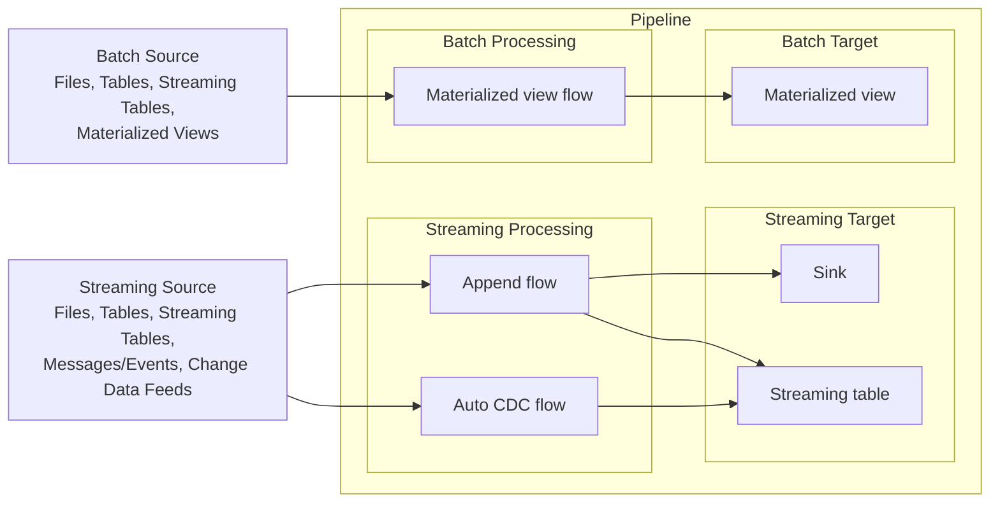
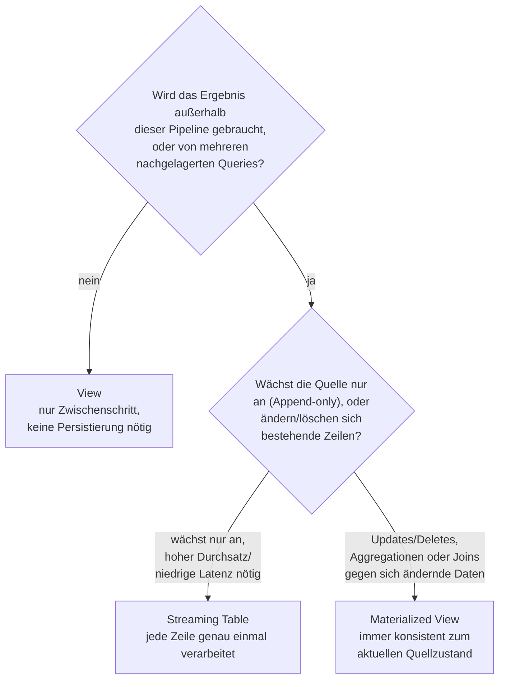

# Kernkonzepte: Pipelines, Views, Materialized Views, Streaming Tables

## 1. Was sind Lakeflow-Pipelines?

- Deklaratives Framework für Batch-/Streaming-Pipelines in SQL und Python. Früher **Delta Live Tables (DLT)** — umbenannt zu Lakeflow-Pipelines (siehe Abschnitt 12).
- Baut auf **Apache Spark™ Declarative Pipelines (SDP)** auf (quelloffen, ab Apache Spark 4.1) — hält Transformationscode über SDP-Laufzeiten portabel.
- Gemeinsam mit SDP: deklaratives SQL/Python, Streaming Tables, Materialized Views, automatische Abhängigkeitsauflösung.
- Nur in Lakeflow (nicht in reinem SDP): `AUTO CDC` (SCD Type 1 + 2), Datenqualitäts-Expectations, abfragbares Event-Log, Update-Flows/Continuous-Modus.
- Typische Quellen: S3, ADLS Gen2, GCS; Kafka, Kinesis, Pub/Sub, Event Hubs, Pulsar.

**Vorteile ggü. manueller Orchestrierung:**
- **Automatische Orchestrierung** — Flows laufen in korrekter Reihenfolge, maximal parallel; gestufte Retries (Task → Flow → Pipeline).
- **Deklarative Verarbeitung** — wenige Definitionen statt hunderter Zeilen Spark-/Structured-Streaming-Code; `AUTO CDC` übernimmt CDC inkl. SCD 1/2 ohne manuellen Code für unsortierte Events/Watermarks.
- **Inkrementelle Verarbeitung** — Engine verarbeitet nur neue/geänderte Quelldaten, wo möglich.

## 2. Kernkonzepte im Zusammenspiel

5 Kernkonzepte: **Pipeline**, **Flow**, **Streaming Table**, **Materialized View**, **Sink**.



- Streaming-Quellen → Append-/Auto-CDC-Flow → Sink oder Streaming Table.
- Batch-Quellen → impliziter Materialized-View-Flow → Materialized View.
- Views: nicht im Diagramm — lesen bei Bedarf aus ST/MV, ohne selbst gespeichert zu werden.

| Dataset-Typ | Verarbeitung |
|---|---|
| Streaming Table | jeder Datensatz genau einmal (Append-only-Quelle vorausgesetzt) |
| Materialized View | bei Bedarf neu berechnet, spiegelt aktuellen Datenstand |
| View | wird bei Abfrage ausgewertet, nicht persistiert |

**Flows** — Grundverarbeitungseinheit; teilt Streaming-Flow-Typen mit Spark Structured Streaming (Append, Update, Complete — aktuell nur Append/Update freigeschaltet); plus zwei eigene Typen:
- **Auto CDC** (Streaming, nur Lakeflow)
- **Materialized View** (Batch, stets implizit Teil der MV-Definition — anders als bei ST nicht separat vom Ziel definierbar)

**Sinks** — Streaming-Ziel außerhalb des pipeline-verwalteten Bereichs: Delta-Tabellen, Kafka-Topics, Azure-Event-Hubs-Topics, benutzerdefinierte Python-Datenquellen. Ein Sink kann von mehreren Append-/Update-Flows beschrieben werden.

**Expectations** — optionale SQL-Boolean-Constraints auf Datasets; bei Verletzung: `warn` (nur protokollieren), `drop` (Datensatz verwerfen), `fail` (Update stoppen).

**Delta-Integration** — alle verwalteten Tabellen sind Delta-Tabellen (ACID, Time Travel, Schema Enforcement) + automatische Pflege via Predictive Optimization (`OPTIMIZE`, `VACUUM`).

## 3. Pipelines

Pipeline = Container für alle Flows/ST/MV/Sinks im Quellcode; kombiniert Quellcode mit Konfiguration.

- **Quellcode:** SQL oder Python, je Datei eine Sprache; Abhängigkeiten werden automatisch analysiert (Reihenfolge egal).
- **Pipeline-Graph:** DAG, automatisch aus Abhängigkeiten inferiert, bestimmt Ausführungsreihenfolge.
- **Pipeline-Update:** Compute initialisieren → Graph aufbauen → Datasets in ermittelter Reihenfolge berechnen. Modi: **Triggered** (läuft bis Fertigstellung) / **Continuous** (läuft fortlaufend) — siehe Abschnitt 10.

| Pipeline-Typ (`pipeline_type` im Event-Log) | Bedeutung |
|---|---|
| `WORKSPACE` (UI: `ETL`) | reguläre Lakeflow-Pipeline (Standard) |
| `MANAGED_INGESTION` (UI: `Ingestion`) | verwaltete Ingestion-Pipeline (Lakeflow Connect) |
| `DBSQL` (UI: `MV/ST`) | Standalone-Pipeline für eine einzelne MV/ST |
| `DATABASE_TABLE_SYNC` | Tabelle ↔ Lakebase-Datenbank-Sync |

**Lakeflow Pipelines Editor:** Multi-File-Editing, visueller Abhängigkeitsgraph, Data Previews, Git-Versionskontrolle.

## 4. Standalone-Pipelines vs. Lakeflow-Pipelines

Beide: gleiche Engine, UC-verwaltete Tabellen. Unterschied: Autoring-/Betriebsumfang.

- **Standalone MV/ST:** ein Dataset, SQL-Syntax, Pipeline wird automatisch von Databricks verwaltet; erstellt/aktualisiert aus SQL-Warehouse oder Notebook auf Serverless General Compute via `spark.sql()`. UI-Typ `MV/ST`.
- **Lakeflow-Pipeline:** viele Datasets, SQL+Python, Abhängigkeitsorchestrierung, Lineage, pipeline-weite Funktionen. Typ `ETL`.

| Eigenschaft | Standalone ST/MV | Pipeline ST/MV |
|---|---|---|
| Authoring | SQL via SQL-Warehouse oder `spark.sql()` (Serverless-Notebook) | SQL und Python |
| Umfang | 1 Dataset, von Databricks verwaltete Pipeline | viele Datasets, Orchestrierung + Lineage |
| Ausführung | Triggered, via `SCHEDULE`/`TRIGGER ON UPDATE`/SQL-Task | Triggered oder Continuous |
| Nur-Pipeline-Features | — | Sinks, `create_auto_cdc_from_snapshot_flow()`, private Datasets |
| Typ-Label | `MV/ST` | `ETL` |
| Zwischen Pipelines verschieben | nicht unterstützt | unterstützt |

Standalone: für einzelne beschleunigte/transformierte Abfragen ohne Sinks/Multi-Stage. Lakeflow: mehrstufig mit Zwischen-Datasets, Python-Autoring, Sinks (`create_sink()`/`foreach_batch_sink()`), CDC aus Snapshot (`create_auto_cdc_from_snapshot_flow()`), Triggered/Continuous über die ganze Pipeline.

## 5. Views

Bei jeder Abfrage neu ausgewertet, nicht persistiert — **kein** UC-Managed-Table, keine Speicherkosten, kein eigener Refresh-Zyklus. Nur innerhalb derselben Pipeline abfragbar.

```python
from pyspark import pipelines as dp

@dp.view
def customers_filtered():
  return spark.read.table("customers_raw").where("email IS NOT NULL")
```

```sql
CREATE OR REFRESH TEMPORARY VIEW customers_filtered
AS SELECT * FROM customers_raw WHERE email IS NOT NULL;
-- Ergebnis: nicht persistiert, bei jeder nachgelagerten Abfrage neu berechnet
```

- Zerlegung großer Queries in wartbare Teile.
- Expectations auf Zwischenergebnisse, ohne diese zu veröffentlichen.
- Spart Speicher-/Compute-Kosten für nicht persistierungsbedürftige Ergebnisse.

## 6. Materialized Views

Cachen Query-Ergebnisse, aktualisieren im festen Intervall (anders als Views, die bei jeder Abfrage neu berechnet werden) → schneller als reguläre Views. Verfolgen Upstream-Änderungen, verarbeiten inkrementell, halten Ausgabe synchron zum Refresh-Intervall — "stets korrekt zum Zeitpunkt ihres Updates". Metadaten in Unity Catalog, gecachte Daten im Cloud-Speicher (Katalog `__databricks_internal`).

```sql
CREATE OR REPLACE MATERIALIZED VIEW regional_sales
AS SELECT *
FROM partners
  INNER JOIN sales ON
    partners.partner_id = sales.partner_id;
-- Ergebnis: gecachte Tabelle, aktualisiert bei jedem Pipeline-Update; inkrementell wo möglich, sonst voll neu berechnet
```

**Einschränkungen:**
- Nicht für Low-Latency (Sekunden/Minuten, nicht Millisekunden).
- Nicht jede Berechnung ist inkrementalisierbar.
- Kein `CLONE`.
- UDF-Verhaltensänderungen können manuellen Full Refresh erfordern.

MV ist zugleich ein eigener **Flow-Typ**: Batch-Flow, der (anders als stets-streamende Append-/Auto-CDC-Flows) nur neue/geänderte Quelldaten verarbeitet, wo möglich.

## 7. Streaming Tables

Delta-Tabelle mit zusätzlicher Streaming-/inkrementeller Verarbeitungsunterstützung; dient als Flow-Ziel.

**Primärer Use Case — Ingestion:** verarbeitet jede Zeile genau einmal, passt für die meisten Ingestion-Workloads, v. a. große **Append-only**-Mengen. Unterstützt: Auto Loader (Cloud-Speicher), Kafka/Event Hubs/Pub-Sub (Message Busse).

> **Wichtig:** Bei sich ändernden Quelldaten (Updates/Deletes) statt Append `AUTO CDC` verwenden.

- Query-Änderungen wirken nur auf **neu** eingehende Zeilen; bereits verarbeitete Zeilen bleiben unverändert, außer bei Full Refresh.

**Low-Latency-Streaming:** Checkpoint-Management; benötigt **natürlich begrenzte** (z. B. endliche Verzeichnisse) oder **Watermark-begrenzte** Streams. Für Sub-Sekunden-Latenz: **Real-Time Mode**.

**Eigentümerschaft:** genau eine Pipeline besitzt/aktualisiert eine ST; mehrere Flows können anhängen (append). Interne Systemtabellen werden zusätzlich angelegt.

**Wichtige Einschränkungen:**
1. Begrenzte Evolution — Query-Änderungen (z. B. neues `UPPER()`) wirken nur auf künftig verarbeitete Zeilen, außer bei Full Refresh.
2. Natürlich/Watermark-begrenzte Streams nötig, um State-bedingte Fehlschläge zu vermeiden.
3. Joins werden bei Dimensionstabellen-Änderungen **nicht** neu berechnet — "fast-but-wrong" (im Unterschied zu MV, die für Korrektheit neu berechnet).
4. Kein `CLONE`.
5. `REFRESH`-Privileg nötig, damit Nicht-Admins die dahinterliegende Pipeline einsehen können.

## 8. Entscheidung: View, Materialized View oder Streaming Table?



| | View | Materialized View | Streaming Table |
|---|---|---|---|
| Persistiert? | nein | ja (UC-Tabelle) | ja (UC-Tabelle) |
| Außerhalb Pipeline abfragbar? | nein | ja | ja |
| Semantik | on demand | Batch, konsistent zum aktuellen Quellzustand | jede Zeile genau einmal |
| Passt zu | Zwischenschritte, Validierung, Kostenersparnis | Aggregationen/Joins gegen sich ändernde Daten, Multi-Consumer | wachsende Quellen, hoher Durchsatz, niedrige Latenz |

## 9. Refresh-Semantik

| Refresh-Art | Streaming Table | Materialized View |
|---|---|---|
| **Default** | verarbeitet nur neue Datensätze seit letztem Update | inkrementell oder voll (Kostenmodell wählt auf Serverless) |
| **Full Refresh** | Tabelle geleert, Checkpoints gelöscht, alles neu verarbeitet | vollständige Neuberechnung |
| **Reset Checkpoints** (nur ST) | Checkpoints für gewählte Flows gelöscht (Daten bleiben), Quelle über diese Flows neu verarbeitet | nicht anwendbar |

- Full Refresh: nur bei Bedarf (z. B. inkompatible Definitions-/Schema-Änderung).
- **Kernunterschied:** ST priorisiert beim Default-Refresh geringere Kosten vor Vollständigkeit; MV bewahrt volle Korrektheit (automatische Wahl inkrementell/voll).

## 10. Pipeline-Modi: Triggered vs. Continuous

| | Triggered | Continuous |
|---|---|---|
| Stopp | automatisch nach Abschluss | läuft bis manuell gestoppt |
| Verarbeitet | Daten verfügbar bei Update-Start | Daten sobald sie eintreffen |
| Passt zu | Updates alle 10 Min. bis täglich | Updates alle 10 Sek. bis wenige Min. |

- Gilt unabhängig vom Tabellentyp (MV und ST in beiden Modi aktualisierbar).
- Standalone MV/ST-Refreshes laufen **immer** Triggered.
- Continuous überwacht Delta-Quellen und aktualisiert nur bei tatsächlicher Änderung.
- Zusätzlich: **Real-Time Mode** für Millisekunden-Latenz.
- Kosten/Latenz: Triggered spart Ressourcen (Cluster läuft nur kurz), Continuous braucht Dauerbetrieb (teurer, niedrigere Latenz).

**Empfehlung:** Continuous-Pipelines über einen **Continuous Job** statt über die Pipeline-Einstellung **Pipeline Mode** laufen lassen — der Job steuert dann den Lebenszyklus und schaltet zusätzliche Serverless-Performance-Modi frei (z. B. Standard Mode), die der eingebaute Continuous-Modus nicht bietet.
- Job-Orchestrierung überschreibt die Pipeline-Mode-Einstellung: Continuous Job führt seine Pipeline immer fortlaufend aus (auch bei `Triggered`-Setting), Triggered/geplanter Job führt immer ein Einzelupdate aus (auch bei `Continuous`-Setting). Standalone MV/ST sind davon nicht betroffen (immer Triggered).
- Empfehlung: `Pipeline Mode` auf `Triggered` (Default) lassen, wenn die Pipeline in einen Continuous Job eingebettet wird.

**Trigger-Intervall** (nur bei Continuous relevant, da Triggered jede Tabelle nur einmal verarbeitet):

```json
{ "configuration": { "pipelines.trigger.interval": "10 seconds" } }
```
Empfohlen: pro Tabelle setzen (Streaming/Batch haben unterschiedliche Defaults); Pipeline-Ebene nur bei einheitlicher Steuerung des ganzen Graphen.

## 11. Serverless vs. Classic Compute

Pro-Pipeline-Einstellung (Compute-Settings → Schalter **Serverless**), keine Automatik. Neue Pipelines: Serverless standardmäßig.

| Fähigkeit | Serverless | Classic |
|---|---|---|
| Infrastruktur | von Databricks verwaltet | Cluster selbst konfigurieren (Autoscaling, Instance-Typen, Policies) |
| Inkrementelles MV-Refresh | unterstützt | **nicht** unterstützt — immer volle Neuberechnung |
| Autoscaling | horizontal + vertikal | nur horizontal |
| Stream Pipelining | standardmäßig aktiv | nicht verfügbar |
| Compute-Erstellungsberechtigung nötig? | nein | ja |
| Unity Catalog | immer | UC oder Legacy-Hive-Metastore |

> **Wichtig:** Inkrementelles MV-Refresh gibt es nur auf Serverless — auf Classic wird eine MV immer vollständig neu berechnet.

**Classic nur wenn:** Legacy-Hive-Metastore statt UC; privates Networking nötig (Serverless unterstützt es nicht); Region ohne Serverless.

## 12. Wo ist DLT geblieben? (Umbenennung)

**Delta Live Tables (DLT)** → **Lakeflow-Pipelines**. Keine Migration nötig — bestehender Code läuft unverändert weiter.

**Python-API:** `import dlt` → `from pyspark import pipelines as dp`
| Alt (`dlt`) | Neu (`dp`) |
|---|---|
| `@dlt` | `@dp` |
| `@table` (→ jetzt für Streaming Tables) | `@table` |
| — | `@materialized_view` (neu, für MVs) |
| `@view` | `@temporary_view` |

**SQL-Syntax** (`CREATE STREAMING TABLE`, `CREATE MATERIALIZED VIEW`, `CREATE FLOW`) blieb unverändert — identisch in DLT/SDP/Apache Spark. Veraltete `LIVE`-Syntax:

| Veraltet (DLT) | Modern (SDP) |
|---|---|
| `CREATE OR REFRESH STREAMING LIVE TABLE` | `CREATE OR REFRESH STREAMING TABLE` |
| `CREATE OR REFRESH LIVE TABLE` | `CREATE OR REFRESH MATERIALIZED VIEW` |
| `CREATE LIVE VIEW` / `CREATE TEMPORARY LIVE VIEW` | `CREATE VIEW` / `CREATE TEMPORARY VIEW` |

Ebenfalls veraltet (Python): `create_target_table()`, `create_streaming_live_table()` → `create_streaming_table()`.

**Verbleibende DLT-Referenzen:** Classic-SKUs beginnen weiterhin mit `DLT`; Event-Log-Schema-Felder mit `dlt` unverändert; `dlt`-benannte Python-APIs funktionieren weiter (Wechsel zu neuen Namen empfohlen).

---

**Stand:** 2026-09-14.
