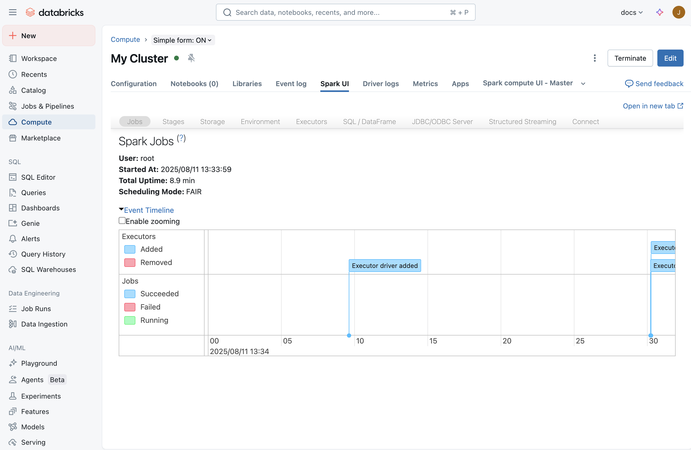

# Spark UI — Übersicht

Das **Spark UI** ist das zentrale Werkzeug, um **Performance- und Kostenprobleme** von Spark-Workloads auf **klassischem Compute** zu diagnostizieren. Es zeigt, **was** lief (Jobs, Stages, Tasks), **wie lange**, **wie viele Daten** bewegt wurden und **wo** Zeit verloren ging (Skew, Spill, Shuffle, kleine Dateien, UDFs …).

> **Kurs-Merksatz:** „Das Spark UI ist Ihr wichtigstes Diagnose-Tool." Performance-Optimierung ist ein Kreislauf: **Engpass finden → gezielt optimieren → Wirkung an Metriken prüfen → wiederholen.**



*Compute-Detailseite mit dem Reiter **Spark UI**. Darunter die Spark-UI-Reiter **Jobs, Stages, Storage, Environment, Executors, SQL / DataFrame, JDBC/ODBC Server, Structured Streaming, Connect** und die **Event Timeline**.*

---

## Wo gibt es das Spark UI — und wo nicht?

| Compute | Spark UI? | Stattdessen / zusätzlich |
|---|---|---|
| Klassisches All-Purpose-Compute | ✅ Reiter **Spark UI** auf der Compute-Seite | Driver-/Executor-Logs, Event log, Metrics |
| Klassisches Jobs-Compute | ✅ über den Job-Run | dito |
| Klassische Lakeflow Pipelines | ✅ | Pipeline-Event-Log |
| **Serverless** (Notebooks, Jobs, Pipelines) | ❌ „The Spark UI is not available." | **Query Profile** / **Query Insights** („See performance") |
| **SQL Warehouses** | (Query Profile ist das Hauptwerkzeug; es lässt sich zusätzlich im Spark UI öffnen) | **Query Profile**, Query History |

→ Details: [05 Query Profile, Serverless und Jobs](05%20Query%20Profile%2C%20Serverless%20und%20Jobs.md)

---

## Die Dateien in diesem Ordner

| # | Datei | Inhalt |
|---|---|---|
| 1 | [Aufbau, Zugriff und Logs](01%20Aufbau%2C%20Zugriff%20und%20Logs.md) | Öffnen, Reiter, Job → Stage → Task, Berechtigungen, Driver-/Executor-Logs, Thread Dump, Compute-Metriken, Event log |
| 2 | [Diagnose-Leitfaden Schritt für Schritt](02%20Diagnose-Leitfaden%20Schritt%20fuer%20Schritt.md) | Der offizielle 5-Schritte-Workflow: Timeline → längste Stage → Skew/Spill → I/O → sonstige Ursachen |
| 3 | [Problembilder und Lösungen](03%20Problembilder%20und%20Loesungen.md) | Lücken, kleine Jobs, ein Task, Fehler, Speicher, Spot, teures Lesen, Rewrite, kleine Dateien, UDFs, Cartesian/Exploding Join |
| 4 | [SQL-DAG, AQE und Photon](04%20SQL-DAG%2C%20AQE%20und%20Photon.md) | SQL-DAG lesen, Operator-Metriken, AQE im Plan (`AdaptiveSparkPlan`, `isSkew`, Coalesced …), AQE-Konfiguration, Photon im DAG |
| 5 | [Query Profile, Serverless und Jobs](05%20Query%20Profile%2C%20Serverless%20und%20Jobs.md) | Query Profile, Serverless-Grenzen, Run Breakdown von Jobs, Streaming-Monitoring, Observability |
| 6 | [Prüfungsfragen und Spickzettel](06%20Pruefungsfragen%20und%20Spickzettel.md) | „Woran erkenne ich X?" als Tabelle, typische Fallen, Übungsfragen |

---

## Der Diagnose-Workflow auf einen Blick

```
1. Jobs → Event Timeline
   ├─ fehlgeschlagene Jobs / entfernte Executors ─► Fehler, Speicher, Spot (03)
   ├─ Lücken ≥ 1 Minute ───────────────────────────► Gaps (03)
   ├─ viele winzige Jobs ──────────────────────────► Small Jobs (03)
   └─ ein/wenige lange Jobs ─► längsten Job öffnen
2. Längste Stage (Stages nach Duration sortieren)
   ├─ Input / Output / Shuffle Read / Shuffle Write notieren
   └─ nur 1 Task? ─► One Spark Task (03)
3. Stage-Seite: Spill? Skew (Max ≫ 75. Perzentil)?
4. Hohe I/O? (≈ 3 MB/s pro Core) ─► Input / Output / Shuffle optimieren
5. Wenig I/O, trotzdem langsam ─► SQL-DAG: kleine Dateien, UDFs, Cartesian/Exploding Join
```

---

## Verwandte Themen im Repo

- [../Predictive Optimize/00 Uebersicht.md](../Predictive%20Optimize/00%20Uebersicht.md) — gegen kleine Dateien: `OPTIMIZE`, Liquid Clustering, Predictive Optimization
- Kurs: [PO 99 - Summary and Next Steps.md](../../../Kursmetrial_Databricks/7_Databricks%20Performance%20Optimization/PO%2099%20-%20Summary%20and%20Next%20Steps.md) · [3_3_Spill.md](../../../Kursmetrial_Databricks/7_Databricks%20Performance%20Optimization/_MD/3_Code%20Optimization/3_3_Spill.md) · [3_1_Skew.md](../../../Kursmetrial_Databricks/7_Databricks%20Performance%20Optimization/_MD/3_Code%20Optimization/3_1_Skew.md)

## Quellen

- [Diagnose cost and performance issues using the Spark UI](https://docs.databricks.com/aws/en/optimizations/spark-ui-guide/)
- [Debugging with the Spark UI](https://docs.databricks.com/aws/en/compute/troubleshooting/debugging-spark-ui)
- [Serverless compute limitations](https://docs.databricks.com/aws/en/compute/serverless/limitations)
- [Query profile](https://docs.databricks.com/aws/en/sql/user/queries/query-profile)
- Alle Bilder: Databricks-Dokumentation (docs.databricks.com), lokal gespeichert unter [images/](images/)
