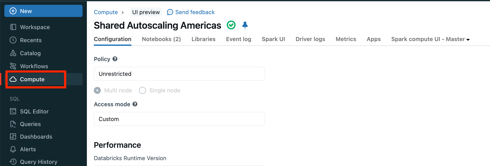
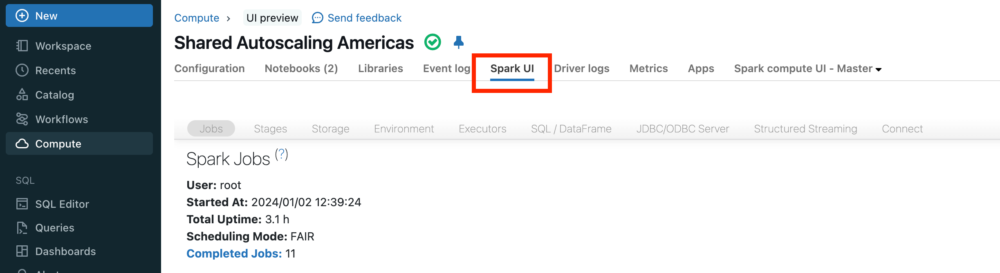
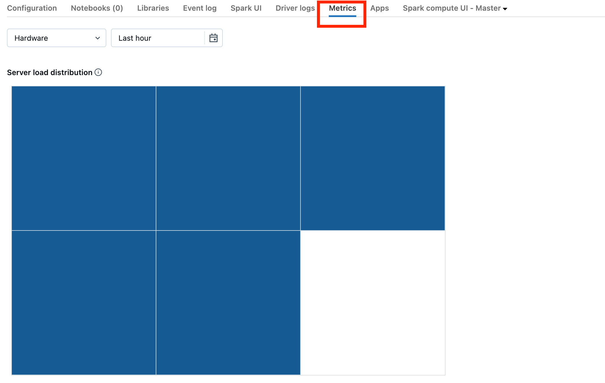
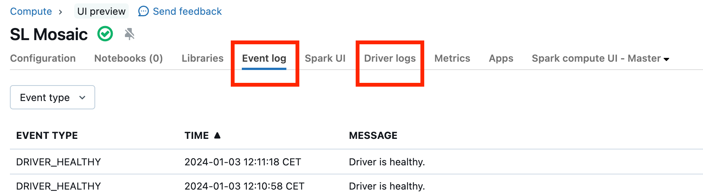

# Spark UI — Aufbau, Zugriff und Logs

## 1. Spark UI öffnen

1. Links **Compute** → Compute-Ressource auswählen.

   

2. Reiter **Spark UI** anklicken (optional „Open in new tab").

   

Weitere Einstiege:
- **Notebook:** unter einer Zelle **Spark Jobs** aufklappen → Link auf Job/Stage (so arbeiten auch die Kurs-Labs).
- **Job-Run** auf klassischem Jobs-Compute → Spark UI des Runs.
- **SQL Warehouse:** im Query Profile über das Kebab-Menü „im Spark UI öffnen".

> ⚠️ Wird ein **beendetes Compute neu gestartet**, zeigt das Spark UI die Daten des **neu gestarteten** Compute — nicht die historischen Informationen des beendeten. Für historische Analysen: **Cluster Log Delivery** konfigurieren (Spark-Event-Logs werden persistiert). Die Databricks-Doku verlinkt dazu ein Notebook „Event Log Replay" (Inhalt hier nicht im Detail geprüft).

---

## 2. Hierarchie: Application → Job → Stage → Task

| Ebene | Was ist das? | Wo im UI? |
|---|---|---|
| **Job** | Wird durch eine **Action** ausgelöst (`count`, `write`, `collect`, `display` …) | Reiter **Jobs** |
| **Stage** | Teil eines Jobs zwischen zwei **Shuffle-Grenzen** | Reiter **Stages**, Job-Detailseite |
| **Task** | Eine Arbeitseinheit auf **einer Partition**, läuft auf **einem Core** | Stage-Detailseite (Tasks-Liste, Summary Metrics) |

Faustregel: **Anzahl Tasks einer Stage = Anzahl Partitionen**. Ein Task nutzt einen Core — wenige Tasks = schlechte Parallelität.

---

## 3. Die Reiter des Spark UI

| Reiter | Wofür? |
|---|---|
| **Jobs** | Liste aller Jobs, **Event Timeline** (Executors hinzugefügt/entfernt; Jobs erfolgreich/fehlgeschlagen/laufend) → **Startpunkt jeder Diagnose** |
| **Stages** | Alle Stages mit **Duration, Tasks, Input, Output, Shuffle Read, Shuffle Write**; Detailseite mit **Summary Metrics** (Min/25%/Median/75%/Max), **Spill**, Tasks |
| **Storage** | Gecachte RDDs/DataFrames |
| **Environment** | Spark-Konfiguration, Runtime-Properties (z. B. prüfen, ob `spark.sql.shuffle.partitions` gesetzt ist) |
| **Executors** | Executors inkl. Driver: Speicher, Tasks, Shuffle, **Logs (stdout/stderr)**, **Thread Dump**, Verlustgrund entfernter Executors |
| **SQL / DataFrame** | **SQL-DAG** je Query mit Operator-Metriken (Rows, Zeit, Dateien, Spill …); AQE-Plan; Photon-Operatoren |
| **JDBC/ODBC Server** | Sitzungen/Statements über JDBC/ODBC |
| **Structured Streaming** / **Streaming** | Nur sichtbar, wenn ein Stream läuft: Input Rate, Processing Rate, Batch Duration |
| **Connect** | Spark-Connect-Sitzungen |

### Wichtige Stage-Spalten

| Spalte | Bedeutung |
|---|---|
| **Input** | Aus dem Storage gelesene Daten (Delta, Parquet, CSV …) |
| **Output** | In den Storage geschriebene Daten |
| **Shuffle Read** | In dieser Stage gelesene Shuffle-Daten |
| **Shuffle Write** | In dieser Stage geschriebene Shuffle-Daten |

*Beispiel: eine Stage mit 258 Tasks, 54 s Dauer und 19,4 GiB Input.*

---

## 4. Wer darf das Spark UI sehen?

| Objekt | Berechtigung für „View Spark UI" |
|---|---|
| **Compute** | **CAN ATTACH TO**, CAN RESTART, CAN MANAGE |
| **Job** | **CAN MANAGE RUN**, IS OWNER, CAN MANAGE (**nicht** CAN VIEW) |
| **Lakeflow Pipeline** | **CAN VIEW**, CAN RUN, CAN MANAGE, IS OWNER („View Spark UI and driver logs") |

**Logs je nach Access Mode:**

| | Standard Access Mode | Dedicated Access Mode |
|---|---|---|
| **Driver-Logs** | nur Workspace-Admins | Dedicated User/Gruppe + Workspace-Admins |
| **Executor-Logs** | **nicht verfügbar** | Dedicated User/Gruppe + Workspace-Admins |

---

## 5. Driver-Logs und Executor-Logs

**Driver-Logs** (Reiter **Driver logs** auf der Compute-Seite) helfen bei:
- **Exceptions**, z. B. wenn ein Stream gar nicht startet (kein Streaming-Reiter) oder Batches nie „Completed" werden,
- **`print`-Ausgaben**, die Teil des DAG sind.

**Executor-Logs**: wenn einzelne Tasks sich auffällig verhalten. Auf der Task-Detailseite den Executor ermitteln → im Spark UI **Executors** → Logs (stdout/stderr) bzw. über die Worker-Seite zum log4j-Output.

---

## 6. Thread Dump

Ein **Thread Dump** ist ein Schnappschuss der JVM-Thread-Zustände — nützlich bei **hängenden oder sehr langsamen Tasks** bzw. einem **hängenden Driver**.

**Für einen Task:**
1. **Jobs** → Job → Link in **Description**.
2. Stage → Link in **Description**.
3. In der Tasks-Liste **Task ID** und **Executor ID** notieren.
4. **Executors** → Zeile mit der Executor ID → **Thread Dump**.
5. Zeile, deren **Thread Name** `TID <Task ID>` enthält (nur solange der Task läuft).

**Für den Driver** (z. B. keine Fortschrittsbalken oder Balken hängen bei 100 %): **Executors** → Zeile **driver** → **Thread Dump**.

---

## 7. Außerhalb des Spark UI, aber eng verwandt

### Compute-Metriken (Reiter **Metrics**)

- Für klassisches All-Purpose- und Jobs-Compute, Erfassung **jede Minute**, historisch per Zeitbereich.
- CPU, Speicher, Disk-I/O, Netzwerk → **Speicherdruck** (OOM-Gefahr) oder **CPU-Druck** erkennen.
- **Server load distribution** (DBR 13.0+): ein Farbblock pro Maschine, **rot = stark ausgelastet**, **blau = kaum**. Nützlich, um einen **überlasteten Driver** zu erkennen.

*Oben: Cluster praktisch idle. Unten: ein roter Block (Driver) — der Driver ist überlastet.*

### Compute Event log (Reiter **Event log**)

Lebenszyklus-Ereignisse: Erstellen, Beenden, Konfigurationsänderungen, **Resizing (Autoscaling)**, **Verlust von Spot-Instanzen**. Export als CSV/Excel (max. 10.000 Zeilen).

### Cluster Log Delivery

Driver-, Worker- und Event-Logs an einen Speicherort ausliefern — für **historische Analysen** (Spark-Event-Logs auswerten: lange Stages, Skew, übermäßige Shuffles, Speicherdruck).

## Quellen

- [Debugging with the Spark UI](https://docs.databricks.com/aws/en/compute/troubleshooting/debugging-spark-ui)
- [Manage compute](https://docs.databricks.com/aws/en/compute/clusters-manage)
- [Access control lists](https://docs.databricks.com/aws/en/security/auth/access-control/)
- [Gaps between Spark jobs](https://docs.databricks.com/aws/en/optimizations/spark-ui-guide/spark-job-gaps)
- [Performance efficiency best practices](https://docs.databricks.com/aws/en/lakehouse-architecture/performance-efficiency/best-practices)
