# Spark UI — Diagnose-Leitfaden Schritt für Schritt

Databricks beschreibt einen festen Ablauf, um Kosten- und Performance-Probleme mit dem Spark UI zu finden. Er sagt nicht nur, **was** jede Seite zeigt, sondern **worauf man achten muss** und **was es bedeutet**.

| Schritt | Frage | Wo? |
|---|---|---|
| 1 | Gibt es auffällige Muster über die Zeit? | **Jobs → Event Timeline** |
| 2 | Welche Stage dauert am längsten, was tut sie? | Job-Seite → Stages nach **Duration** |
| 3 | Gibt es **Spill** oder **Skew**? | **Stage-Detailseite** |
| 4 | Ist die Stage **I/O-gebunden**? | Stage-Spalten Input/Output/Shuffle |
| 5 | Wenig I/O, trotzdem langsam — warum? | **SQL-DAG** |

---

## Schritt 1: Jobs Timeline

**Jobs** → **Event Timeline** aufklappen. Die Timeline zeigt, **was** lief, **wie lange** und ob es **Fehler** gab.

> Hinweis: Ein Job gilt ab **Einreichung** als „running", nicht ab dem ersten Task. Werden Jobs parallel eingereicht (Threads, Futures), scheinen alle gleichzeitig zu starten — das ist normal.

### Was man sucht

**a) Fehlgeschlagene Jobs oder entfernte Executors** (rot)

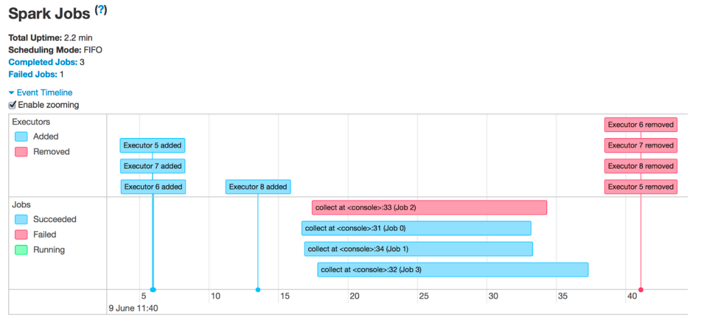

→ [03: Fehlgeschlagene Jobs / Executors](03%20Problembilder%20und%20Loesungen.md#failing)

**b) Lücken von einer Minute oder mehr**

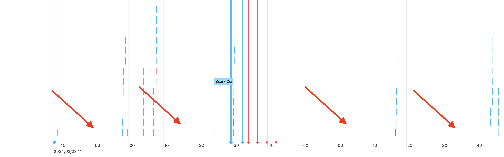

Kurze Lücken sind normal (der Driver koordiniert). Lange, **unerklärte Lücken mitten in einer Pipeline** sind verdächtig. Bei einem dauerhaft laufenden All-Purpose-Cluster können Lücken einfach Leerlauf zwischen Abfragen sein.
→ [03: Lücken zwischen Jobs](03%20Problembilder%20und%20Loesungen.md#gaps)

**c) Ein oder wenige sehr lange Jobs**

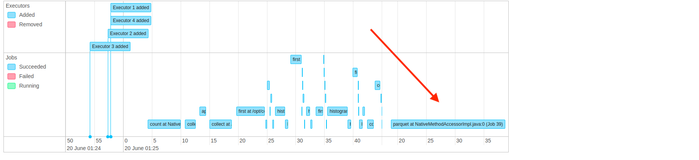

→ Den längsten Job anklicken → **Schritt 2**.

**d) Viele winzige Jobs** (viele kurze blaue Striche, je wenige Sekunden)

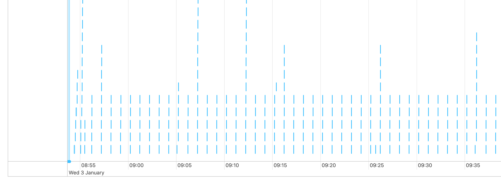

→ [03: Viele kleine Jobs](03%20Problembilder%20und%20Loesungen.md#small-jobs)

**e) Nichts davon** → Jobs nach **Duration** sortieren und den längsten öffnen:

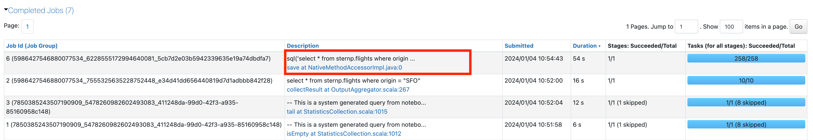

---

## Schritt 2: Die längste Stage

Auf der Job-Seite nach unten zur Stage-Liste scrollen und nach **Duration** sortieren:

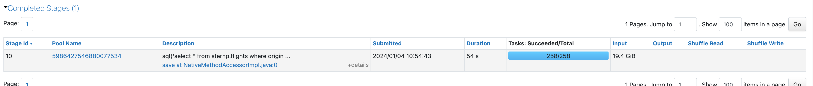

### Stage-I/O notieren

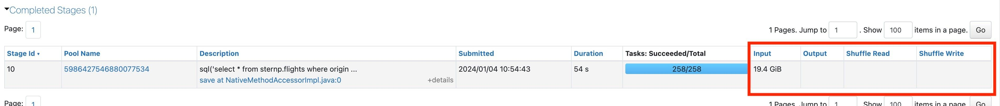

| Spalte | Bedeutung |
|---|---|
| **Input** | wie viel aus dem Storage gelesen wurde |
| **Output** | wie viel in den Storage geschrieben wurde |
| **Shuffle Read** | wie viele Shuffle-Daten gelesen wurden |
| **Shuffle Write** | wie viele Shuffle-Daten geschrieben wurden |

Diese Zahlen werden in Schritt 4 gebraucht.

### Anzahl der Tasks

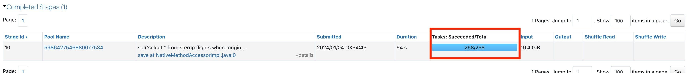

- **Nur ein Task** → wahrscheinlich ein Problem (nur ein Core arbeitet) → [03: One Spark Task](03%20Problembilder%20und%20Loesungen.md#one-task)
- **Mehr als ein Task** → Stage öffnen (Link in der Beschreibung):

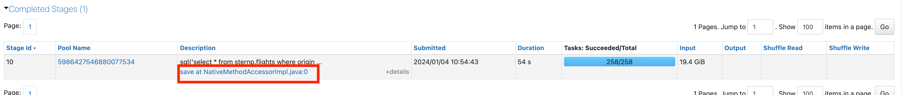

---

## Schritt 3: Spill und Skew (Stage-Detailseite)

### Spill

Oben auf der Stage-Seite stehen die Details — ggf. mit Spill-Statistiken:

- **Spill** passiert, wenn Spark **zu wenig Execution Memory** hat (für Shuffles, Joins, Sorts, Aggregationen) und Daten vom Speicher auf die **Disk** auslagert — teuer.
- Tritt am häufigsten beim **Shuffle** auf.
- **Keine Spill-Statistik sichtbar = kein Spill.** (Kurs: Die Spill-Spalten erscheinen nur, wenn irgendwo Spill auftritt.)
- Zwei Werte: **Spill (Memory)** = Größe der ausgelagerten Daten im Speicher; **Spill (Disk)** = Größe auf der Disk (serialisiert/komprimiert, daher kleiner).
- Weitere Metrik hier: **Peak Execution Memory**.

**Gegenmaßnahmen** (Kurs + Doku): mehr Shuffle-Partitionen (`spark.sql.shuffle.partitions=auto` empfohlen), mehr Speicher pro Core, Skew beheben.

### Skew

Skew = **ein oder wenige Tasks dauern viel länger als der Rest** → schlechte Cluster-Auslastung, längere Jobs.

Zu **Summary Metrics** scrollen und **Max** mit dem **75. Perzentil** der **Duration** vergleichen:

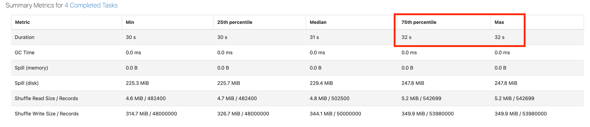

*Gesunde Stage: 75. Perzentil (32 s) = Max (32 s). (Nebenbei zeigt das Beispiel ~225–248 MiB **Spill (disk)** pro Task.)*

> **Regel:** Ist **Max um mehr als 50 % höher als das 75. Perzentil**, liegt vermutlich **Skew** vor.

**Gegenmaßnahmen:** AQE Skew Join (standardmäßig aktiv), Liquid Clustering, Salting, Filter auf schiefe Schlüssel.

### Weder Spill noch Skew

Zurück zur Job-Seite über **Associated Job Ids**:

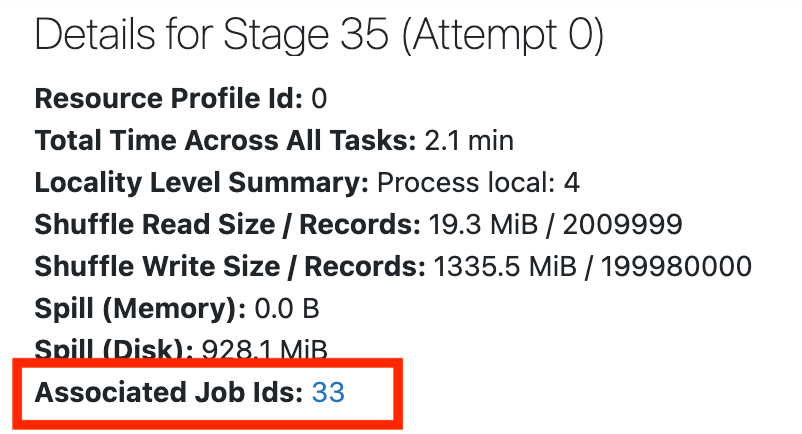

→ **Schritt 4**.

---

## Schritt 4: Ist die Stage I/O-gebunden?

### Was ist „hohe I/O"?

> Jeder Core kann grob **~3 MB pro Sekunde** lesen/schreiben.

**Rechnung:** größte I/O-Spalte ÷ Anzahl **Worker-Cores** ÷ Dauer in Sekunden. Liegt das Ergebnis **um 3 MB**, ist die Stage vermutlich **I/O-gebunden**.

*Rechenbeispiel (Annahme 128 Worker-Cores):* 19,4 GiB ≈ 19.866 MB ÷ 128 Cores ÷ 54 s ≈ **2,9 MB/s pro Core** → I/O-gebunden.

### Hoher Input → Lesen beschleunigen

Zuerst herausfinden, **welche Daten** gelesen werden → [04: teures Lesen im DAG finden](04%20SQL-DAG%2C%20AQE%20und%20Photon.md#expensive-read). Dann:
- **Delta** verwenden,
- **Liquid Clustering** für besseres **Data Skipping**,
- **Photon** (hilft stark beim Lesen, besonders bei breiten Tabellen),
- Query **selektiver** machen (weniger lesen),
- Gleiche Daten mehrfach gelesen → **Disk (Delta) Cache**,
- Bei Joins **Dynamic File Pruning (DFP)** zum Greifen bringen,
- **Cluster vergrößern** oder **Serverless** nutzen.

### Hoher Output → Schreiben beschleunigen

- Werden **viele Daten neu geschrieben**? → [03: Rewrite erkennen](03%20Problembilder%20und%20Loesungen.md#rewrite)
  - `MERGE` optimieren,
  - **Deletion Vectors** nutzen (Zeilen als gelöscht/geändert markieren statt Parquet-Dateien neu zu schreiben).
- **Photon** aktivieren (hilft stark beim Schreiben).
- **Cluster vergrößern** oder **Serverless**.

### Hoher Shuffle

> Databricks empfiehlt `spark.sql.shuffle.partitions=auto`, damit Spark die optimale Anzahl Shuffle-Partitionen selbst wählt.

Weitere Hebel (Kurs): Broadcast Join für kleine Tabellen, Shuffle vermeiden, weniger aber größere Worker.

### Keine hohe I/O → **Schritt 5**

---

## Schritt 5: Langsame Stage mit wenig I/O

Mögliche Ursachen:
- **viele kleine Dateien lesen**
- **viele kleine Dateien schreiben**
- **langsame UDFs**
- **Cartesian Join**
- **Exploding Join** / `explode()`

Fast alle lassen sich im **SQL-DAG** erkennen → [04: SQL-DAG](04%20SQL-DAG%2C%20AQE%20und%20Photon.md) und [03: Problembilder](03%20Problembilder%20und%20Loesungen.md#low-io).

## Quellen

- [Diagnose cost and performance issues using the Spark UI](https://docs.databricks.com/aws/en/optimizations/spark-ui-guide/)
- [Jobs timeline](https://docs.databricks.com/aws/en/optimizations/spark-ui-guide/jobs-timeline)
- [Diagnosing a long job in Spark](https://docs.databricks.com/aws/en/optimizations/spark-ui-guide/long-spark-stage)
- [Skew and spill](https://docs.databricks.com/aws/en/optimizations/spark-ui-guide/long-spark-stage-page)
- [Spark stage high I/O](https://docs.databricks.com/aws/en/optimizations/spark-ui-guide/long-spark-stage-io)
- [Slow Spark stage with little I/O](https://docs.databricks.com/aws/en/optimizations/spark-ui-guide/slow-spark-stage-low-io)
