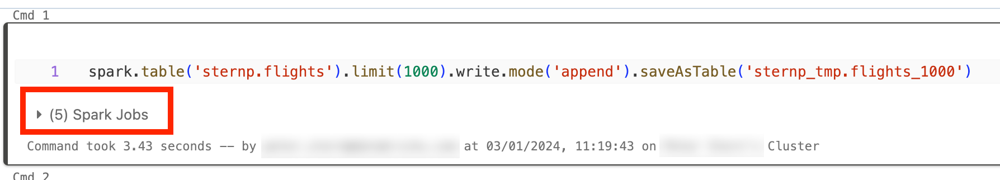
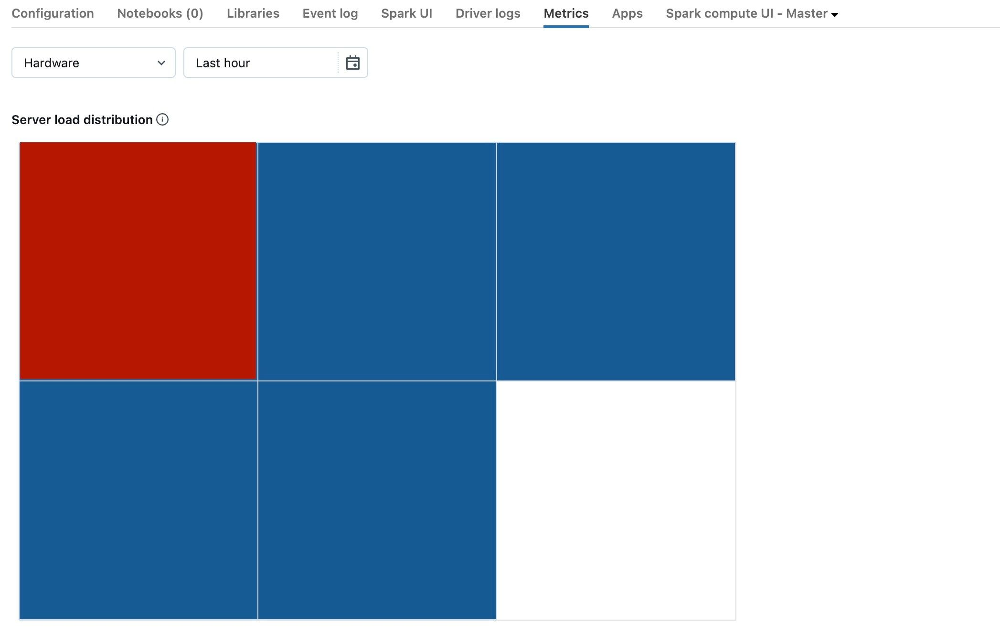
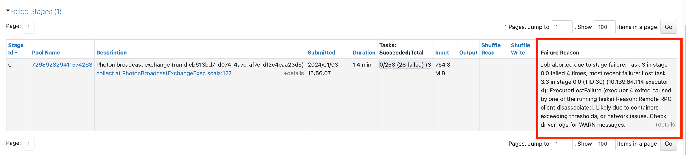
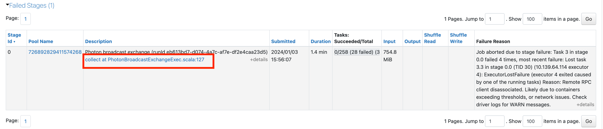
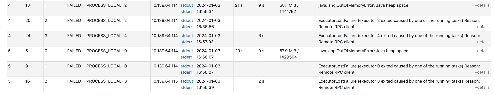
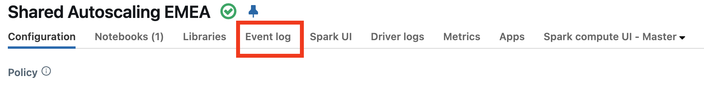
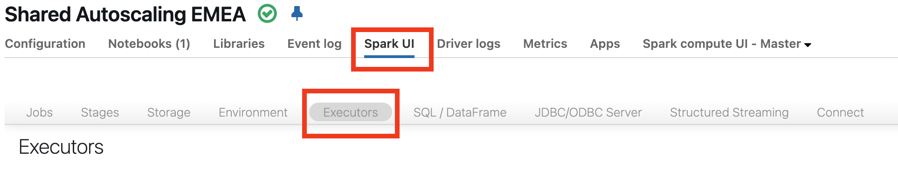
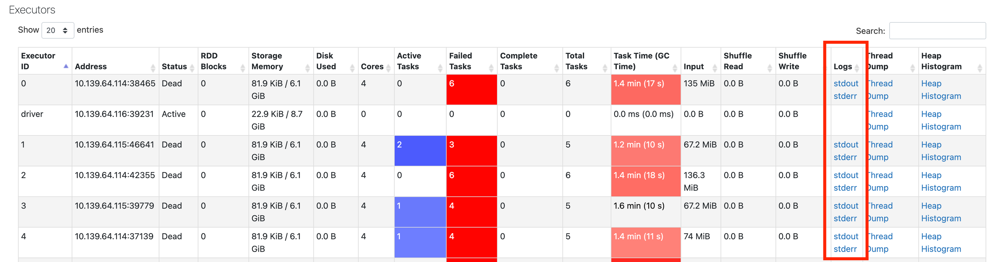
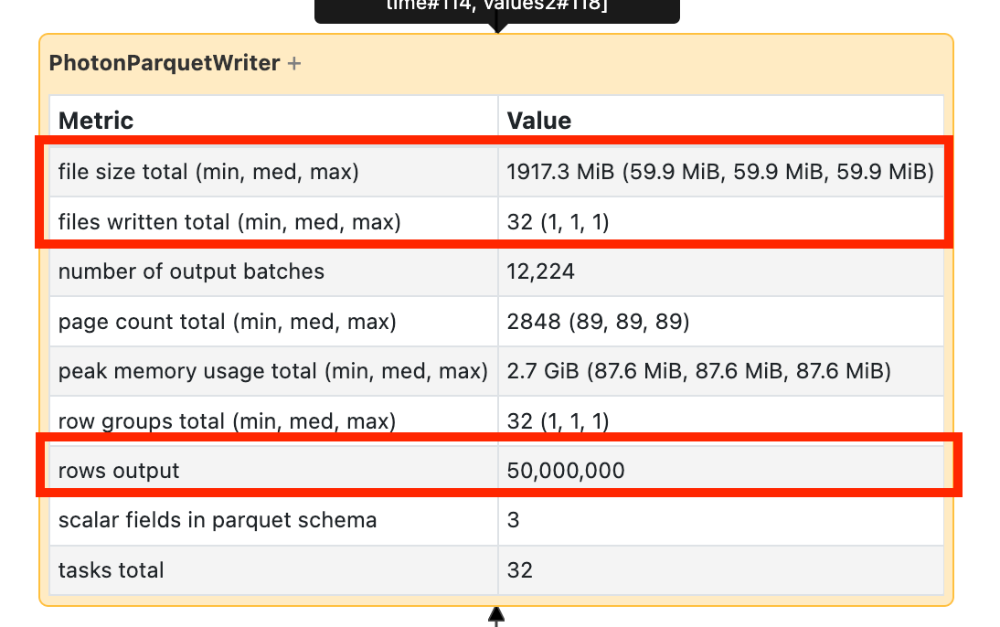
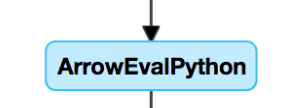

# Spark UI — Problembilder und Lösungen

Jedes Problembild: **Woran erkenne ich es? → Ursachen → Lösung.**

---

## <a id="gaps"></a>1. Lücken zwischen Spark-Jobs

**Erkennen:** Lücken von **≥ 1 Minute** in der Event Timeline, vor allem mitten in einer Pipeline.


| Ursache | Erklärung | Lösung |
|---|---|---|
| **Keine Arbeit** | Auf All-Purpose-Compute die wahrscheinlichste Erklärung: Zeit zwischen Abfragen | **Serverless** nutzen (keine Kosten für Leerlauf) |
| **Komplexer Ausführungsplan** | z. B. `withColumn()` in einer **Schleife** → sehr teurer Plan; der Driver ist mit Planen beschäftigt | Mehrere `withColumn()` per `selectExpr()` zusammenfassen oder in **SQL** umschreiben |
| **Nicht-Spark-Code** | z. B. Python-Schleife mit nativen Python-Funktionen; Worker stehen still und kosten Geld | Code in Spark umschreiben oder bewusst **Serverless** nutzen |
| **Driver überlastet** | siehe Abschnitt 2 | Driver vergrößern, Nebenläufigkeit reduzieren |
| **Cluster defekt** | selten | Cluster neu starten; **Event log** und **Driver logs** prüfen; Cluster Log Delivery aktivieren |

**Prüfen, ob Code Spark nutzt:** Interaktiv im Notebook ausführen — unter der Zelle erscheinen **Spark Jobs**, wenn Spark arbeitet:



```python
# Schlecht: withColumn in einer Schleife → riesiger Plan
for c in cols:
    df = df.withColumn(c, F.upper(F.col(c)))

# Besser: ein einziger Ausdruck
df = df.selectExpr("*", *[f"upper({c}) AS {c}_u" for c in cols])
```

---

## <a id="driver"></a>2. Driver überlastet

**Erkennen:** Reiter **Metrics** (DBR 13.0+) → **Server load distribution**: ein **roter** Block (Maus darüber → Driver), die anderen blau.



**Häufigste Ursache:** zu viele gleichzeitige Dinge auf dem Cluster — zu viele **Streams**, **Queries** oder **Spark-Jobs** (z. B. per Threads), oder **Nicht-Spark-Code**, der den Driver beschäftigt.

**Lösungen:**
1. **Driver vergrößern** — Databricks empfiehlt, zuerst die **Driver-Größe zu verdoppeln**,
2. **Nebenläufigkeit reduzieren**,
3. **Last auf mehrere Cluster verteilen**.

---

## <a id="small-jobs"></a>3. Viele kleine Spark-Jobs

**Erkennen:** Timeline voller winziger Jobs (je wenige Sekunden).


**Ursache:** viele Operationen auf relativ **kleinen Daten (< 10 GB)**; der Overhead pro Operation summiert sich.

**Lösungen:** Operationen **parallel** ausführen:
- **Lakeflow Pipelines** machen das automatisch,
- **Multi-Task-Jobs** (mehrere Notebooks parallel auf demselben Cluster),
- Reines SQL → **SQL Warehouses** (für viele parallele Abfragen gebaut).

---

## <a id="one-task"></a>4. Lange Stage mit nur einem Task

**Erkennen:** Stage-Liste zeigt **1** Task; nur ein CPU-Core arbeitet, der Rest des Clusters ist idle.

**Typische Ursachen:**
- teure **UDF auf kleinen Daten**,
- **nicht splitbares Dateiformat** (z. B. **Gzip**) → eine große Datei = ein Task,
- Option **`multiLine`** beim Lesen von JSON/CSV,
- **Schema-Inferenz** einer großen Datei,
- **`repartition(1)`** oder **`coalesce(1)`**.

**Lösung (abgeleitet):** splitbare Formate (Parquet/Delta, unkomprimiert oder splitbar komprimiert), Schema vorgeben, `repartition(1)`/`coalesce(1)` vermeiden, vor UDFs `repartition(n)`.

---

## <a id="failing"></a>5. Fehlgeschlagene Jobs oder entfernte Executors


**Häufigste Gründe für entfernte Executors:**
- **Autoscaling** — erwartet, **kein Fehler**,
- **Verlust von Spot-Instanzen** — der Cloud-Anbieter holt VMs zurück,
- **Executors laufen aus dem Speicher (OOM)**.

### Fehlgeschlagene Jobs untersuchen

1. Fehlgeschlagenen Job öffnen → fehlgeschlagene Stage und **Failure Reason**:

   

2. Bei generischer Meldung: Link in der Beschreibung für mehr Details:

   

3. Nach unten scrollen → **warum jeder Task fehlschlug** (hier: Speicherproblem):

   

### Fehlgeschlagene Executors untersuchen

1. Zuerst das **Compute Event log** prüfen (Resizing? Spot-Verlust?):

   

2. Nichts gefunden → Spark UI → **Executors**:

   

3. Logs der fehlgeschlagenen Executors ansehen:

   

Nach Abschluss eines Decommissioning ist der Verlustgrund eines Executors ebenfalls unter **Spark UI > Executors** sichtbar.

Bleibt keine andere Erklärung → sehr wahrscheinlich **Speicherproblem** (Abschnitt 6).

---

## <a id="memory"></a>6. Speicherprobleme

**Typische (oft generische) Fehlermeldung:**

```
SparkException: Job aborted due to stage failure: Task 3 in stage 0.0 failed 4 times, ...
ExecutorLostFailure (executor 4 exited caused by one of the running tasks)
Reason: Remote RPC client disassociated. Likely due to containers exceeding thresholds, or network issues.
```

**Verifizieren:** **Speicher pro Core verdoppeln** (z. B. 4 Cores/16 GB → 4 Cores/32 GB = 8 GB statt 4 GB pro Core). Entscheidend ist das **Verhältnis Cores : Speicher**. Schlägt es später oder gar nicht mehr fehl → Speicherproblem bestätigt. Löst mehr Speicher das Problem und sind die Kosten tragbar, ist das evtl. schon die Lösung.

**Mögliche Ursachen:**
- **zu wenige Shuffle-Partitionen**,
- **zu großer Broadcast**,
- **UDFs** (jeder Task lädt ggf. seine ganze Partition in den Speicher),
- **Window-Funktion ohne `PARTITION BY`**,
- **Skew**,
- **Streaming State** (State Store).

---

## <a id="spot"></a>7. Verlust von Spot-Instanzen

Instanztyp mit **hoher Reclaim-Rate**? → Instanztyp wechseln (AWS: **Spot Instance Advisor**) oder **keine Spot-Instanzen** verwenden.

---

## <a id="rewrite"></a>8. Werden Daten neu geschrieben (Rewrite)?

**Vorgehen:** SQL-DAG der Write-Stage öffnen (Job-Seite → **Associated SQL Query**):


- Bei **DELETE/UPDATE**: geschriebene Datenmenge im Writer mit der **Erwartung** vergleichen. Viel mehr als erwartet → es wird neu geschrieben:

  

- Bei **MERGE**: der Merge-Knoten zeigt explizit, **wie viele Daten** neu geschrieben werden.

**Lösungen:** `MERGE` optimieren (z. B. Zielbereich per Prädikat einschränken, Liquid Clustering auf Join-Schlüssel), **Deletion Vectors**, Photon.

---

## <a id="low-io"></a>9. Langsame Stage mit wenig I/O — Ursachen im SQL-DAG

### 9.1 Viele kleine Dateien lesen

Scan-Operator öffnen → **number of files read**:


- **Zehntausende Dateien oder mehr** → Small-File-Problem.
- Dateien sollten **nicht kleiner als 8 MB** sein.
- Häufigste Ursache: **Partitionierung auf zu vielen Spalten** oder einer **hochkardinalen Spalte**.
- **Lösung:** `OPTIMIZE` ausführen, **Predictive Optimization** aktivieren, Datenlayout überdenken (Liquid Clustering statt Over-Partitioning). → [../Predictive Optimize/07 OPTIMIZE.md](../Predictive%20Optimize/07%20OPTIMIZE.md)

### 9.2 Viele kleine Dateien schreiben

Write-Operator öffnen → **Anzahl Dateien** und **geschriebene Datenmenge**:


**Lösung:** Predictive Optimization, Datenlayout überdenken, **Optimized Writes** einschalten.

### 9.3 Langsame UDFs

**Erkennen:** UDF-Knoten im DAG (z. B. `BatchEvalPython` / `ArrowEvalPython`):



**Vorgehen:**
1. UDF testweise auskommentieren → Einfluss auf die Laufzeit messen.
2. Wenn die UDF die Zeit kostet: **mit nativen Funktionen neu schreiben** (beste Option).
3. Sonst: Hat die Stage **weniger Tasks als Cores**, vor der UDF **`repartition()`**:

```python
(df
  .repartition(num_cores)
  .withColumn('new_col', udf(...))
)
```

UDFs können auch Speicherprobleme verursachen (jeder Task lädt seine Partition in den Speicher) — `repartition` macht Tasks kleiner.

*Kurs: Python-UDFs umgehen den Optimizer und laufen nicht in Photon; SQL-UDFs werden von Catalyst und Photon optimiert.*

### 9.4 Cartesian Join / Nested Loop Join

Ein **Cartesian Join** oder **Nested Loop Join** im DAG ist **sehr teuer**. Prüfen, ob das beabsichtigt ist, und nach Alternativen suchen (fehlende/falsche Join-Bedingung?).

### 9.5 Exploding Join oder `explode()`

**Erkennen:** **wenige Zeilen** gehen in einen Knoten hinein, **um Größenordnungen mehr** kommen heraus:


**Ursache:** doppelte Join-Schlüssel (Kurs: Zeilenzahl ×100, massiver Spill) oder `explode()`.
**Lösung (Kurs):** Join-Reihenfolge ändern (kleinere zuerst), `ANALYZE TABLE` für den kostenbasierten Optimizer, Duplikate bereinigen, mehr Shuffle-Partitionen.

## Quellen

- [Gaps between Spark jobs](https://docs.databricks.com/aws/en/optimizations/spark-ui-guide/spark-job-gaps)
- [Spark driver overloaded](https://docs.databricks.com/aws/en/optimizations/spark-ui-guide/spark-driver-overloaded)
- [Many small Spark jobs](https://docs.databricks.com/aws/en/optimizations/spark-ui-guide/small-spark-jobs)
- [One Spark task](https://docs.databricks.com/aws/en/optimizations/spark-ui-guide/one-spark-task)
- [Failing jobs or executors removed](https://docs.databricks.com/aws/en/optimizations/spark-ui-guide/failing-spark-jobs)
- [Spark memory issues](https://docs.databricks.com/aws/en/optimizations/spark-ui-guide/spark-memory-issues)
- [Losing spot instances](https://docs.databricks.com/aws/en/optimizations/spark-ui-guide/losing-spot-instances)
- [How to determine if Spark is rewriting data](https://docs.databricks.com/aws/en/optimizations/spark-ui-guide/spark-rewriting-data)
- [Slow Spark stage with little I/O](https://docs.databricks.com/aws/en/optimizations/spark-ui-guide/slow-spark-stage-low-io)
- Kurs: [PO 1.4L - Exploding Join.md](../../../Kursmetrial_Databricks/7_Databricks%20Performance%20Optimization/PO%201.4L%20-%20Exploding%20Join.md) · [PO 1.5 - User-Defined Functions.md](../../../Kursmetrial_Databricks/7_Databricks%20Performance%20Optimization/PO%201.5%20-%20User-Defined%20Functions.md)
