# Spark UI — SQL-DAG, AQE und Photon

Der **SQL-DAG** (Reiter **SQL / DataFrame** bzw. „Associated SQL Query") zeigt den **physischen Plan** einer Abfrage als Graph mit **Metriken je Operator**. Hier findet man fast alle Ursachen für „langsam trotz wenig I/O".

---

## 1. SQL-DAG öffnen

Von der Job-Seite ganz nach oben → **Associated SQL Query**:

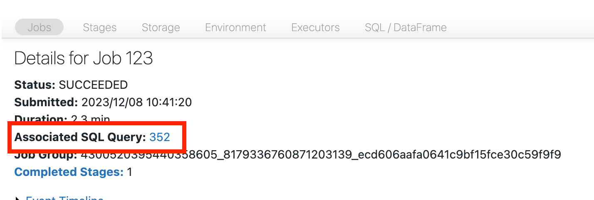

Der DAG (ggf. etwas scrollen):

---

## 2. Zeit im DAG finden

Manche Knoten zeigen die Zeit direkt, inkl. **Stage-ID** (hier 2,1 Minuten):

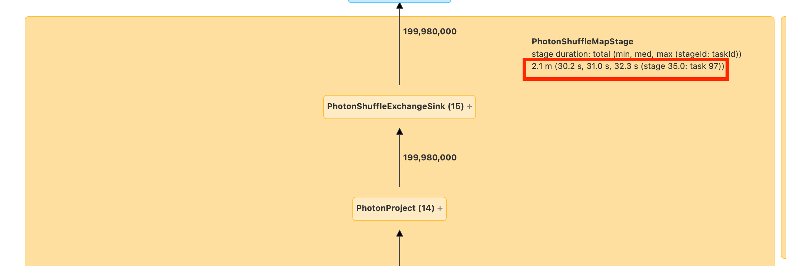

Andere muss man **aufklappen** (hier 1,4 Minuten für einen Write):

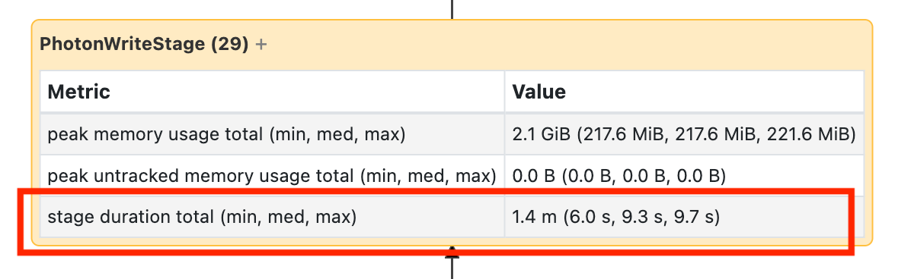

> ⚠️ Die Zeiten im DAG sind **kumulativ**: Summe der Executor-Zeit über **alle Tasks**, **nicht** die Wanduhr-Zeit. Sie korrelieren aber mit Laufzeit und Kosten.

Aufgeklappte Operatoren zeigen Metriken wie **number of output rows**, **peak memory**, **spill size**, **number of files read**.

---

## 3. Teures Lesen im DAG identifizieren

1. Auf der Job-Seite die **Stage-ID** der lesenden Stage notieren (hier 194):

   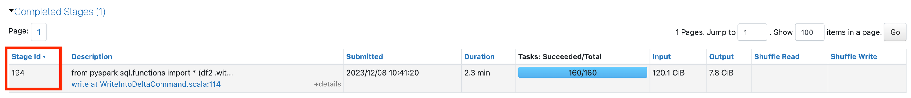

2. **Associated SQL Query** öffnen (siehe oben).
3. Im DAG die Stage-ID suchen:

   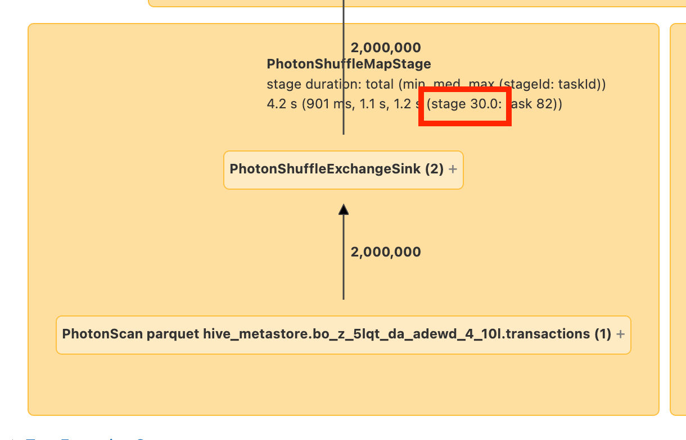

4. Den **Scan**-Knoten suchen — hier wird die Tabelle `transactions` gelesen:

   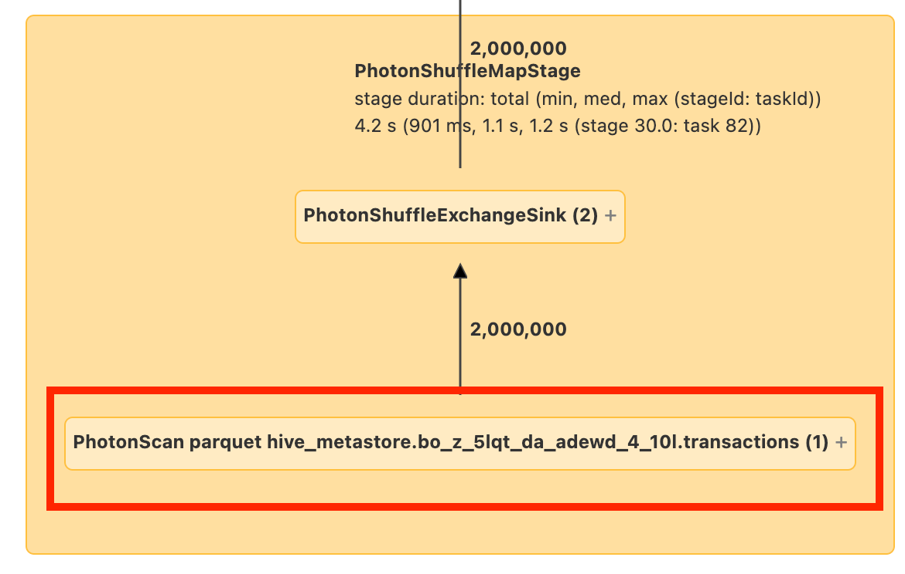

Ggf. auf den Knoten klicken/hovern, um den **Speicherort** der gelesenen Daten zu sehen.

---

## 4. Wichtige Operatoren und was sie verraten

| Operator im DAG | Hinweis auf |
|---|---|
| **Scan** (`PhotonScan parquet …`, `Scan parquet …`) | gelesene Dateien/Bytes, übersprungene Dateien → Small Files, Data Skipping |
| **Exchange** / `ShuffleExchange` / `PhotonShuffleExchangeSink/Source` | **Shuffle**: Größe, Spill („num bytes spilled to disk due to memory pressure") |
| `AQEShuffleRead` / `CustomShuffleReader` (coalesced) | AQE hat Shuffle-Partitionen zusammengefasst |
| **BroadcastHashJoin** / `BroadcastExchange` | Broadcast Join (kleine Seite an alle Executors) |
| **SortMergeJoin** | Shuffle-basierter Join; mit `isSkew=true` → AQE-Skew-Behandlung |
| **CartesianProduct** / **BroadcastNestedLoopJoin** | sehr teure Joins |
| `BatchEvalPython` / `ArrowEvalPython` | Python-/Pandas-UDF |
| `Generate` (explode) | `explode()` — auf Zeilenexplosion achten |
| **WriteFiles** / Write-Knoten | Anzahl geschriebener Dateien, Bytes → Small Files beim Schreiben, Rewrite |
| `AdaptiveSparkPlan` | Query wurde von **AQE** verarbeitet |
| `LocalTableScan` (leer) | AQE hat eine leere Relation erkannt |

---

## 5. AQE im Plan erkennen

**AQE (Adaptive Query Execution)** optimiert die Abfrage **während der Ausführung** neu, basierend auf den genauen Statistiken am Ende jeder **Shuffle- oder Broadcast-Stage** (in AQE „Query Stage" genannt). Besonders hilfreich, wenn Statistiken fehlen oder veraltet sind oder nach Skew.

**AQE ist standardmäßig aktiv** und hat vier Hauptfunktionen:
1. **Sort-Merge-Join → Broadcast-Hash-Join** dynamisch umwandeln,
2. Partitionen nach dem Shuffle **zusammenfassen** (coalesce),
3. **Skew** in Sort-Merge- und Shuffle-Hash-Joins behandeln (schiefe Tasks aufteilen, ggf. replizieren),
4. **Leere Relationen** erkennen und propagieren.

**Gilt für** alle Abfragen, die **nicht streaming** sind und mindestens einen **Exchange** (Join, Aggregation, Window) und/oder eine Unterabfrage enthalten. Nicht jede AQE-Abfrage wird tatsächlich umgeplant.

### 5.1 Im Spark UI

- **`AdaptiveSparkPlan`**-Knoten (meist Wurzel jeder (Unter-)Abfrage). Vor/während der Ausführung **`isFinalPlan=false`**, danach **`isFinalPlan=true`**.
- **Sich entwickelnder Plan:** Das Diagramm zeigt immer den aktuellen Plan. Bereits ausgeführte Knoten (mit Metriken) ändern sich nicht mehr, die übrigen können sich durch Re-Optimierung noch ändern.

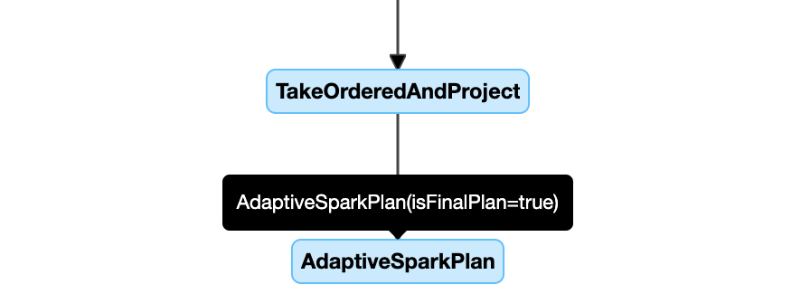

### 5.2 In `DataFrame.explain()`

Unter `AdaptiveSparkPlan` stehen **Initial Plan** und **Current/Final Plan**. Statistiken der Shuffle-/Broadcast-Stages: vor der Ausführung Schätzungen (`isRuntime=false`), danach echte Laufzeitwerte (`isRuntime=true`).

| Vor der Ausführung | Während | Danach |
|---|---|---|
| 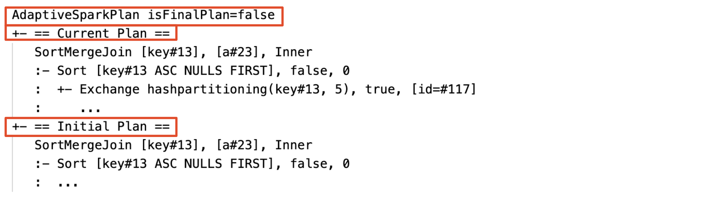 | 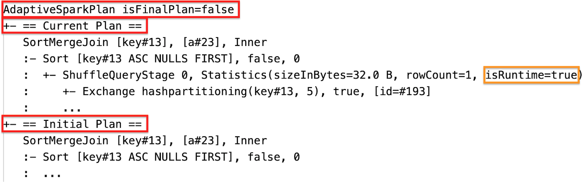 | 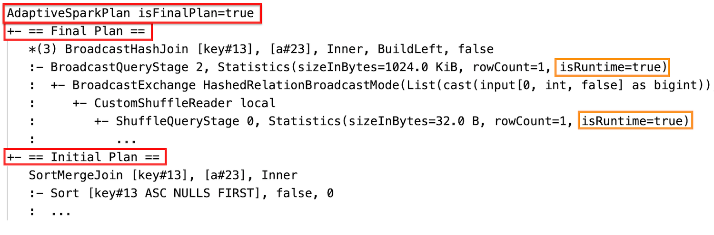 |

### 5.3 In `SQL EXPLAIN`

`EXPLAIN` führt die Abfrage **nicht** aus → der aktuelle Plan ist **immer gleich dem Initial Plan** und zeigt **nicht**, was AQE später tut.

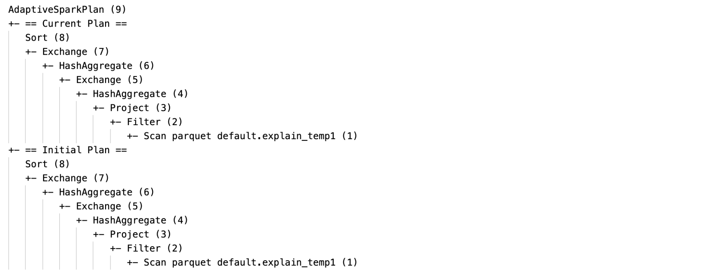

### 5.4 Woran man sieht, dass AQE gewirkt hat

| AQE-Optimierung | Erkennungsmerkmal im Plan | Bilder |
|---|---|---|
| SMJ → Broadcast Hash Join | anderer physischer Join-Knoten im finalen vs. initialen Plan | 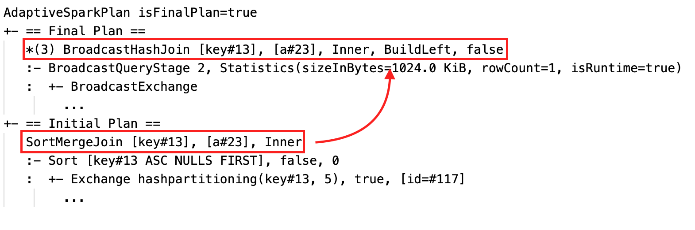 |
| Partitionen zusammengefasst | Knoten **`CustomShuffleReader`** mit Eigenschaft **`Coalesced`** (in neueren Plänen `AQEShuffleRead`) |  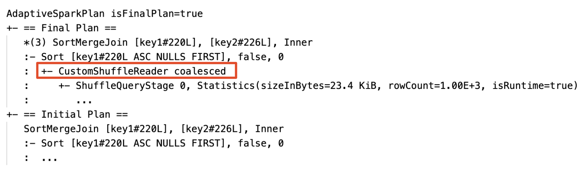 |
| Skew Join | Knoten **`SortMergeJoin`** mit **`isSkew = true`** | 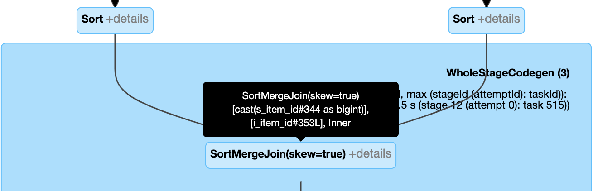  |
| Leere Relation | Plan(teil) ersetzt durch **`LocalTableScan`** mit leerer Relation | 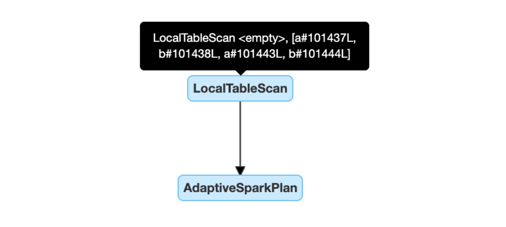 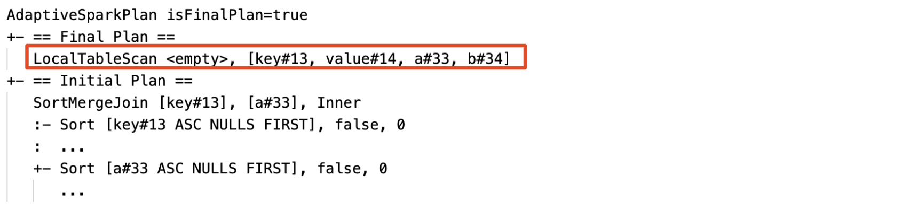 |

### 5.5 AQE-Konfiguration (Defaults)

| Eigenschaft | Default | Bedeutung |
|---|---|---|
| `spark.databricks.optimizer.adaptive.enabled` | `true` | AQE an/aus |
| `spark.sql.shuffle.partitions` | `200` | `auto` = **auto-optimized shuffle** (Anzahl aus Plan und Input-Größe); bei Streaming nicht zwischen Neustarts vom selben Checkpoint änderbar |
| `spark.databricks.adaptive.autoBroadcastJoinThreshold` | **`30MB`** | Schwelle für den Wechsel zu Broadcast zur Laufzeit |
| `spark.sql.adaptive.coalescePartitions.enabled` | `true` | Coalescing an/aus |
| `spark.sql.adaptive.advisoryPartitionSizeInBytes` | `64MB` | Zielgröße nach Coalescing |
| `spark.sql.adaptive.coalescePartitions.minPartitionSize` | `1MB` | Mindestgröße nach Coalescing |
| `spark.sql.adaptive.coalescePartitions.minPartitionNum` | 2 × Cluster-Cores | nicht empfohlen (überschreibt `minPartitionSize`) |
| `spark.sql.adaptive.skewJoin.enabled` | `true` | Skew-Join-Behandlung |
| `spark.sql.adaptive.skewJoin.skewedPartitionFactor` | `5` | Faktor × Median-Partitionsgröße |
| `spark.sql.adaptive.skewJoin.skewedPartitionThresholdInBytes` | `256MB` | Mindestgröße einer schiefen Partition |
| `spark.databricks.adaptive.emptyRelationPropagation.enabled` | `true` | leere Relationen propagieren |

> Eine Partition gilt als **schief**, wenn **beides** gilt: Größe **> 5 × Median** **und** Größe **> 256 MB**.

### 5.6 AQE-FAQ (prüfungsrelevant)

| Frage | Antwort |
|---|---|
| Warum wurde eine kleine Tabelle nicht gebroadcastet? | Join-Typ unterstützt es nicht (z. B. linke Seite eines `LEFT OUTER JOIN`), oder viele leere Partitionen (`nonEmptyPartitionRatioForBroadcastJoin`) |
| Broadcast-Hint trotz AQE sinnvoll? | **Ja** — ein statisch geplanter Broadcast ist meist schneller, weil AQE erst **nach** dem Shuffle beider Seiten umschalten kann |
| Skew-Hint oder AQE-Skew-Join? | **AQE** — vollautomatisch und meist besser |
| Ändert AQE die Join-Reihenfolge? | **Nein**, dynamisches Join-Reordering ist nicht Teil von AQE |
| Welche Joins werden skew-optimiert? | Nur Shuffle-basierte (SMJ, Shuffle Hash). **Broadcast Joins nie.** `INNER`/`CROSS` beide Seiten, `LEFT OUTER`/`LEFT SEMI`/`LEFT ANTI` nur links, `RIGHT OUTER` nur rechts, `FULL OUTER` keine Seite |

---

## 6. Photon im DAG

- **Spark UI** (klassisches Compute), Reiter **SQL/DataFrame**: **Photon-Operatoren orange**, normale Spark-Operatoren **blau**.
- **Query Profile** (SQL Warehouse, Serverless): Photon-Operatoren **lila**, normale **grau**; „Execution Details" zeigt den **Anteil der Task-Zeit in Photon**.
- Photon-Operatoren tragen das Präfix `Photon…` (`PhotonScan`, `PhotonShuffleExchangeSink`, …) — so heißen sie in den Kurs-Labs.
- Läuft ein Teil **nicht** in Photon: auf **UDFs**, **RDD-/Dataset-APIs**, nicht unterstützte Formate oder Operationen prüfen (Fallback auf die Spark-Engine).
- Photon hilft laut Spark-UI-Leitfaden besonders bei **hohem Input** (breite Tabellen) und **hohem Output** (Schreiben).

## Quellen

- [Slow Spark stage with little I/O](https://docs.databricks.com/aws/en/optimizations/spark-ui-guide/slow-spark-stage-low-io)
- [Identifying an expensive read in Spark's DAG](https://docs.databricks.com/aws/en/optimizations/spark-ui-guide/spark-dag-expensive-read)
- [Adaptive query execution](https://docs.databricks.com/aws/en/optimizations/aqe)
- [What is Photon?](https://docs.databricks.com/aws/en/compute/photon)
- [Apache Spark Web UI — SQL metrics](https://spark.apache.org/docs/latest/web-ui.html#sql-metrics)
