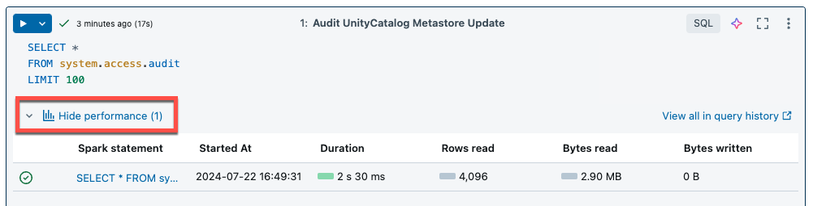
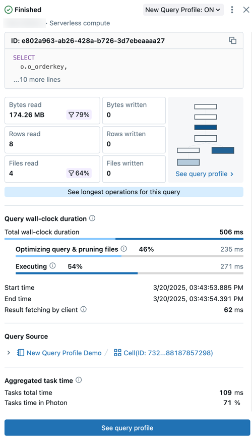
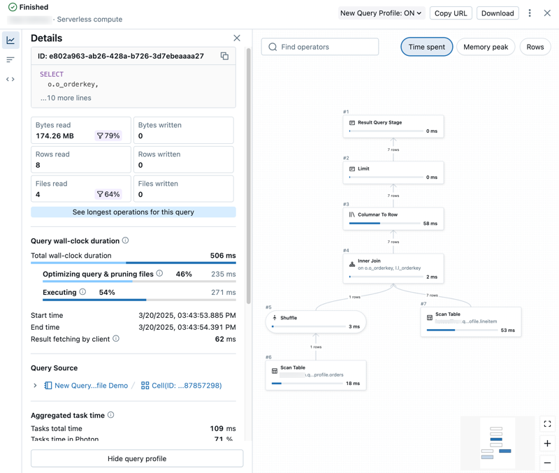
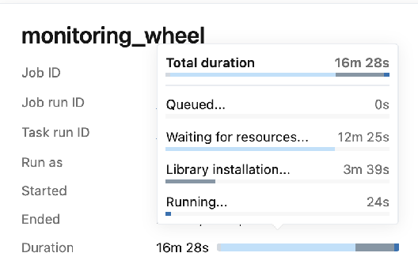

# Query Profile, Serverless und Jobs

Das Spark UI gibt es nur auf **klassischem Compute**. Für **Serverless** und **SQL Warehouses** ist das **Query Profile** das Gegenstück. Außerdem liefern die **Jobs-UI** und das **Streaming-Monitoring** eigene Performance-Sichten.

---

## 1. Serverless: kein Spark UI

> „The Spark UI is not available. Instead, use the query profile to view information about your Spark queries."

Weitere Einschränkungen bei Serverless-Notebooks/-Jobs (Query Insights):
- Metriken werden **live** aktualisiert, das **vollständige Query Profile** gibt es aber erst **nach Ende** der Abfrage,
- **keine Verbose-Metriken**,
- **kein Download** des Query Profiles,
- **kein Zugriff auf das Spark UI**.

### Query Insights im Notebook

Nach dem Ausführen einer Zelle auf Serverless: **See performance** → Liste der Spark-Statements → Statement anklicken → Query-Metriken → **See query profile**.



---

## 2. Query Profile

Visualisiert die Ausführung einer Abfrage, um **Engpässe** zu finden:
- jeden **Operator** mit Metriken (Zeit, verarbeitete Zeilen, Speicher),
- den **langsamsten Teil** auf einen Blick; Wirkung von Änderungen bewerten,
- typische Fehler wie **Exploding Joins** oder **Full Table Scans** erkennen.

**Voraussetzung:** Eigentümer der Abfrage **oder** mindestens **CAN MONITOR** auf dem SQL Warehouse, das sie ausgeführt hat.

### Öffnen

**Query History** → Abfrage anklicken → Detailpanel:



Das Panel zeigt u. a.:
- **Status** (Queued, Running, Finished, Failed, Cancelled), Benutzer, Compute, ID, Statement,
- **Query-Metriken**; Filter-Symbole = **Anteil der beim Scan gepruneten Daten**,
- **See longest operators** → Panel **Top operators**,
- **Wall-clock duration** mit Aufschlüsselung (Scheduling, Optimierung/File Pruning, Ausführung),
- **Aggregated task time** — Summe über **alle Cores aller Knoten**; kann viel **länger** als die Wanduhr-Zeit sein (Parallelität) oder **kürzer** (Tasks warten auf Knoten),
- **I/O** — gelesene und geschriebene Daten.

**See query profile** → detaillierter DAG:



> Kommt eine Abfrage aus dem **Query Cache**, gibt es **kein Profil** („Query profile is not available"). Workaround: Abfrage minimal ändern (z. B. `LIMIT`).

### DAG im Query Profile

- Metriken **Time spent**, **Memory peak**, **Rows** umschaltbar,
- Suche, Zoom, Klick auf Operatoren → Details,
- Standardmäßig sind Metriken unwichtiger Operationen ausgeblendet (über das Kebab-Menü einblendbar),
- Für Databricks-SQL-Abfragen lässt sich das Profil **auch im Spark UI** öffnen.

**Häufige Operationen:** **Scan**, **Join**, **Union**, **Shuffle** (teuer: Daten wandern zwischen Executors), **Hash/Sort** (Gruppierung + Aggregation), **Filter**.

### Performance Insights

Databricks erkennt Optimierungsmöglichkeiten automatisch:
- Zusammenfassung der wichtigsten Insights im Detailpanel (nach Einfluss auf die Task-Dauer sortiert),
- Reiter **Performance insights** im Profil mit allen Details,
- **Optimize** öffnet Genie Code: schreibt die Abfrage um oder fasst Tabellen-/Compute-Empfehlungen zusammen.

### Teilen und Importieren

- Mit **CAN MANAGE** auf die Abfrage: **Share** (URL).
- Sonst: **Download** als JSON → Empfänger importiert es über die Query History (nur für die Browser-Sitzung, nicht persistent).

### Weitere Einstiege ins Query Profile

SQL-Editor (Link mit Laufzeit/Zeilenzahl), Notebook auf SQL Warehouse/Serverless (**See performance**), Lakeflow-Pipelines-UI (Reiter **Query History**), Jobs-UI (SQL Warehouse/Serverless).

### Spark UI vs. Query Profile

| | Spark UI | Query Profile |
|---|---|---|
| Compute | klassisch (All-Purpose, Jobs, klassische Pipelines) | SQL Warehouse, Serverless |
| Sicht | Application → Jobs → Stages → Tasks, Executors | pro **Abfrage**: DAG, Top-Operatoren, Insights |
| Skew/Spill auf Task-Ebene | ✅ Summary Metrics je Stage | über Operator-Metriken |
| Photon-Farbe | orange (Spark: blau) | lila (Standard: grau) |
| Berechtigung | CAN ATTACH TO (Compute) | Owner oder CAN MONITOR (Warehouse) |

---

## 3. Jobs: Laufzeit analysieren

### Run Breakdown

Über der **Duration** eines Job-/Task-Runs hovern → Aufschlüsselung in **Queued**, **Waiting for resources**, **Library installation**, **Running**:



Die Phase mit dem größten Anteil zeigt, wo man ansetzt (z. B. Queued = Concurrency-Limits). Pipeline-Tasks haben eigene Phasen (created, waiting for resources, initializing, setting up tables, running).

### Wo man weiter analysiert

- **Serverless-Jobs:** Query History → langsamste Abfragen → **Query Profile**; Timeline-Ansicht des Jobs ist mit Query Profiles verknüpft. Optional **Query-Performance-Metriken** und Insights direkt im Job-Run-UI (Preview „Improved Lakeflow Performance Observability").
- **Klassisches Compute:** **Spark UI** — mit der **Event Timeline** beginnen (lange Jobs, Lücken, Fehler), dann Stages und Tasks.

---

## 4. Structured Streaming überwachen

### Streaming-Reiter im Spark UI

Nur sichtbar, wenn auf dem Compute ein Stream läuft (sonst ggf. Exception → Driver-Logs prüfen).

- **Input Rate**: Kommen Events an (z. B. 1000 Events/s)? Bei mehreren Input-Streams Details je Receiver.
- **Processing Time**: **Faustregel — jeder Batch sollte in ≤ 80 % des Batch-Intervalls verarbeitet werden.** Liegt die Verarbeitungszeit nahe oder über dem Intervall, entsteht ein **Rückstau** (Backlog), der den Stream irgendwann zum Erliegen bringt.
- **Completed Batches**: die letzten **1000** Batches mit Events und Dauer → **Batch-Details** (Input: z. B. Kafka-Topic/Partition/Offsets; Processing: Link zur Job-ID).
- **Job-Details**: DAG; **graue Boxen = übersprungene Stages** (Daten aus Checkpoint/Cache).
- **Task-Details**: Tasks, Executors, Shuffle — prüfen, ob Tasks auf **mehreren Executors** laufen (genug Parallelität).

### Streams unterscheidbar machen

```python
(df.writeStream
   .queryName("orders_bronze")   # eindeutiger Name → im Spark UI zuordenbar
   .option("checkpointLocation", "/Volumes/.../chk")
   .toTable("bronze.orders"))
```

### Metriken nach außen

- **`StreamingQueryListener`** (Python/Scala ab DBR 11.3 LTS) → Metriken an externe Systeme pushen (Alerting, Dashboards).
- **Observable Metrics** (`observe()`) → benannte Aggregationen je Batch/Epoch.
- **Jobs-UI**: Streaming-Metriken je Task (Backlog Seconds/Bytes/Records/Files) für Kafka, Kinesis, Auto Loader, Pub/Sub, Delta.

---

## 5. Observability-Überblick

| Werkzeug | Wofür |
|---|---|
| **Spark UI** | Jobs/Stages/Tasks, Skew, Spill, Shuffle, DAG (klassisch) |
| **Query Profile** | Abfrage-DAG, Top-Operatoren, Insights (Serverless/Warehouse) |
| **Compute-Metriken** | CPU, Speicher, Disk, Netzwerk; Driver-Last |
| **Compute Event log** | Autoscaling, Spot-Verlust, Start/Stop |
| **Driver-/Executor-Logs** | Exceptions, `print`, Task-Fehler |
| **Cluster Log Delivery** | Spark-Event-Logs historisch auswerten |
| **Systemtabellen** | `system.compute` (Auslastung), `system.workflow` (Jobs), `system.query` (Warehouse-Abfragen) |
| **Pipeline-Event-Log** | Batch-Dauer, Durchsatz, Backpressure in Lakeflow Pipelines |

## Quellen

- [Serverless compute limitations](https://docs.databricks.com/aws/en/compute/serverless/limitations)
- [Serverless best practices](https://docs.databricks.com/aws/en/compute/serverless/best-practices)
- [Serverless compute for notebooks](https://docs.databricks.com/aws/en/compute/serverless/notebooks)
- [Query profile](https://docs.databricks.com/aws/en/sql/user/queries/query-profile)
- [Diagnose job performance](https://docs.databricks.com/aws/en/jobs/diagnose-job-performance)
- [Debugging with the Spark UI (Streaming)](https://docs.databricks.com/aws/en/compute/troubleshooting/debugging-spark-ui)
- [Monitoring Structured Streaming queries](https://docs.databricks.com/aws/en/structured-streaming/stream-monitoring)
- [Observability best practices](https://docs.databricks.com/aws/en/data-engineering/observability-best-practices)
- [Performance efficiency best practices](https://docs.databricks.com/aws/en/lakehouse-architecture/performance-efficiency/best-practices)
