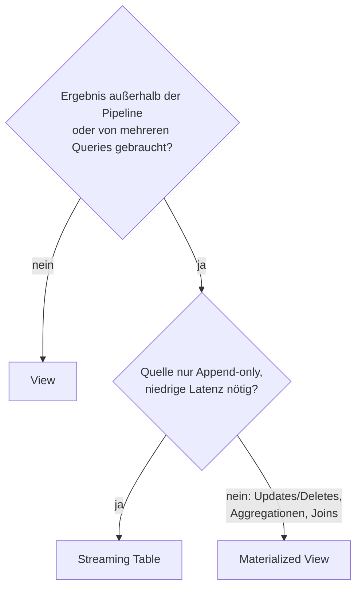

# View-Typen in Databricks

Welche Views gibt es, wofür setzt man sie ein, was können sie und wo sind ihre Grenzen?

> Gegenstück zu Tabellen: [Tabellentypen.md](Tabellentypen.md)

---

## Überblick

| Typ | Speichert Daten? | Lebensdauer / Sichtbarkeit | Unity-Catalog-Objekt? | Typischer Einsatz |
|---|---|---|---|---|
| **View** (Standard) | ❌ nein, wird bei jeder Abfrage neu berechnet | dauerhaft, `catalog.schema.view` | ✅ | Logik kapseln, Zugriff einschränken |
| **Dynamic View** | ❌ | dauerhaft | ✅ (normale View) | Zeilen/Spalten abhängig vom Nutzer filtern oder maskieren |
| **Materialized View** | ✅ vorberechnet | dauerhaft, Stand = letzter Refresh | ✅ | Aggregationen/Joins, BI, Gold-Layer |
| **Metric View** | ❌ | dauerhaft | ✅ | Wiederverwendbare KPI-/Metrikdefinitionen |
| **Temporary View** | ❌ | nur aktuelle **Session** (SparkSession) | ❌ | Zwischenschritte in Notebook/SQL |
| **Global Temporary View** | ❌ | ganze **Spark-Anwendung** (Cluster), Schema `global_temp` | ❌ | Teilen zwischen Notebooks auf demselben Cluster |
| **Pipeline-View** (Lakeflow) | ❌ | nur **innerhalb der Pipeline** | ❌ | Zwischenschritte, Expectations ohne Veröffentlichung |

**Merksatz:** *View = gespeicherte Abfrage. Materialized View = gespeichertes Ergebnis.*

---

## 1. View (Standard-View)

Schreibgeschütztes Objekt in einem Schema, definiert durch eine SQL-Abfrage über Tabellen oder andere Views. Das Ergebnis wird **bei jeder Abfrage neu berechnet**.

```sql
CREATE OR REPLACE VIEW main.sales.experienced_employee
  (id COMMENT 'Unique identification number', name)
  COMMENT 'View for experienced employees'
AS SELECT id, name FROM main.hr.all_employee WHERE working_years > 5;

-- übernimmt Schemaänderungen der Basistabelle automatisch
CREATE VIEW emp_v WITH SCHEMA EVOLUTION AS SELECT * FROM emp;
```

**Rechte:** `USE CATALOG`, `USE SCHEMA` und `SELECT` auf der View. **Keine Rechte auf die Basistabellen nötig**, weil zur Laufzeit die Rechte des **View-Eigentümers** gelten. Ein `SELECT` auf Schema- oder Catalog-Ebene wird an alle aktuellen und künftigen Views vererbt.

**Vorteile**
- Kein Speicherplatz, keine Refresh-Kosten, immer aktuell.
- Kapselt komplexe Geschäftslogik und vereinfacht Abfragen.
- **Zugriffssteuerung:** gibt nur bestimmte Zeilen oder Spalten frei, ohne die Tabelle offenzulegen.

**Einschränkungen**
- Die Abfrage läuft bei jedem Zugriff neu, das ist bei teuren Joins/Aggregationen langsam.
- Nur lesend, kein DML auf die View.

---

## 2. Dynamic View

Kein eigener Objekttyp, sondern eine **normale View mit Funktionen wie `is_account_group_member()`**. Das Ergebnis hängt vom abfragenden Nutzer ab.

```sql
CREATE VIEW catalog.gold.v_customer_current AS
SELECT customer_id, name, city,
       CASE WHEN is_account_group_member('pii_readers') THEN email
            ELSE '***' END AS email
FROM catalog.silver.dim_customer_history
WHERE __END_AT IS NULL;

GRANT SELECT ON VIEW catalog.gold.v_customer_current TO `analysts`;
-- analysts erhalten KEIN SELECT auf die Tabelle
```

**Vorteile**
- Maskierung und Row-Level-Security, **ohne die Tabelle zu verändern**. Das eignet sich z. B. für AUTO-CDC-Ziele.
- Mehrere Views mit unterschiedlicher Sicht auf dieselbe Tabelle sind möglich.

**Einschränkungen**
- Schützt nur, wenn Nutzer **keinen** direkten Zugriff auf die Basistabelle haben.
- Wenn die Regel für **jeden** Zugriff gelten soll, sind **Row Filter und Column Mask** direkt auf der Tabelle die Alternative.

---

## 3. Materialized View

Berechnet das Abfrageergebnis **vorab und speichert es** (Delta, intern im Katalog `__databricks_internal`). Das Ergebnis entspricht dem Stand des letzten Refresh. Sie arbeitet mit **Batch-Semantik**. Erstellt wird sie in einer Lakeflow-Pipeline oder standalone per Databricks SQL.

```sql
-- ad hoc
CREATE OR REPLACE MATERIALIZED VIEW mv1
AS SELECT date, sum(sales) AS sum_of_sales FROM base_table1 GROUP BY date;

-- Refresh bei Änderung der Quelle
CREATE OR REPLACE MATERIALIZED VIEW mv_trigger TRIGGER ON UPDATE AS SELECT ...;

-- zeitgesteuert
CREATE OR REPLACE MATERIALIZED VIEW daily_revenue
  SCHEDULE CRON '0 30 3 * * ?' AT TIME ZONE 'UTC' AS SELECT ...;

REFRESH MATERIALIZED VIEW mv1;          -- synchron
REFRESH MATERIALIZED VIEW mv1 ASYNC;    -- im Hintergrund
```

**Rechte:** wie bei der Standard-View, zusätzlich **`REFRESH`**. Mit nur `SELECT` kann man lesen, aber keinen Refresh auslösen.

**Einsatzgebiete**
- **Aggregationen und Joins**, auch wenn sich die Quelldaten durch Updates oder Deletes ändern.
- Mehrere nachgelagerte Queries oder Konsumenten lesen dasselbe Ergebnis (Cache).
- Gold-Layer, BI-Dashboards.
- Ergebnisse während der Entwicklung prüfen.

**Vorteile**
- Deutlich schnellere Abfragen als bei normalen Views.
- **Inkrementeller Refresh**: Es werden nur Änderungen verarbeitet. Voraussetzung ist **Row Tracking** auf der Delta-Quelle, sonst gibt es einen Full Refresh.
- Das Ergebnis ist **immer korrekt** zum Refresh-Zeitpunkt, notfalls wird vollständig neu berechnet.
- Refresh läuft auf Serverless. Die Kosten richten sich nach der verarbeiteten Datenmenge, nicht nach der Warehouse-Größe.

**Einschränkungen**
- **Nicht für niedrige Latenz** gedacht (Minuten statt Millisekunden). Für Streaming ist die Streaming Table die richtige Wahl.
- Nicht jede Berechnung lässt sich inkrementell refreshen.
- Kein `CLONE`, **kein Time Travel**, keine Identity Columns oder Surrogate Keys.
- Change Data Feed ist nur lesbar, wenn er explizit aktiviert ist.
- Zusätzlicher Speicherplatz und Refresh-Kosten.
- Ändert sich das Verhalten einer UDF, ist ggf. ein manueller Full Refresh nötig.

---

## 4. Metric View

Schreibgeschütztes Objekt mit **wiederverwendbaren Metrikdefinitionen** (Kennzahlen, Dimensionen) über Tabellen, Views oder SQL-Abfragen. Man fragt sie wie eine Standard-View ab.

**Rechte:** wie bei der Standard-View (`SELECT` plus Nutzungsrechte). Zur Laufzeit gelten die Rechte des Eigentümers.

**Vorteile**
- **Eine** zentrale Definition von KPIs (z. B. „Umsatz“), die in BI, SQL und Dashboards einheitlich genutzt wird.
- Governance über Unity Catalog.

**Einschränkungen**
- Nur lesend. Die Metriken werden bei der Abfrage berechnet, nicht vorab gespeichert.

---

## 5. Temporary View und Global Temporary View

Kein Unity-Catalog-Objekt. Die Views existieren nur zur Laufzeit.

```sql
CREATE TEMPORARY VIEW subscribed_movies AS
SELECT mo.member_id, mb.full_name, mo.movie_title
FROM movies mo JOIN members mb ON mo.member_id = mb.id;
```

```python
df.createOrReplaceTempView("people")          # Session
df.createOrReplaceGlobalTempView("people")    # Spark-Anwendung
spark.sql("SELECT * FROM global_temp.people")  # Global Temp immer mit global_temp.
```

| | Temporary View | Global Temporary View |
|---|---|---|
| Lebensdauer | `SparkSession` (Notebook/Session) | Spark-Anwendung (Cluster) |
| Zugriff | nur die erstellende Session | andere Sessions auf demselben Cluster |
| Ansprechen | nur mit Namen | `global_temp.<name>` |

**Vorteile**
- Keine Rechte zum Anlegen nötig, kein Katalogeintrag, schnell zum Strukturieren von Abfragen.
- Brücke zwischen DataFrame-API und SQL (`createOrReplaceTempView` → `spark.sql`).

**Einschränkungen**
- Verschwindet mit Session- bzw. Cluster-Ende und ist nicht teilbar.
- `createTempView` wirft `TempTableAlreadyExistsException`, wenn der Name existiert. Idempotent ist `createOrReplaceTempView`.
- Temporary Views und **Temporary Tables** teilen sich einen Namensraum.

---

## 6. Pipeline-View (Lakeflow Spark Declarative Pipelines)

```python
from pyspark import pipelines as dp

@dp.view
def customers_filtered():
    return spark.read.table("customers_raw").where("email IS NOT NULL")
```

```sql
CREATE TEMPORARY VIEW customers_filtered
AS SELECT * FROM customers_raw WHERE email IS NOT NULL;
```

**Einsatzgebiete:** große Queries zerlegen, **Zwischenergebnisse mit Expectations validieren**, ohne sie zu veröffentlichen.

**Vorteile:** keine Speicher- und Refresh-Kosten.

**Einschränkungen:** nur **innerhalb der definierenden Pipeline** abfragbar. Wer das Ergebnis außerhalb braucht, nimmt eine Materialized View oder Streaming Table.

---

## Entscheidungshilfe (Pipeline-Kontext)



| | View | Materialized View | Streaming Table |
|---|---|---|---|
| Persistiert? | nein | ja | ja |
| Semantik | on demand | **Batch** (inkrementell wenn möglich) | **Streaming** (jede Zeile genau einmal) |
| Joins gegen sich ändernde Dimensionen | aktuell | ✅ korrekt neu berechnet | ❌ nicht neu berechnet |
| Latenz | abhängig von Query | Minuten | Sekunden bis unter einer Sekunde |

## Typische Prüfungsfallen

- Eine **Standard-View speichert keine Daten**, eine **Materialized View speichert das Ergebnis**.
- Wer eine View abfragt, braucht **kein** Recht auf die Basistabelle, weil die Rechte des Owners gelten.
- Materialized View hat das zusätzliche Privileg **`REFRESH`**.
- Inkrementeller MV-Refresh braucht **Row Tracking** auf der Quelle.
- MV: **kein Time Travel, kein CLONE**.
- **Global Temp View** wird immer über **`global_temp.`** angesprochen.
- **Dynamic View** ist eine normale View mit `is_account_group_member()`. Row Filter und Column Mask dagegen hängen direkt an der Tabelle.
- Pipeline-Views sind außerhalb der Pipeline **nicht** sichtbar.

---

## Quellen im Projekt

- [05 View.md (Unity Catalog)](../Full%20Doc/Themen/02%20Unity%20Catalog/05%20View.md)
- [06 Materialized View.md (Unity Catalog)](../Full%20Doc/Themen/02%20Unity%20Catalog/06%20Materialized%20View.md)
- [07 Metric View.md (Unity Catalog)](../Full%20Doc/Themen/02%20Unity%20Catalog/07%20Metric%20View.md)
- [05 Views.md (Lakeflow)](../Full%20Doc/Themen/07%20Data%20Management/01%20Data%20Engineering/03%20Lakeflow%20Pipelines/01%20Concepts/05%20Views.md)
- [06 Materialized Views.md (Lakeflow)](../Full%20Doc/Themen/07%20Data%20Management/01%20Data%20Engineering/03%20Lakeflow%20Pipelines/01%20Concepts/06%20Materialized%20Views.md)
- [01 Materialized Views (DBSQL).md](../Full%20Doc/Themen/07%20Data%20Management/01%20Data%20Engineering/03%20Lakeflow%20Pipelines/15%20Databricks%20SQL%20fuer%20LDP/01%20Materialized%20Views%20%28DBSQL%29.md)
- [Temporäre Views (PySpark)](../Full%20Doc/Themen/05%20SQL%20und%20PySpark/02%20PySpark/07%20DataFrame/02%20Temporaere%20Views/01%20createTempView.md)
- [05 SCD mit Governance, Data Quality und Performance.md](SCD/05%20SCD%20mit%20Governance%2C%20Data%20Quality%20und%20Performance.md) (Dynamic View, Row Filter, Column Mask)
- [04 External und Foreign Tables.md](../Full%20Doc/Themen/01%20Platform/02%20Tables/04%20External%20und%20Foreign%20Tables.md) (gemeinsamer Namensraum Temp Tables/Views)

Offizielle Doku: [What is a view?](https://docs.databricks.com/aws/en/views/) · [Materialized views](https://docs.databricks.com/aws/en/ldp/concepts/materialized-views) · [Standalone MVs](https://docs.databricks.com/aws/en/ldp/dbsql/materialized) · [Metric views](https://docs.databricks.com/aws/en/uc-semantics/metric-views/)
